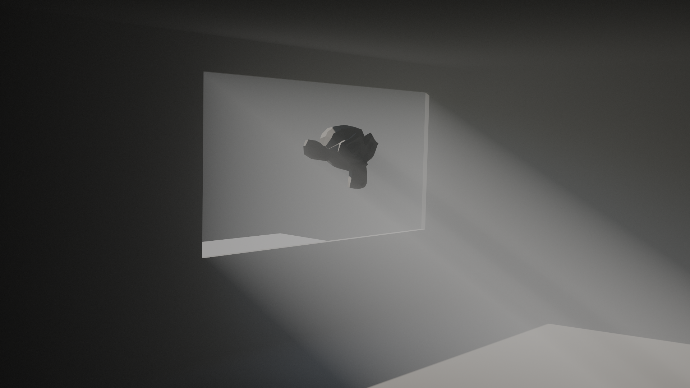
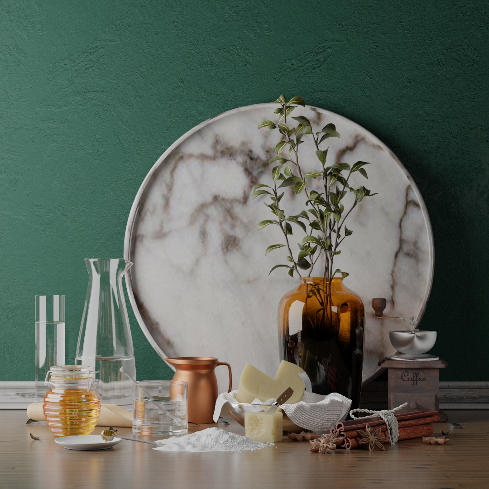
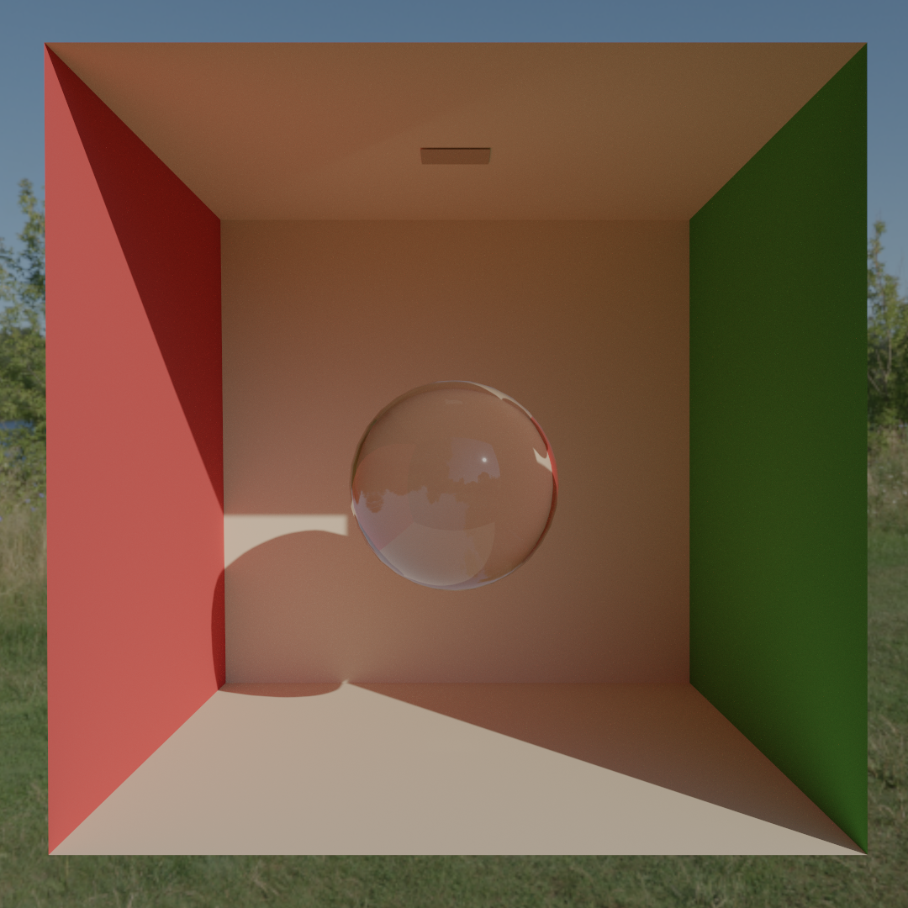

## Performance & Benchmarks
This is an offline path tracer, but of course having it in interactive framerates speeds up development and shortens render times. It wasn't my priority to make this thing run as fast as possible and there are a couple areas of possible improvement, nonetheless, I think the performance is quite good, it's not like I didn't care about it at all.

Hardware the benchmark was done with:
- CPU: Intel Core i5-10400F 2.90GHz
- GPU: Nvidia RTX 3060
- RAM: 16GB DDR4
- OS: Debian 12

### Breakfast Room
- Vertices: 161'418
- Indices: 809'292
- Resolution: 1920x1080
- Samples Per Pixel: 50'000
- Render Time: 2 minutes 32 seconds

  

### Volumetric Room
- Vertices: 2'114
- Indices: 3'150
- Resolution: 1920x1080
- Samples Per Pixel: 50'000
- Render Time: 2 minutes 15s

  

### Cannelle Et Fromage
- Vertices: 1'976'973
- Indices: 9'179'637
- Resolution: 1080x1080
- Samples Per Pixel: 50'000
- Render Time: 3 minutes 12 seconds

  

### Cornell Box With Glass Sphere
- Vertices: 583
- Indices: 2916
- Resolution: 1080x1080
- Samples Per Pixel 5'000
- Render Time: 15 seconds

  

