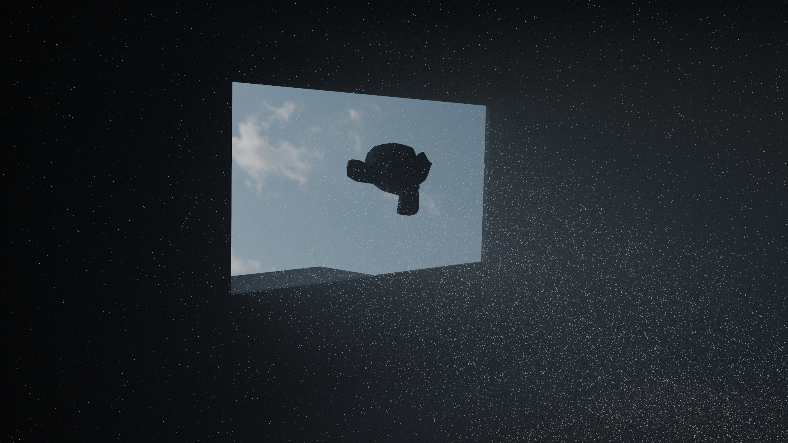
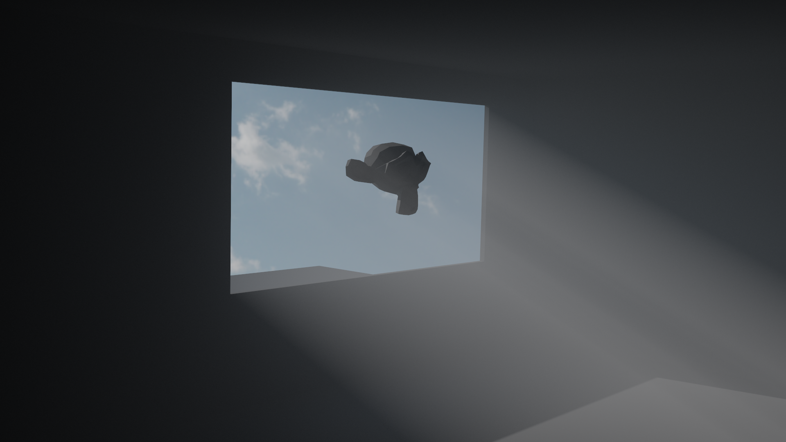

## Next Event Estimation

Naive path tracing (sometimes called brute force), is a type of path tracing, where rays shot from the camera bounce around the scene until they loose all energy, lights are discovered by pure chance, no shortcuts or approximations are used. It can compute global illumination very accurately, but I've hit a limit on this technique fairly soon in the development.

Consider what happens if I'd place sun in the scene, it's really far away, so it appears small, and it's insanely bright. Probability of rays randomly bouncing around and hitting the sun is marginal, and brightness is measured in thousands if not millions. So variance will be through the roof, and that's exactly what happens. The image below is 100K samples per pixel, and the amount of noise is unbelievable, there are really bright pixels scattered almost everywhere, and the direct lighting from sun has not converged very well. The image is mathematically correct of course, it will converge eventually, but you'd probably have to render it for multiple days and take tens of millions of samples per pixel.

<p align="center">
  
</p>

### Solution

NEE (next event estimation) is a technique of explicitly sampling light sources at each bounce to accurately estimate direct lighting from them. It's done by shooting a shadow ray from the surface point to a sampled light source and checking for occlusion. If surface point is unoccluded, direct lighting is estimated.

#### MIS

The problem is that direct lighting can't just be added to what is already there, that would cause double counting, adding light contribution from a single light source twice (once for NEE sample and once for BSDF sample) which would overbrighten the image. So light contribution from one strategy has to go. But that would cause the problem of poor distribution match for some surfaces, the same problem as with uniformly sampling the BSDF directions. This exact problem is described in detail in [Optimally Combining Sampling Techniques for Monte Carlo Rendering](https://www.cs.jhu.edu/~misha/ReadingSeminar/Papers/Veach95.pdf), and a solution is proposed. And that is to combine two sampling strategies using MIS weights.

I take two samples, one from each sampling strategy:

- **BSDF / Phase function Sample**
- - Direction: $\omega_\text{bsdf}$
- - BSDF evaluation: $f(\omega_\text{bsdf})$
- - PDF evaluation: $p_\text{bsdf}(\omega_\text{bsdf})$
- - Additional PDF evaluation in the direction of light: $p_\text{bsdf}(\omega_\text{light})$
- **Light Sample**
- - Direction: $\omega_\text{light}$
- - BSDF evaluation: $f(\omega_\text{light})$
- - PDF evaluation: $p_\text{light}(\omega_\text{light})$
- - Additional PDF evaluation in the direction of BSDF: $p_\text{light}(\omega_\text{bsdf})$

My MIS weights are computed using power heuristic with $\beta = 2$:

$$
\begin{gather*}
w_\text{light} = \frac{p_\text{light}(\omega_\text{light})^2}{p_\text{light}(\omega_\text{light})^2 + p_\text{bsdf}(\omega_\text{light})^2}\\
w_\text{bsdf} = \frac{p_\text{bsdf}(\omega_\text{bsdf})^2}{p_\text{bsdf}(\omega_\text{bsdf})^2 + p_\text{light}(\omega_\text{bsdf})^2}
\end{gather*}
$$

Explicitly sampling lights is happening in `ClosestHit.slang`, where the weighted contribution of the sampled light is added to the surface' emitted light.

$$
L_e = L_e + w_\text{light} \cdot \frac{f(\omega_\text{light}) \cdot \text{light}_\text{emission}}{p_\text{light}(\omega _\text{light})}
$$

When a BSDF sampled ray hits the light by chance, the contribution of the light also has to be weighted to avoid double counting. This happens in `Miss.slang` when ray hits the environment map. For now NEE works only for environment map, sampling mesh lights is not implemented yet.

$$
L_e = L_e + w_\text{bsdf} \cdot \text{light}_\text{emission}
$$

This approach ensures that both sampling strategies contribute appropriately while avoiding double counting.

Also, because there are volumes in the scene, transmittance must be taken into account. That is, how much light is blocked by a volume in the way. It's computed with a simple Beer-Lambert law: $T = e^{-\sigma_t \cdot t}$.

#### Sampling Lights

The method of sampling the direction to the light source and evaluating it's PDF is different for every type of light source.

##### Environment Map

Since environment map is conceptually just a big sphere around the scene, I first tried to uniformly sample it. So direction is random vector on a sphere, and PDF is $\frac{1}{4 \pi}$.

But, uniform sampling won't make much difference, chance of sampling small bright spot on a huge 4K texture will be just as small as the chance for a ray to randomly bounce into it. It's an improvement, of course, but still not good enough. Image below has 100K samples per pixel, it has somewhat less noise than naive version, but it's still a lot of noise nonetheless. So in order to fix that, I use importance sampling. That will steer sampled directions into the brighter areas of environment map.

<p align="center">
  
</p>

So t importance sample the environment map, I decided to use [Alias Method](https://en.wikipedia.org/wiki/Alias_method). It has O(1) time complexity so it's great for performance, and it works really well.

##### Emissive Meshes
Sampling of emissive meshes is not yet supported. Only Environment Map NEE works properly.

### Results

I don't think I have to point out the difference in noise. All images have 25K samples per pixel taken. First one represents naive path tracing. Second one is NEE with uniformly sampled environment map. And third one is NEE with importance sampled environment map.

<p align="center">
  
</p>
<p align="center">
  
</p>
<p align="center">
  
</p>

If you look closely at the last image, you'll see that there are still really bright pixels spread out in the image. These are called *fireflies*. They appear because even with NEE, it's still possible for ray to stumble upon really bright light source by bouncing randomly in the scene. And since the emission value of those is very high, the pixel is very bright. They do not contribute much to the final image and are mostly just annoying noise, so to get rid of them I set maximum luminance value which pixel can have, and if it exceeds it, it gets scaled down. For this image max luminance I used was 20, so that it doesn't interfere with scene lighting but affects the fireflies.

```
float luminance = dot(pixelValue, float3(0.212671f, 0.715160f, 0.072169f));
float scale = MaxLuminance / max(luminance, MaxLuminance);
pixelValue *= scale;
```

<p align="center">
  
  
</p>

With this final improvement, I added some subtle depth of field effect into the scene, focusing on the teapot on the table, bumped the resolution to 4K (3840x2160), and rendered the final image you can find in the [Gallery](#gallery):

<p align="center">
  
</p>

Scattering inside volumes also doesn't take an eternity to converge now, the only difference here is that instead of calculating the surface BSDF, I evaluate the phase function. Both images below are 25K samples per pixels. First one is naive path tracing, and the second on is NEE with importance sampling.

<p align="center">
  
  
</p>