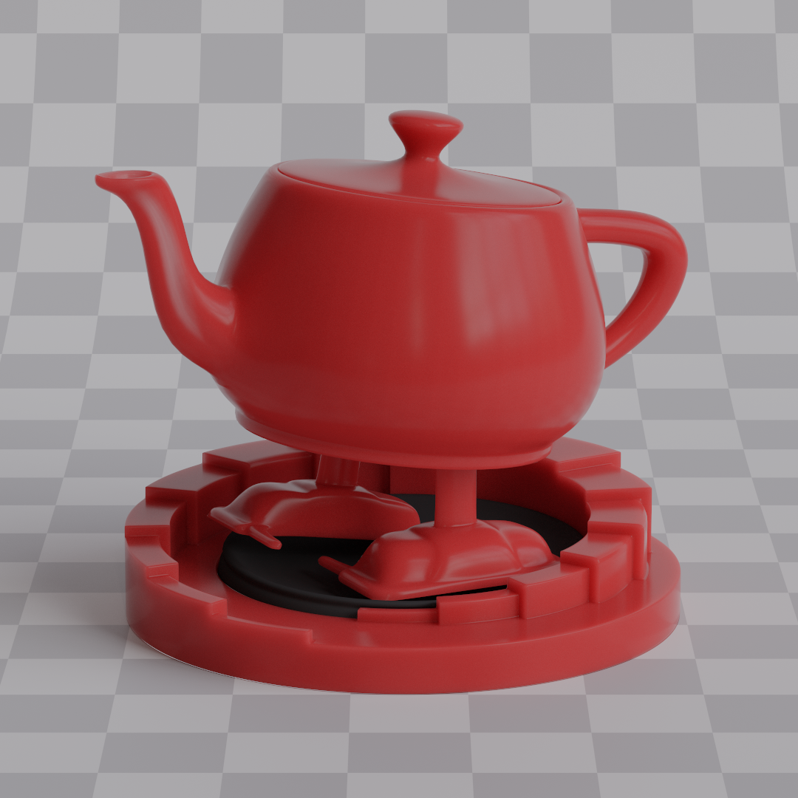
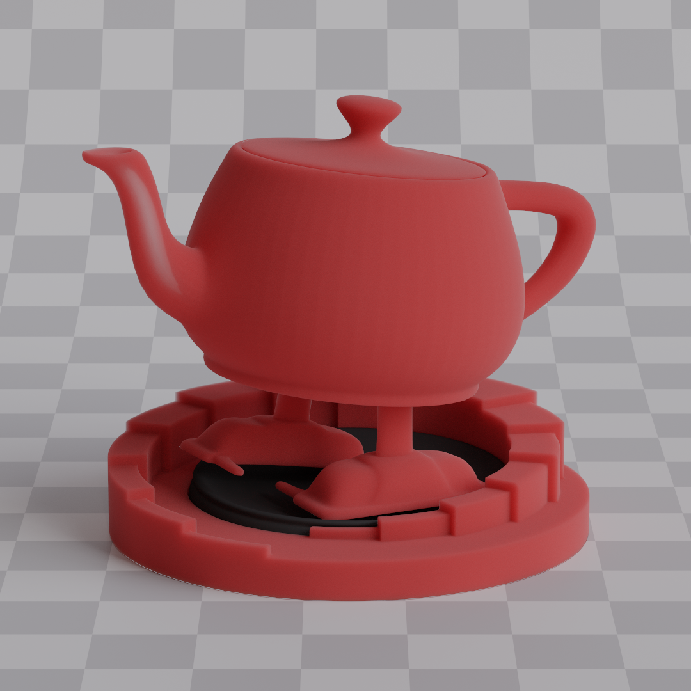

## Participating media

I implement two distinct types of volumetric rendering in this path tracer:

1. **Nested volumes** - Volumes contained within mesh boundaries
2. **AABB volumes** - Volumes contained within axis-aligned bounding boxes that users can place manually

### Why Two Separate Approaches?

The fundamental challenge was determining whether any given point in 3D space is inside or outside a volume.

#### The Problem with Mesh-Based Volumes

Consider a fog effect that fills an entire room. If I place the camera inside that room, rays will start from within the volumetric medium. So to properly account for volumetric scattering, I need to know whether I'm currently inside or outside the volume (in this case I'm inside).

For mesh defined volumes, the only way to answer this question is to shoot a ray in any direction and count how many times it intersects the mesh boundary. If it's an odd number, you're inside, if even, you're outside. However, this approach had several serious problems:

- **Mesh requirements**: The mesh must be perfectly watertight with no gaps, holes, or non-manifold geometry. It also needs to be 3D and not a 2D plane, for example.
- **Performance cost**: The bigger issue though is performance, since every volume now requires additional ray tracing. You'd need to use anyhit shaders to check every intersection along the ray path. That's 1 additional really expensive ray query per pixel for *each* volume in the scene. For complex meshes with a lot of triangles, that becomes quite expensive really fast.
- **Importance sampling lights**: Transmittance values have to be computed when sampling lights, and that means additional ray queries, this time on every bounce.

#### The AABB Solution
Axis aligned bounding boxes solve all these problems. It's incredibly easy to determine whether point $p$ is inside or outside an AABB, and it doesn't require tracing any rays. Ray intersection tests with AABBs are also simple and fast.

So for large volumes that span entire scenes, I use AABBs. Mesh volumes are still included, they're great for simulating subsurface scattering and many other effects. However, due to the performance constraints mentioned above, if a ray spawns inside a mesh volume, the possibility of scattering within it is ignored. Scattering is only accounted for if the ray explicitly enters the volume from outside first. Importance sampling of lights is also disabled from within nested volumes.

The only downside of this approach is that you can't have fancy shapes for volumes you want to spawn rays within. But that's hardly an issue for things like fog. And more complex volumetric shapes are usually stored in something like OpenVDB format instead of triangles anyway.

### Nested Volumes
To determine whether a ray was currently in a volume or not, I decided to keep a global flag in the payload. When a ray refracts through the mesh surface from outside, the flag is set to true. When a ray refracts from inside, the flag is set to false. This way no additional cost is added to determine whether to scatter in a volume or not. If the ray got refracted from outside, and the mesh has a volume inside it, it has a chance of scattering inside the medium instead of reaching the other side of the mesh, it's as simple as that. The only thing that is needed for simulating scattering is the distance which the ray has traveled through the volume. It's easy to compute since it's just the distance between two intersection points.

### AABB volumes
AABB volumes are pretty much the same, but this time there is no global flag dictating whether the ray is inside the volume or not, since it has to account for the fact that it can spawn inside the volume. So an AABB ray intersection test is done every time. The math for that is dirt cheap, so it doesn't cause any performance issues even for multiple volumes.

### Scattering

To simulate scattering I use a simple tracking approach, since for now I only support homogenous volumes, there's no need for anything more sophisticated like delta tracking. I implemented it according to [this article](https://www.scratchapixel.com/lessons/mathematics-physics-for-computer-graphics/monte-carlo-methods-in-practice/monte-carlo-simulation.html) and [Production Volume Rendering](https://graphics.pixar.com/library/ProductionVolumeRendering/paper.pdf) paper. Distance along the ray at which scattering has occurred is given by:

$$
t = -\frac{\ln(1 - \xi)}{\sigma_t}
$$

If this distance is shorter than the distance to the other side of the volume, or any other closest geometry, the ray has scattered inside the volume.

With $t$ in place, the next thing is simulating the scattering itself. That's done with a phase function $p(\mathbf{V} \cdot \mathbf{L})$. It dictates how likely the ray is to scatter in direction $\mathbf{L}$ given $\mathbf{V}$. These functions are usually parameterized by $G$, also called anisotropy. It controls the average scattering angle, in other words, the likelihood of light being scattered forward, backward, or isotropically. I decided to use the Henyey-Greenstein phase function since it has become a standard in PBR for volumes for it's ease of use.

$$
p(\mathbf{V} \cdot \mathbf{L}) = \frac{1}{4\pi} \cdot \frac{1 - g^2}{(1 + g^2 - 2g(\mathbf{V} \cdot \mathbf{L}))^{\frac{3}{2}}}
$$

So to sample the direction I had to use inverse transform sampling:

$$
\mathbf{V} \cdot \mathbf{L} = 
\begin{cases}
\frac{1}{2g}(1 + g^2 - (\frac{1 - g^2}{1 - g + 2g \xi_1})^2) & if & g \neq 0\\
1 - 2 \xi_1 & if & g = 0
\end{cases}
$$

The problem was that this gives only the cosine of the angle between $\mathbf{V}$ and $\mathbf{L}$. To get the full 3D direction, another angle around the cone has to be sampled and a 3D direction has to be created from both of them.

$$
\begin{gather*}
\sin\theta = \sqrt{1 - (\mathbf{V} \cdot \mathbf{L})^2}\\
\phi = 2\pi \xi_2
\end{gather*}
$$

So first I constructed $\mathbf{L}$ in a coordinate system where $\mathbf{V}$ points along the z-axis, and then transformed it to world space using orthonormal basis around $\mathbf{V}$:

$$
\begin{gather*}
\mathbf{L}_{local} = (\sin\theta \cos\phi, \sin\theta \sin\phi, \mathbf{V} \cdot \mathbf{L})\\
\mathbf{T}_1 = 
\begin{cases}
\text{normalize}(\mathbf{V} \times (0, 0, 1)) & \text{if } |\mathbf{V}_y| = 1\\
\text{normalize}(\mathbf{V} \times (0, 1, 0)) & \text{otherwise}
\end{cases}\\
\mathbf{T}_2 = \mathbf{V} \times \mathbf{T}_1\\
\mathbf{L} = \mathbf{L}_{local}.x \cdot \mathbf{T}_1 + \mathbf{L}_{local}.y \cdot \mathbf{T}_2 + \mathbf{L}_{local}.z \cdot \mathbf{V}
\end{gather*}
$$

The rest was easy. Since both $\mathbf{V}$ and $\mathbf{L}$ were in place, all that's left was to evaluate how much light gets scattered from $\mathbf{L}$ to $\mathbf{V}$. BxDF $f = \mathbf{C} \cdot p$. $\mathbf{C}$ being the medium color. And PDF is just the phase function $p$. With this, it's possible to simulate a lot of effects, subsurface scattering being the best example.

  
   
  Subsurface suzanne

  
  

This gives materials a more waxy look because light can penetrate the surface and exit on the same side but in a different location, as opposed to reflecting immediately. It's a pretty expensive simulation since the medium has to be really dense, and a lot of scattering events have to be simulated. So usually for rendering, subsurface scattering is just approximated using different and more efficient methods. But with this, it's almost as accurate as you can get.

  
  

Among other effects that are possible to simulate, is volumetric glass. It's basically a glass object filled volume of anisotropy 1.0, so the ray will travel in a straight line. This way, instead of tinting the color on refraction, the color is tinted as ray travels through the object. So the color is less saturated in thin areas and more saturated in thick ones. It's just an opinion, but I think it looks way better than normal glass.

  
  
  
  

  
  
  

When it comes to AABB volumes there's really not much to see without any explicit light sampling. The most you can do, is place fog around the scene and wait eternity for it to converge. Probability of a light ray bouncing in a volume multiple times and then hitting a light source is abysmally low, most of the paths won't contribute anything. Image below is an example of that, it took 1 millions samples **per pixel** (2 073 600 000 000 samples in total, that's a scary number, god bless GPUs) to look somewhat decent, I had to path trace this for almost 2 hours, which is quite long considering how simple the scene is.

  

Where AABB volumes really shine though, is direct light sampling. Then it's possible to create god rays and other effects in a decent amount of time.