# Vulkan-Path-Tracer
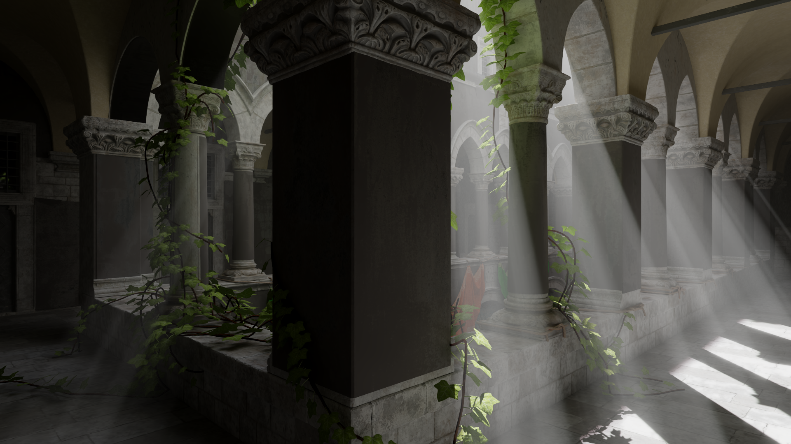

Physically based offline path tracer made in Vulkan with Ray Tracing Pipeline extension. It uses energy conserving BSDF with Diffuse, Dielectric, Metallic and Glass lobes + volumetric scattering. Renders can also be saved as png images.

# System Requirements
- Windows 10 with MSVC or Linux with GCC (Only debian 12 with GCC 12.2 is tested)
- Either NVIDIA RTX 2000+ series or AMD RX 6000+ series to support all of the extensions below. You may check whether they're present on your device [here](https://vulkan.gpuinfo.org/listdevices.php), maybe it's possible to run on some older hardware.
  - VK_KHR_ray_query
  - VK_KHR_acceleration_structure
  - VK_KHR_ray_tracing_pipeline
  - VK_KHR_swapchain
  - VK_KHR_deferred_host_operations

# Building
## Prerequisites
- [Vulkan SDK](https://vulkan.lunarg.com/sdk/home)
- [Cmake](https://cmake.org/) 3.5 or higher

## Windows
```
git clone --recursive https://github.com/Zydak/Vulkan-Path-Tracer
cd Vulkan-Path-Tracer
mkdir build
cd build
cmake .. -DCMAKE_POLICY_VERSION_MINIMUM=3.5
```
Then open generated Visual Studio solution and build.

## Linux
```
git clone --recursive https://github.com/Zydak/Vulkan-Path-Tracer
cd Vulkan-Path-Tracer
mkdir build
cd build
cmake .. -DCMAKE_POLICY_VERSION_MINIMUM=3.5
make
```
Executable will be in `build/Debug/VulkanPathTracer`.

# Features Overview

- BSDF with importance sampling
- Energy compensation implemented according to [Practical multiple scattering compensation for microfacet models](https://blog.selfshadow.com/publications/turquin/ms_comp_final.pdf).
- HDR Environment Maps with importance sampling
- NEE for environment map light
- Volumetric scattering with importance sampling implemented according to [Production Volume Rendering 2017](https://graphics.pixar.com/library/ProductionVolumeRendering/paper.pdf)
- Non uniform volumes imported from OpenVDB files.
- Henyey-Greenstein, Draine, and approximated MIE phase functions implemented according to [An Approximate Mie Scattering Function for Fog and Cloud Rendering](https://research.nvidia.com/labs/rtr/approximate-mie/).
- Multiple Importance Sampling implemented according to [Optimally Combining Sampling Techniques for Monte Carlo Rendering](https://www.cs.jhu.edu/~misha/ReadingSeminar/Papers/Veach95.pdf)
- Emissive Volumes with [temperature parametrization](https://tannerhelland.com/2012/09/18/convert-temperature-rgb-algorithm-code.html)
- Multiple Atmospheric Scattering [A Scalable and Production Ready Sky and Atmosphere Rendering Technique](https://sebh.github.io/publications/egsr2020.pdf)
- Optimized Cloud Scattering with techniques described in [The Design and Evolution of Disney’s Hyperion Renderer](https://media.disneyanimation.com/uploads/production/publication_asset/177/asset/a.pdf)
- Textures and Normal Maps
- Editor
  - Changing material and path tracing properties at runtime
  - Loading your own scenes in any format supported by [assimp](https://github.com/assimp/assimp/blob/master/doc/Fileformats.md)
  - Exporting renders into .PNG files
- Post Processing
  - Bloom
  - ACES tonemapping
- Anti Aliasing
- Depth of Field
- Russian roulette

# Gallery
<p align="center">


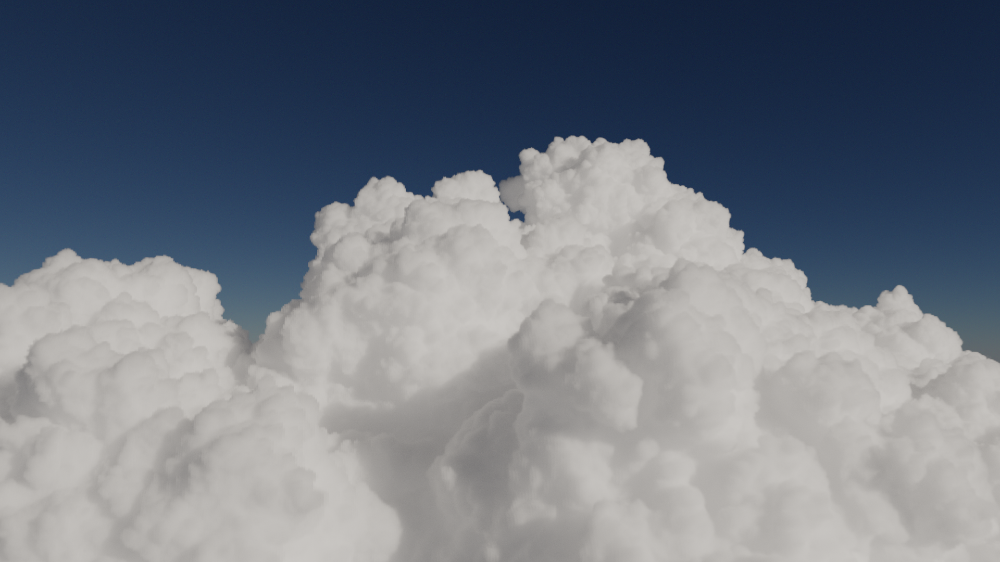
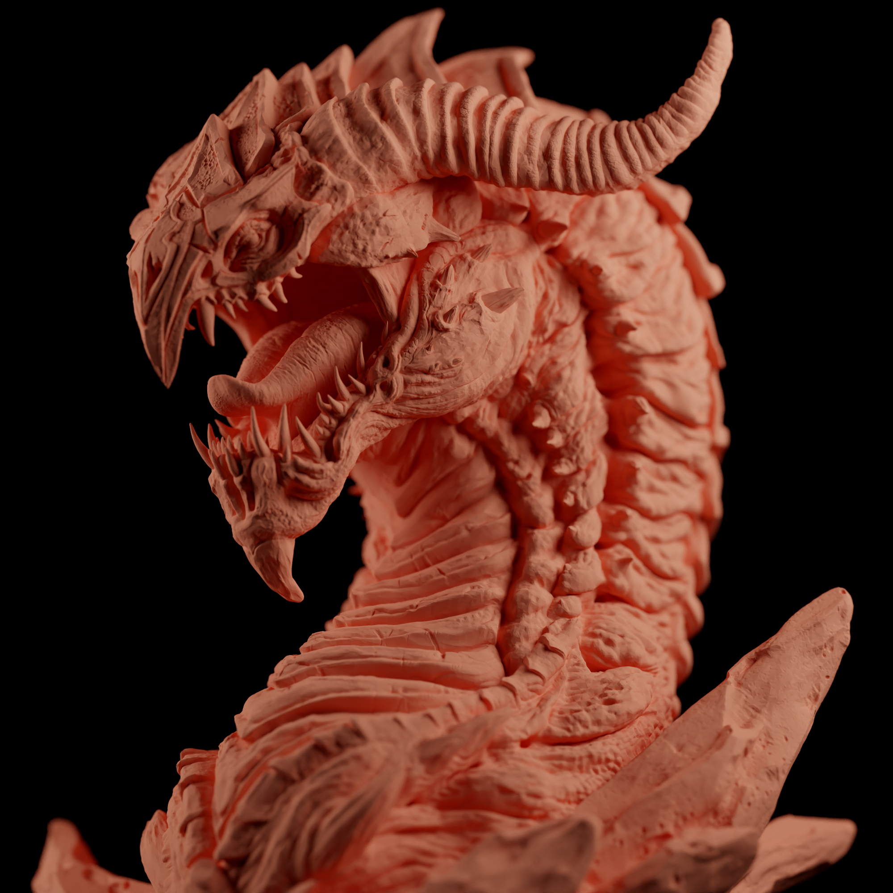

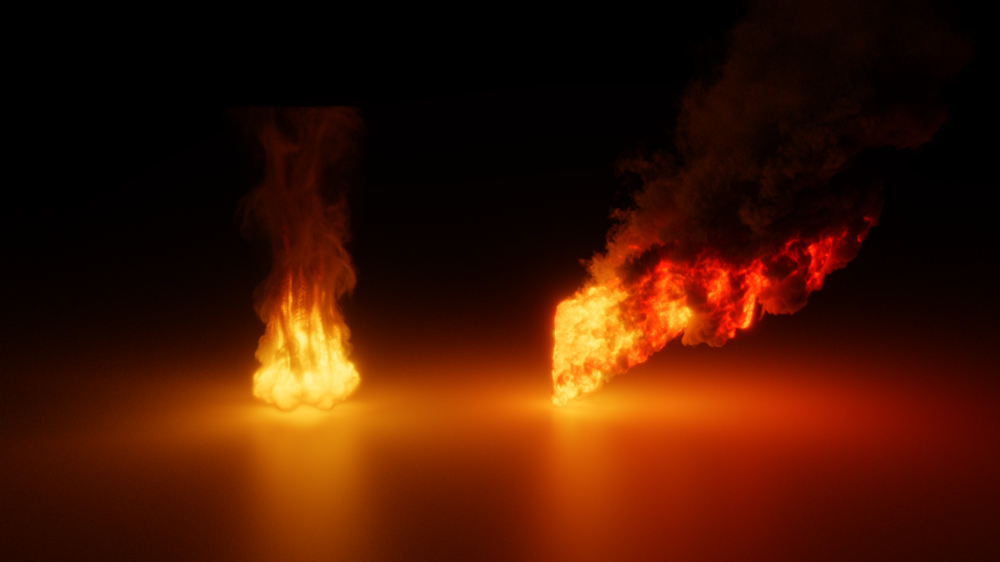
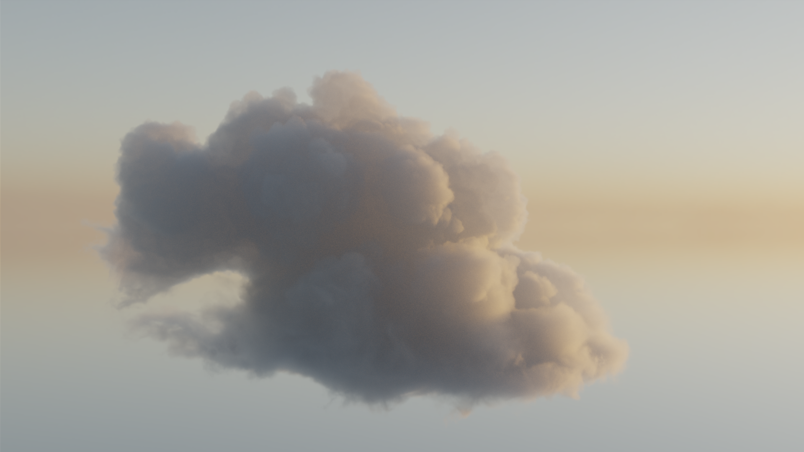


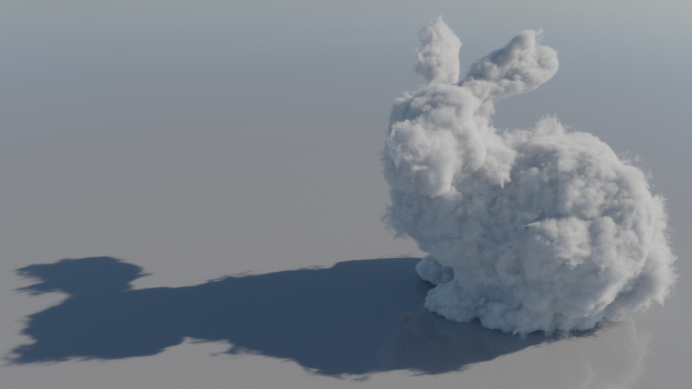
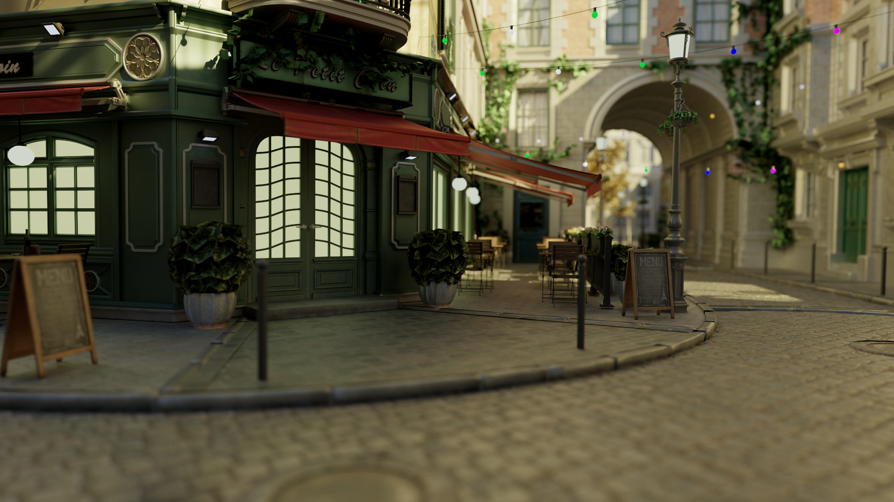
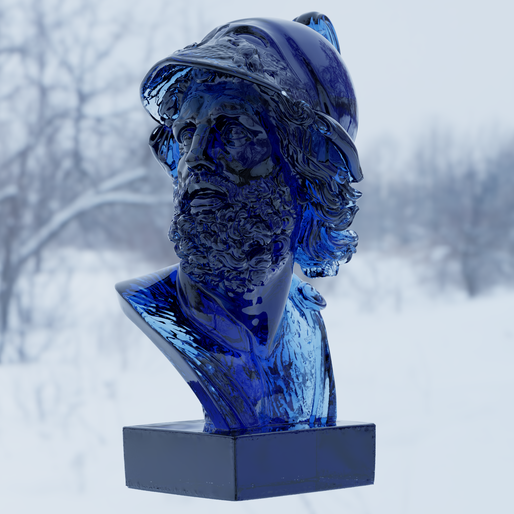
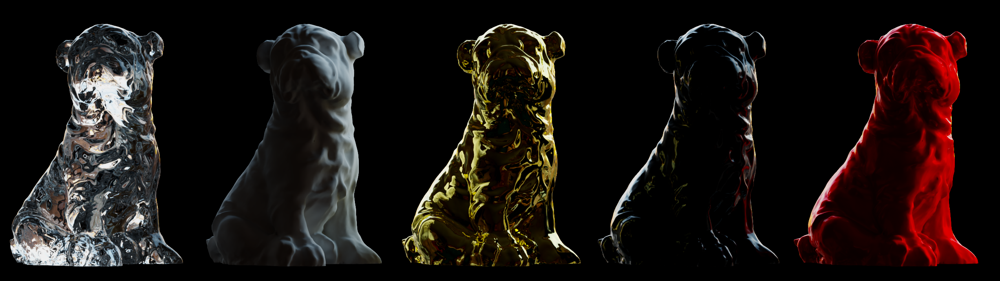


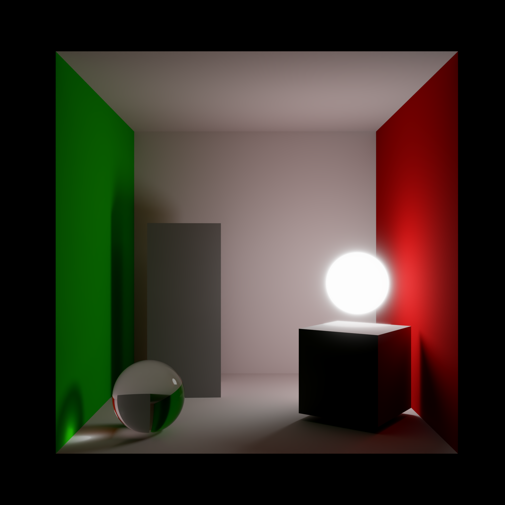

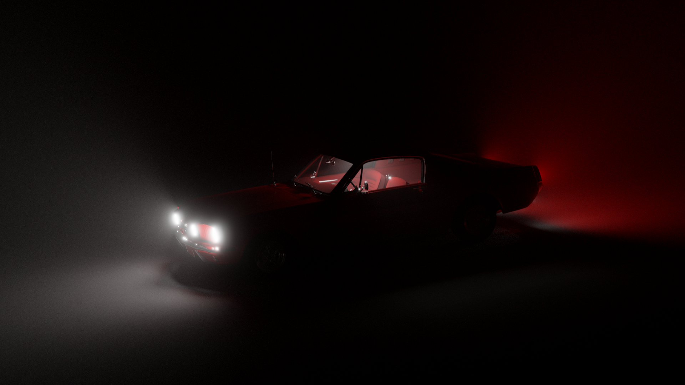
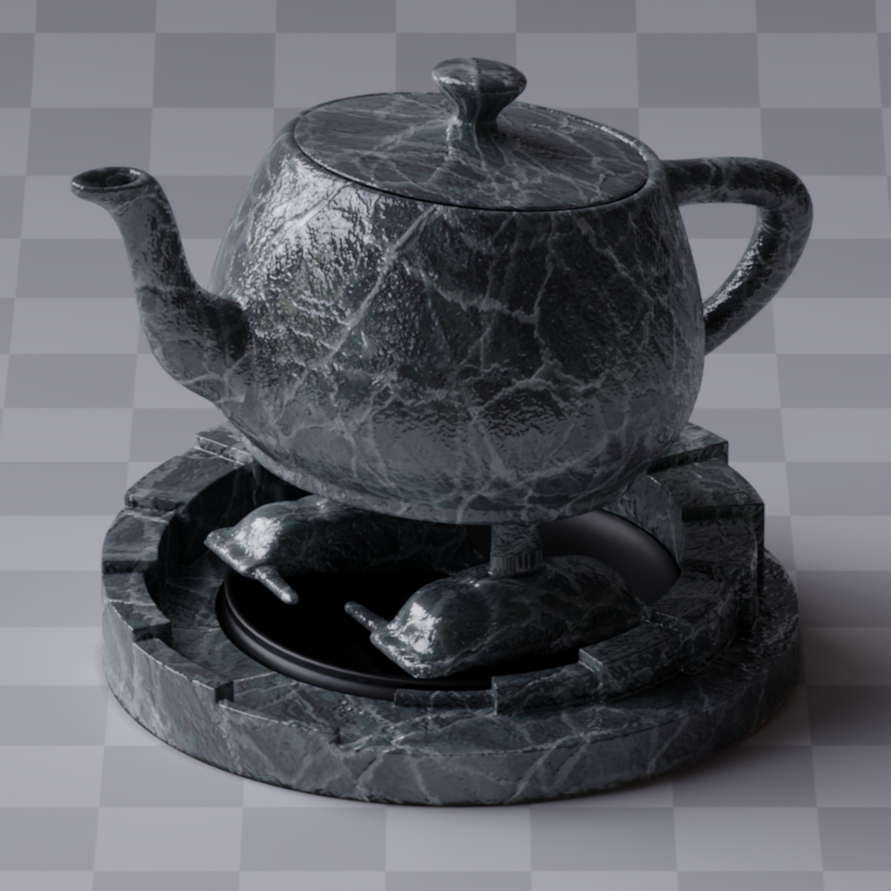
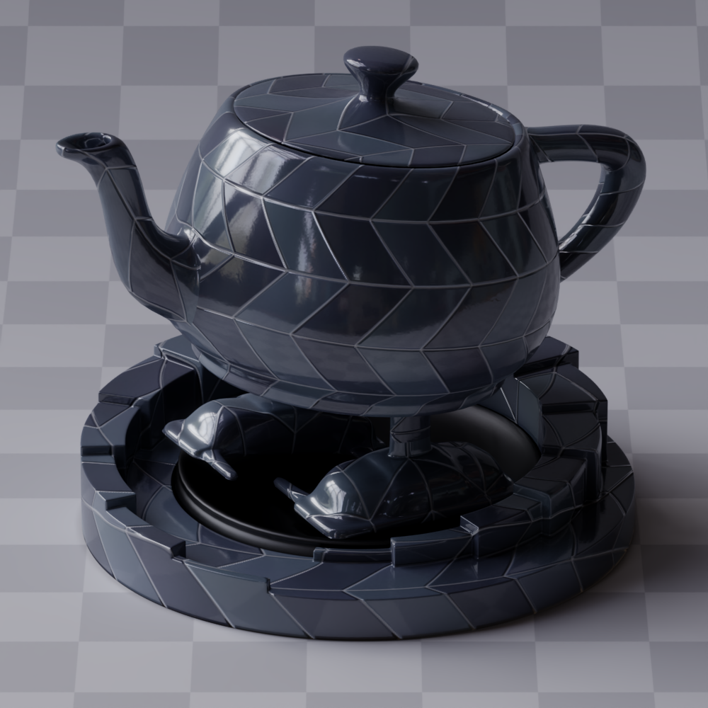
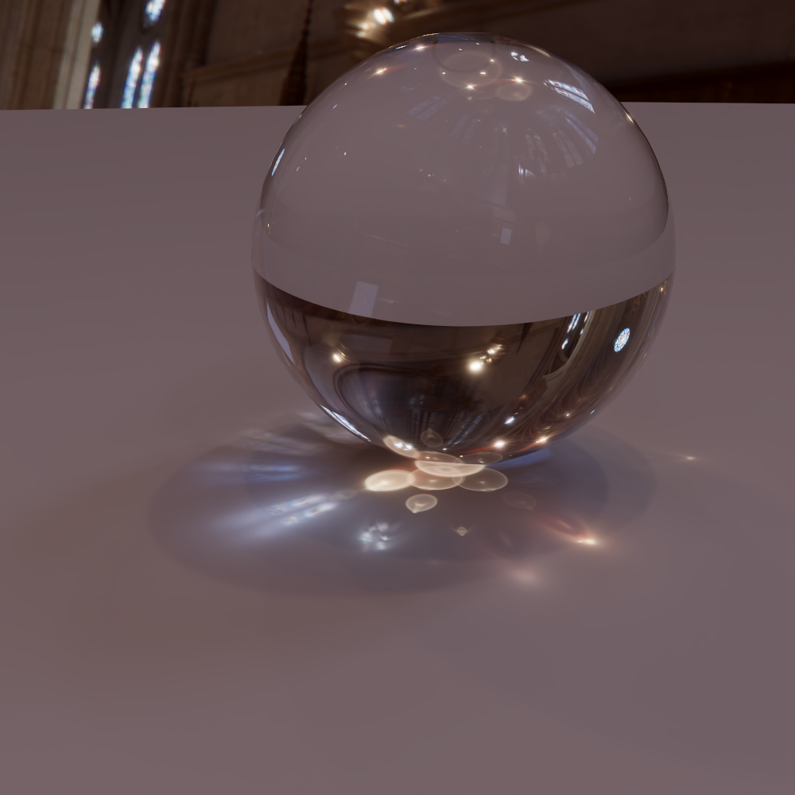

</p>


# References

## Papers Implemented
- [Sampling the GGX Distribution of Visible Normals](https://jcgt.org/published/0007/04/01/paper.pdf)
- [Microfacet Models for Refraction through Rough Surfaces](https://www.graphics.cornell.edu/~bjw/microfacetbsdf.pdf)
- [Importance Sampling Microfacet-Based BSDFs using the Distribution of Visible Normals](https://inria.hal.science/hal-00996995v2/document)
- [A Reflectance Model For Computer Graphics](https://dl.acm.org/doi/pdf/10.1145/357290.357293)
- [Practical multiple scattering compensation for microfacet models](https://blog.selfshadow.com/publications/turquin/ms_comp_final.pdf)
- [Production Volume Rendering 2017](https://graphics.pixar.com/library/ProductionVolumeRendering/paper.pdf)
- [Optimally Combining Sampling Techniques for Monte Carlo Rendering](https://www.cs.jhu.edu/~misha/ReadingSeminar/Papers/Veach95.pdf)
- [Scratch a pixel article on volumes](https://www.scratchapixel.com/lessons/mathematics-physics-for-computer-graphics/monte-carlo-methods-in-practice/monte-carlo-simulation.html)
- [An Approximate Mie Scattering Function for Fog and Cloud Rendering](https://research.nvidia.com/labs/rtr/approximate-mie/)
- [A Scalable and Production Ready Sky and Atmosphere Rendering Technique](https://sebh.github.io/publications/egsr2020.pdf)
- [The Design and Evolution of Disney’s Hyperion Renderer](https://media.disneyanimation.com/uploads/production/publication_asset/177/asset/a.pdf)

## Models
- https://developer.nvidia.com/orca/amazon-lumberyard-bistro - Bistro
- https://www.intel.com/content/www/us/en/developer/topic-technology/graphics-research/samples.html - Sponza
- https://sketchfab.com/3d-models/screaming-dragon-head-3d-print-5712b52618f743b193bdd39459099f25 - Screaming Dragon Head
- https://sketchfab.com/3d-models/dog-statue-49d97ca2fbf34f85b6c88ae8ebc7514f - Dog Statue
- https://github.com/mmacklin/tinsel - Ajax
- https://polyhaven.com/hdris - Env Maps
- https://benedikt-bitterli.me/resources/ - Dragon
- https://wirewheelsclub.com/models/1965-ford-mustang-fastback/ - Mustang
- https://renderman.pixar.com/official-swatch - RenderMan teapot
- https://www.cgbookcase.com/ - Textures for teapots
- https://casual-effects.com/g3d/data10/ - Breakfast Room
- https://luxcorerender.org/example-scenes/ - Cannele & Fromage
- https://disneyanimation.com/resources/clouds/ - Disney Cloud
- https://www.openvdb.org/download/ - Bunny Cloud
- https://jangafx.com/software/embergen/download/free-vdb-animations - Smoke Plume
- https://www.blackboxcolour.com/assets - Cloud pack
- https://samk9632.gumroad.com/l/Freebie-Cloud - Wispy Cloud by Samuel Krug
- https://drive.google.com/file/d/1ACBLnJBbmFzP07djNC1N15qnlqTGHmOM/view - Cloud by Samuel Krug
- https://drive.google.com/drive/folders/17RueIORCc-Na4zjszHbShv9MbV_RUeBo - Cloud Pack by Samuel Krug
