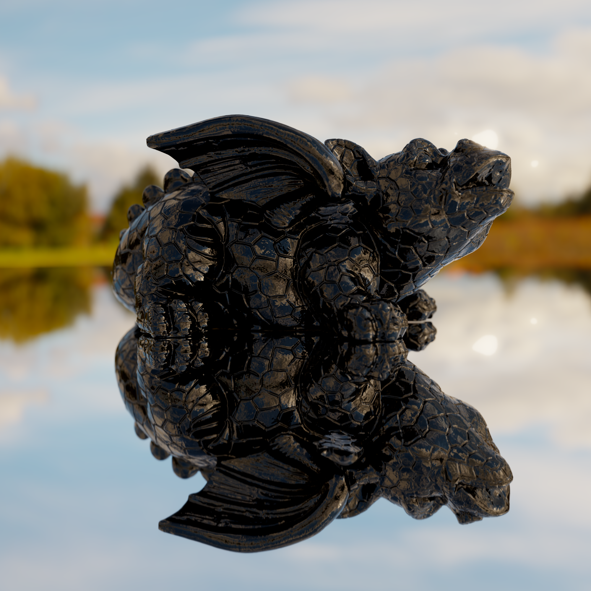
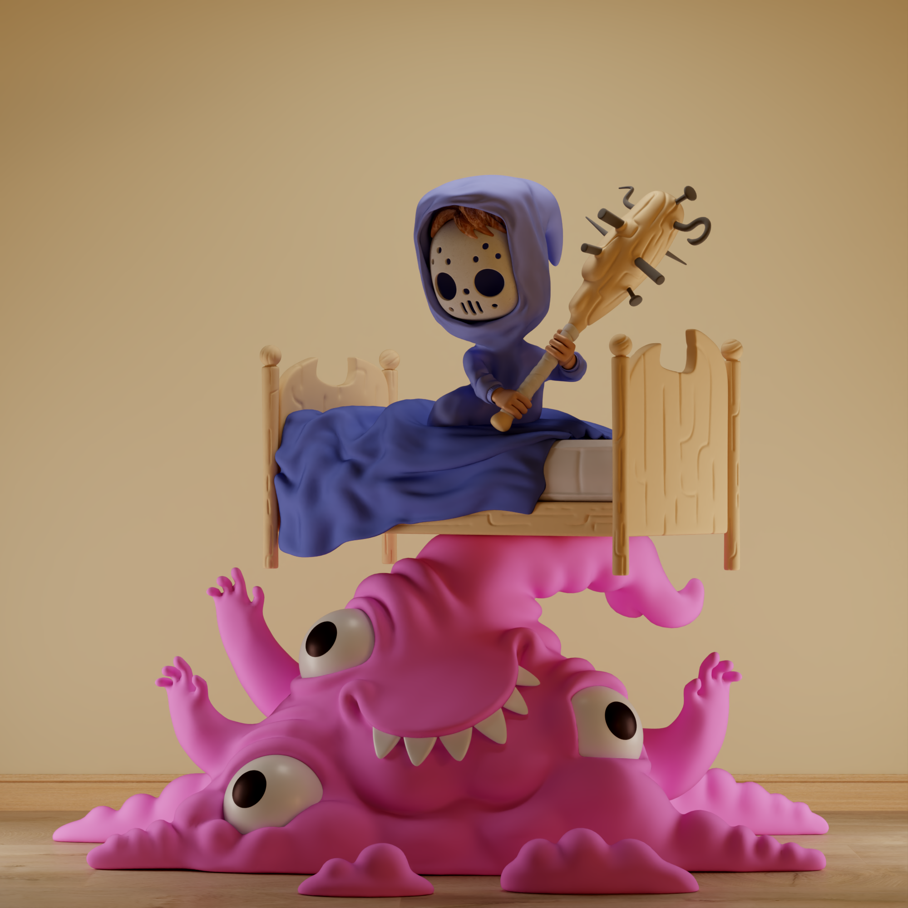
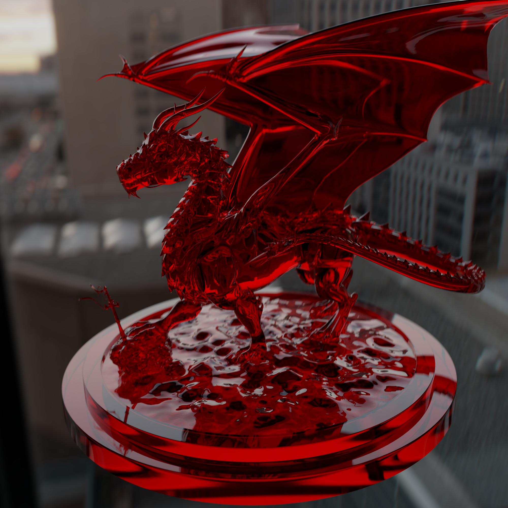
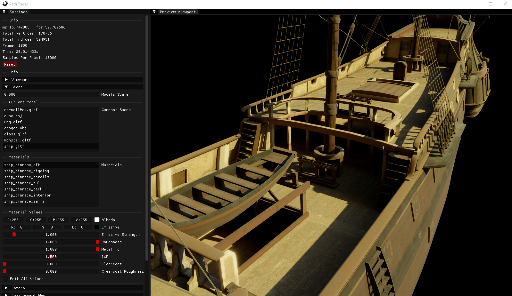

# Vulkan-Path-Tracer

Vulkan Path Tracer is an offline PBR renderer made using the Vulkan API, designed for simulating global illumination and complex lighting effects, featuring a lot of post-processing effects. Renders that you create can be easly saved to disk as PNG images.

# Gallery

# Features
- Complex Materials
  - Albedo, Metallic and Roughness Textures
  - Translucent materials with IOR
  - Clearcoat
  - Emissive Factor
- Editor
  - Loading your own scenes in .gltf and .obj format
  - Editing scene materials in runtime
- Exporting renders into .PNG files
- Shader reloading and caching
- HDR Environment Maps with importance sampling
- Post Processing
  - Bloom using Mip Maps
  - Exposure
  - Contrast
  - Brightness
  - Saturation
  - Vignette
  - Gamma
  - Temperature with Tint
  - Color Filter
  - Chromatic Aberration
  - 6 Tonemappers (Filmic, Hill Aces, Narkowicz Aces, Exposure Mapping, Uncharted 2, Reinchard Extended)
  - Ink Effect: Detects Edges, turns everything to black and white, applies blue noise and adds paper texture.
  - Posterize Effect: Quantizes Colors, Applies Dithering and adds ability to replace color pallet with your own colors or colors generated in OKLAB color space
- Physically Accurate BSDF
- GPU Path Tracing using Vulkan Ray Tracing Pipeline
  - Albedo, Glossy Reflections, Glass
  - Fireflies Elimination
- Anti Aliasing
- Depth of Field effect with automatic focal length
- Image Denoising using Nvidia Optix Denoiser
- Camera made using quaternions

# Building
## Windows Only :(

- Run `git clone https://github.com/Zydak/Vulkan-Path-Tracer --recursive`.
- Go to Releases and download Shaderc.zip
- Unzip and copy Shaderc libraries into `Vulture/lib/shaderc/`.
- Run `setup.bat` in main directory.
- Open generated solution in Visual Studio.

# Credits
## Resources
- https://nvpro-samples.github.io/vk_raytracing_tutorial_KHR/ - Introduction to Vulkan Ray Tracing Pipeline
- https://www.youtube.com/@Acerola_t - Post Processing Effects
- https://github.com/knightcrawler25/GLSL-PathTracer - Great Resource for BSDFs
- https://github.com/nvpro-samples/vk_denoise - Integrating Optix
- https://www.scratchapixel.com/ - Great Resources for learning math behind path tracing

## Models
- https://sketchfab.com/3d-models/dog-statue-49d97ca2fbf34f85b6c88ae8ebc7514f - Dog Statue
- https://pbrt.org/scenes-v3 - Glass & Small Dragon
- https://www.blender.org/download/demo-files/ - Monster
- https://polyhaven.com/hdris - Env Maps
- https://polyhaven.com/a/ship_pinnace - Ship
- https://benedikt-bitterli.me/resources/ - Dragon