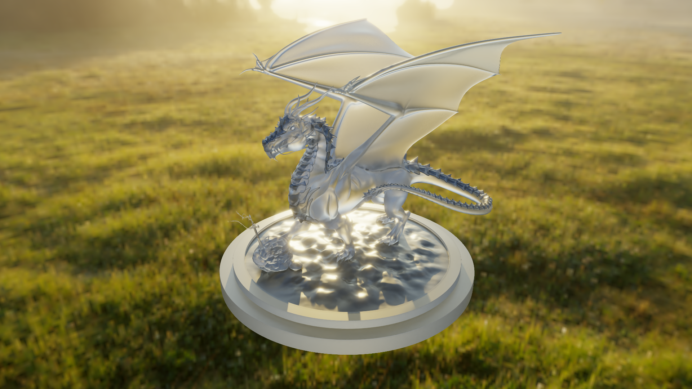

# Vulkan-Path-Tracer

Vulkan Path Tracer is an offline PBR renderer based on the Vulkan API, designed for simulating global illumination and complex lighting effects, featuring a lot of post-processing effects. Renders that you create can be easly saved to disk as PNG images.

# Gallery

