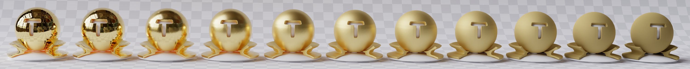
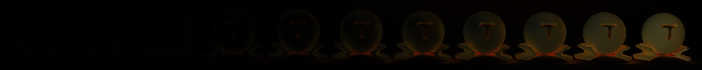
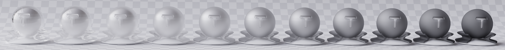
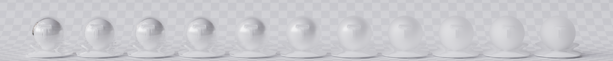
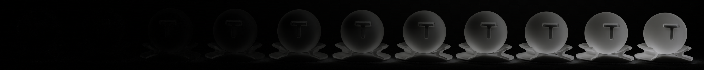
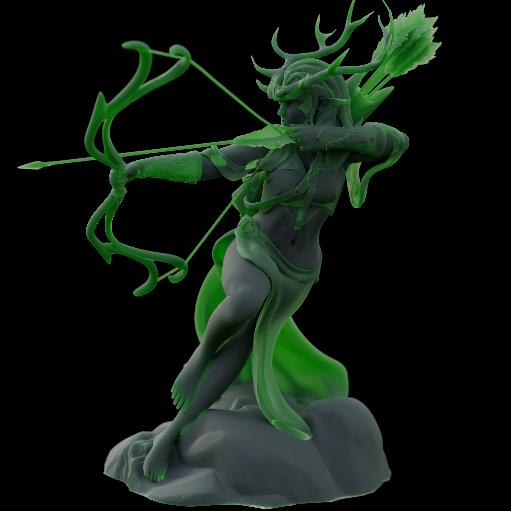
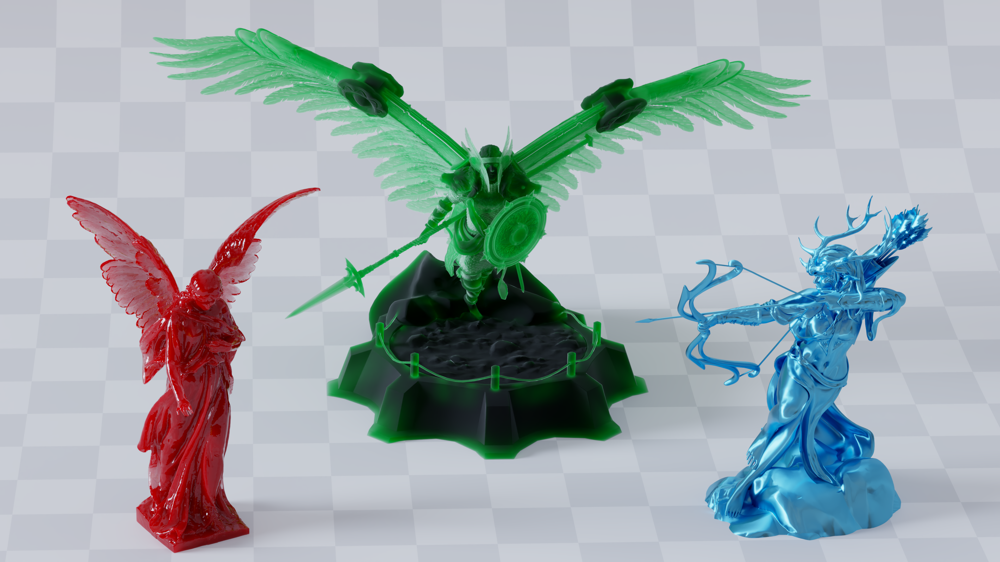
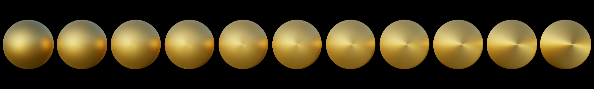
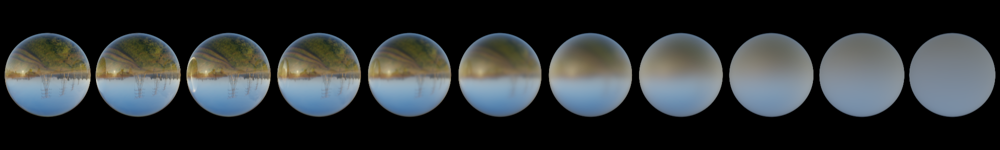

# Vulkan-Path-Tracer

Physically based offline path tracer made in Vulkan with Ray Tracing Pipeline extension. It uses energy conserving BSSRDF with Diffuse, Dielectric, Metallic and Glass lobes + volume scattering. Renders can be saved as png images. It also features post processing effects and a denoiser.

# System Requirements
- Windows 10 and newer.
- Either NVIDIA RTX 2000+ series or AMD RX 6000+ series to support all of the extensions below. You may check whether they're present on your device [here](https://vulkan.gpuinfo.org/listdevices.php), maybe it's possible to run on older hardware.
- - VK_KHR_ray_query,
- - VK_KHR_acceleration_structure,
- - VK_KHR_ray_tracing_pipeline,
- - VK_KHR_swapchain,
- - VK_KHR_deferred_host_operations,
- - VK_KHR_shader_clock,
- - VK_KHR_external_memory_win32,
- - VK_KHR_external_semaphore_win32,
- - VK_KHR_external_fence_win32,
- Visual Studio 2022 (older versions might work but aren't tested).

# Running
## Windows Only
- Download [Vulkan SDK](https://vulkan.lunarg.com/sdk/home#windows).
- Download [PathTracer.zip](https://github.com/Zydak/Vulkan-Path-Tracer/releases/download/Release-v1.0.0/PathTracer.zip) from [Releases](https://github.com/Zydak/Vulkan-Path-Tracer/releases).
- Unzip and run `PathTracer\PathTracer\PathTracer.exe`.

# Building
## Windows Only
- Download [Vulkan SDK](https://vulkan.lunarg.com/sdk/home#windows).
- Run `git clone https://github.com/Zydak/Vulkan-Path-Tracer --recursive`.
- Go to Releases and download [Shaderc.zip](https://github.com/Zydak/Vulkan-Path-Tracer/releases/download/Release-v1.0.0/Shaderc.zip)
- Unzip and copy Shaderc libraries into `Vulkan-Helper/lib/shaderc/`.
- Run `setup.bat` in main directory.
- Open generated solution in Visual Studio.

# Features
- Energy Conserving BSSRDF:

  
  

  Difference:
  

------------

  
  

  Difference:
  

- HDR Environment Maps
- Environment map MIS
- Complex Materials
- Volumetric Scattering
- Textures and Normal Maps
- Editor
  - Loading your own scenes in .gltf .fbx and .obj format
  - Editing scene materials in runtime
  - Exporting renders into .PNG files
  - Saving and loading scenes
- Post Processing
  - Bloom using Mip Maps
  - Chromatic Aberration
  - Exposure and many more
- Anti Aliasing
- Depth of Field effect with automatic focal length
- Image Denoising using Nvidia Optix Denoiser
- Camera controller made using quaternions

# Gallery

## Material Showcase

- Metallic factor ranging from 0 to 1. Determines whether the surface is metallic or dielectric.

- Roughness factor on metallic surface ranging from 0 to 1.

- Anisotropy factor on metallic surface with roughness 0.5 ranging from 0 to 1.

- Index of refraction (IOR) factor ranging from 1 to 3. Changes the strength of specular highlights on dielectric surfaces.

- Roughness factor on dielectric surface ranging from 0 to 1.

- Specular Tint factor on dielectric surface ranging from 0 to 1. Gradually Tints the specular highlights to the surface color.

- Transparency factor ranging from 0 to 1. Determines whether the material is able to refract light rays or not.

- Roughness factor on transparent surface ranging from 0 to 1.

- Index of refraction (IOR) factor on transparent surface ranging from 1 to 2. Determines how much the path of light is bent during refraction.

# References

## Papers Implemented
- [Sampling the GGX Distribution of Visible Normals](https://jcgt.org/published/0007/04/01/paper.pdf)
- [Microfacet Models for Refraction through Rough Surfaces](https://www.graphics.cornell.edu/~bjw/microfacetbsdf.pdf)
- [Importance Sampling Microfacet-Based BSDFs using the Distribution of Visible Normals](https://inria.hal.science/hal-00996995v2/document)
- [A Reflectance Model For Computer Graphics](https://dl.acm.org/doi/pdf/10.1145/357290.357293)
- [Practical multiple scattering compensation for microfacet models](https://blog.selfshadow.com/publications/turquin/ms_comp_final.pdf)

## Models
- https://developer.nvidia.com/orca/amazon-lumberyard-bistro - Bistro
- https://sketchfab.com/3d-models/elven-ranger-statue-71aec2d9f7724ae09992435ce8ff7258 - Archer
- https://www.intel.com/content/www/us/en/developer/topic-technology/graphics-research/samples.html - Sponza
- https://www.blender.org/download/demo-files/ - Classroom
- https://sketchfab.com/3d-models/screaming-dragon-head-3d-print-5712b52618f743b193bdd39459099f25 - Screaming Dragon Head
- https://sketchfab.com/3d-models/dog-statue-49d97ca2fbf34f85b6c88ae8ebc7514f - Dog Statue
- https://github.com/mmacklin/tinsel - Ajax
- https://pbrt.org/scenes-v3 - Small Dragon
- https://pbrt.org/scenes-v3 - Coffee Cup
- https://www.blender.org/download/demo-files/ - Monster
- https://polyhaven.com/hdris - Env Maps
- https://polyhaven.com/a/ship_pinnace - Ship
- https://benedikt-bitterli.me/resources/ - Dragon
- https://wirewheelsclub.com/models/1965-ford-mustang-fastback/ - Mustang
- https://renderman.pixar.com/official-swatch - RenderMan teapot
- https://www.cgbookcase.com/ - Textures for teapots
- https://benedikt-bitterli.me/resources/ - Material Test Ball
- https://sketchfab.com/3d-models/cemetery-angel-miller-3b7e4e4a84f94f0d876e21e853eb8db8 - Angel
- https://sketchfab.com/3d-models/norse-valkyrie-a4b4ab11feb24b979fcd81013096fe63 - Valkyrie