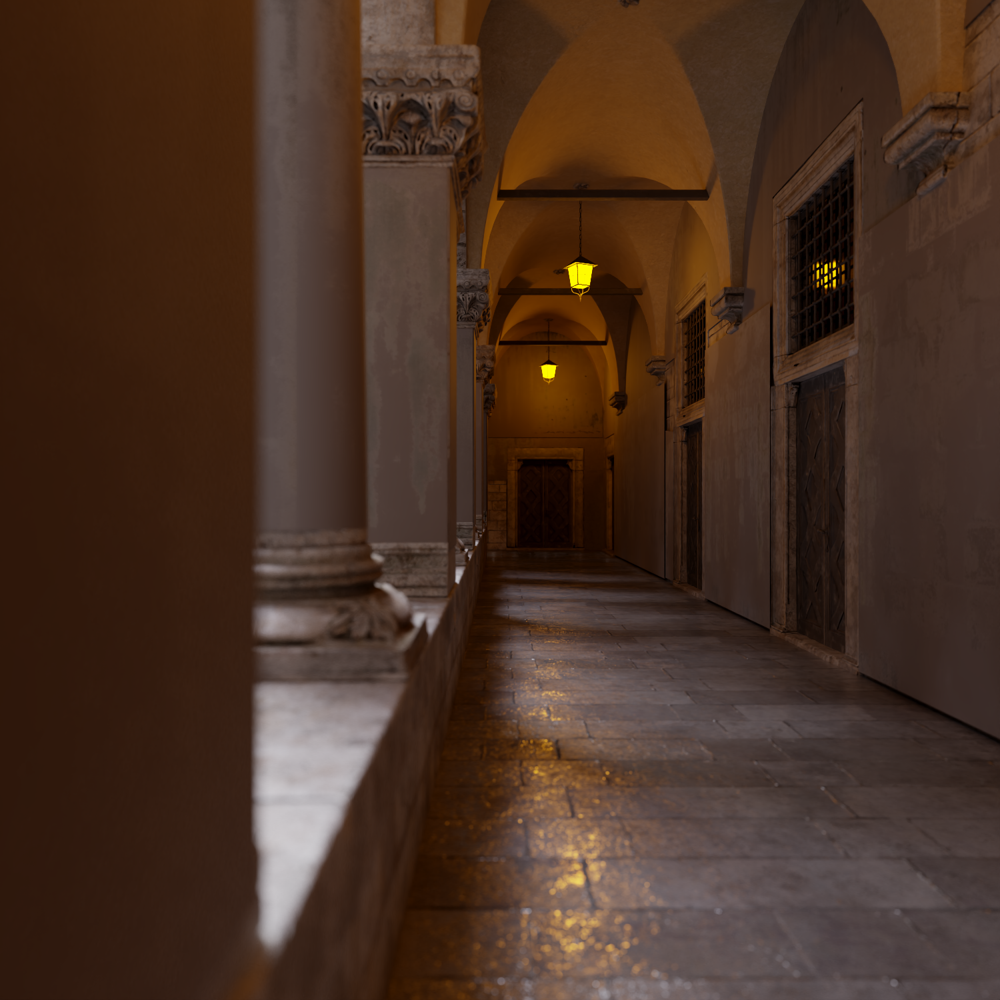
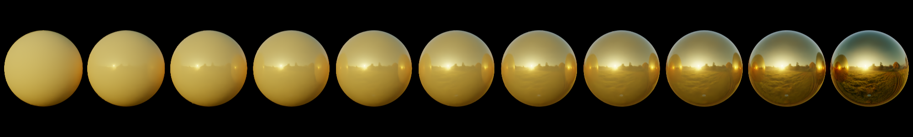
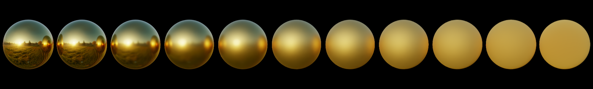
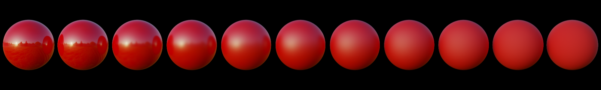
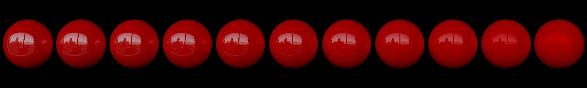
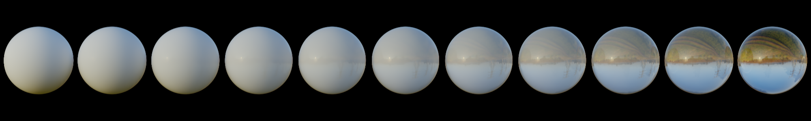
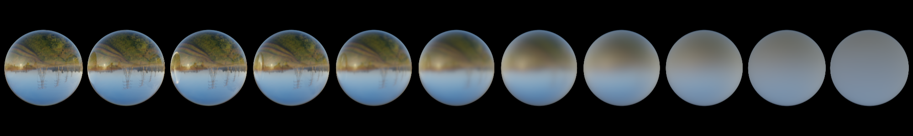

# Vulkan-Path-Tracer

Vulkan Path Tracer is a simple offline renderer made from scratch in Vulkan using my framework [Vulture](https://github.com/Zydak/Vulture). For ray tracing it utilizes Vulkan Ray-Tracing Pipeline. It uses a simple energy conserving BSDF (more on that in [Technical Overview](https://github.com/Zydak/Vulkan-Path-Tracer/blob/main/TechnicalOverview.md)) with Diffuse, Dielectric, Metallic and Glass lobes. Renders that you create can be easily saved as .png images. It also features a post processing graph that allows you to create your own combination of post processing effects and apply them to your renders.

# Gallery

--------

--------

--------

--------

--------

--------

--------

--------

--------

## Material Showcase

- Metallic factor ranging from 0 to 1. Determines whether the surface is metallic or dielectric.

- Roughness factor on metallic surface ranging from 0 to 1.

- Specular Strength factor ranging from 0 to 1. Changes the strength of specular highlights on dielectric surfaces.

- Roughness factor on dielectric surface ranging from 0 to 1.

- Specular Tint factor on dielectric surface ranging from 0 to 1. Gradually Tints the specular highlights to the surface color.

- Transparency factor ranging from 0 to 1. Determines whether the material is able to refract light rays or not.

- Roughness factor on glass surface ranging from 0 to 1.

- Index of refraction (IOR) factor on glass surface ranging from 1 to 2. Determines how much the path of light is bent during refraction.

# List Of Features
- Energy Conserving BSDF
- Complex Materials
  - Diffuse, Metallic and Roughness Textures
  - Transparent materials with IOR
  - Emissive Objects
- Editor
  - Loading your own scenes in .gltf .fbx and .obj format
  - Editing scene materials in runtime
- Exporting renders into .PNG files
- Shader hot reloading and caching
- HDR Environment Maps
- Post Processing
  - Bloom using Mip Maps
  - Exposure
  - Contrast
  - Brightness
  - Saturation
  - Vignette
  - Gamma
  - Temperature with Tint
  - Color Filter
  - Chromatic Aberration
  - 6 Tonemappers (Filmic, Hill Aces, Narkowicz Aces, Exposure Mapping, Uncharted 2, Reinchard Extended)
  - Ink Effect: Detects Edges, turns everything to black and white, applies blue noise and adds paper texture.
  - Posterize Effect: Quantizes Colors, Applies Dithering and adds ability to replace color pallet with your own colors or colors generated in OKLAB color space
- Anti Aliasing
- Depth of Field effect with automatic focal length
- Image Denoising using Nvidia Optix Denoiser
- Camera controller made using quaternions

# Running
- Download [Vulkan SDK](https://vulkan.lunarg.com/sdk/home#windows).
- Download [PathTracer.zip](https://github.com/Zydak/Vulkan-Path-Tracer/releases/download/Release-v1.0.0-alpha/PathTracer.zip) from Releases.
- Unzip and run `PathTracer/PathTracer/PathTracer.exe`.

# Building
## Windows Only
- Download [Vulkan SDK](https://vulkan.lunarg.com/sdk/home#windows).
- Run `git clone https://github.com/Zydak/Vulkan-Path-Tracer --recursive`.
- Go to Releases and download [Shaderc.zip](https://github.com/Zydak/Vulkan-Path-Tracer/releases/download/Release/Shaderc.zip)
- Unzip and copy Shaderc libraries into `Vulture/lib/shaderc/`.
- Run `setup.bat` in main directory.
- Open generated solution in Visual Studio.

# Credits
## Models
- https://sketchfab.com/3d-models/dog-statue-49d97ca2fbf34f85b6c88ae8ebc7514f - Dog Statue
- https://pbrt.org/scenes-v3 - Glass & Small Dragon
- https://www.blender.org/download/demo-files/ - Monster
- https://polyhaven.com/hdris - Env Maps
- https://polyhaven.com/a/ship_pinnace - Ship
- https://benedikt-bitterli.me/resources/ - Dragon
- https://sketchfab.com/3d-models/sponza-0cbee5e07f3a4fae95be8b3a036abc91 - Sponza
