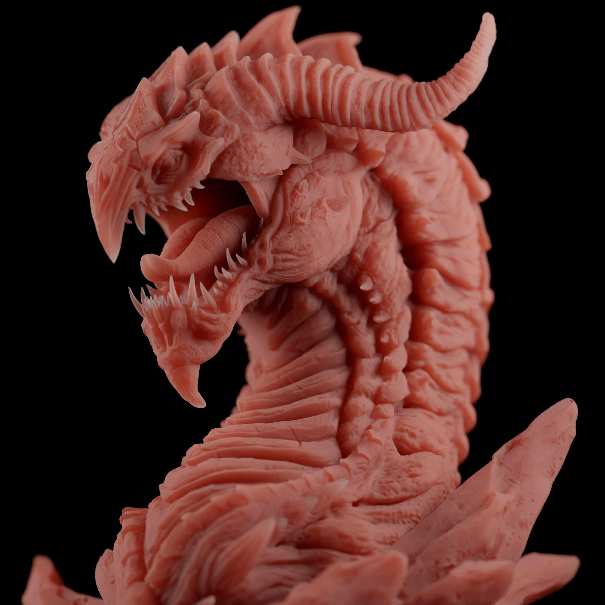

# Vulkan-Path-Tracer

Physically based path tracer made from scratch in Vulkan using my framework [Vulture](https://github.com/Zydak/Vulture). For ray tracing it utilizes Vulkan Ray-Tracing Pipeline. It uses a simple energy conserving BSDF (more on that in [Technical Overview](https://github.com/Zydak/Vulkan-Path-Tracer/blob/main/TechnicalOverview.md)) with Diffuse, Dielectric, Metallic and Glass lobes. Renders that you create can be easily saved as .png images. It also features a lot of post processing effects like bloom, tonemapping, and many more. It also uses Optix Denoiser for denoising.

For more info on the project visit [Technical Overview](https://github.com/Zydak/Vulkan-Path-Tracer/blob/main/TechnicalOverview.md).

# Running
## Windows Only
- Download [Vulkan SDK](https://vulkan.lunarg.com/sdk/home#windows).
- Download [PathTracer.zip](https://github.com/Zydak/Vulkan-Path-Tracer/releases/download/Release-v1.0.0-alpha/PathTracer.zip) from Releases.
- Unzip and run `PathTracer/PathTracer/PathTracer.exe`.

# Building
## Windows Only
- Download [Vulkan SDK](https://vulkan.lunarg.com/sdk/home#windows).
- Run `git clone https://github.com/Zydak/Vulkan-Path-Tracer --recursive`.
- Go to Releases and download [Shaderc.zip](https://github.com/Zydak/Vulkan-Path-Tracer/releases/download/Release/Shaderc.zip)
- Unzip and copy Shaderc libraries into `Vulture/lib/shaderc/`.
- Run `setup.bat` in main directory.
- Open generated solution in Visual Studio.

# Gallery

--------

--------

--------

--------

--------

--------

--------

--------

--------

--------

## Material Showcase

- Metallic factor ranging from 0 to 1. Determines whether the surface is metallic or dielectric.

- Roughness factor on metallic surface ranging from 0 to 1.

- Anisotropy factor on metallic surface with roughness 0.5 ranging from 0 to 1.

- Index of refraction (IOR) factor ranging from 0 to 1. Changes the strength of specular highlights on dielectric surfaces.

- Roughness factor on dielectric surface ranging from 0 to 1.

- Specular Tint factor on dielectric surface ranging from 0 to 1. Gradually Tints the specular highlights to the surface color.

- Transparency factor ranging from 0 to 1. Determines whether the material is able to refract light rays or not.

- Roughness factor on transparent surface ranging from 0 to 1.

- Index of refraction (IOR) factor on transparent surface ranging from 1 to 2. Determines how much the path of light is bent during refraction.

# List Of Features
- Energy Conserving BSSRDF.

  
  

- HDR Environment Maps
- Environment map MIS
- Complex Materials
- Volumetric Scattering using delta tracking
- Textures and Normal Maps
- Editor
  - Loading your own scenes in .gltf .fbx and .obj format
  - Editing scene materials in runtime
  - Exporting renders into .PNG files
  - Saving and loading scenes
- Shader hot reloading and caching
- Post Processing
  - Bloom using Mip Maps
  - Exposure
  - Contrast
  - Brightness
  - Saturation
  - Vignette
  - Gamma
  - Temperature with Tint
  - Color Filter
  - Chromatic Aberration
  - 6 Tonemappers (Filmic, Hill Aces, Narkowicz Aces, Exposure Mapping, Uncharted 2, Reinchard Extended)
- Anti Aliasing
- Depth of Field effect with automatic focal length
- Image Denoising using Nvidia Optix Denoiser
- Camera controller made using quaternions

# References

## Papers Implemented
- [Sampling the GGX Distribution of Visible Normals](https://jcgt.org/published/0007/04/01/paper.pdf)
- [Microfacet Models for Refraction through Rough Surfaces](https://www.graphics.cornell.edu/~bjw/microfacetbsdf.pdf)
- [Importance Sampling Microfacet-Based BSDFs using the Distribution of Visible Normals](https://inria.hal.science/hal-00996995v2/document)
- [A Reflectance Model For Computer Graphics](https://dl.acm.org/doi/pdf/10.1145/357290.357293)
- [Practical multiple scattering compensation for microfacet models](https://blog.selfshadow.com/publications/turquin/ms_comp_final.pdf)

## Models
- https://developer.nvidia.com/orca/amazon-lumberyard-bistro - Bistro
- https://www.intel.com/content/www/us/en/developer/topic-technology/graphics-research/samples.html - Sponza
- https://www.blender.org/download/demo-files/ - Classroom
- https://sketchfab.com/3d-models/screaming-dragon-head-3d-print-5712b52618f743b193bdd39459099f25 - Screaming Dragon Head
- https://sketchfab.com/3d-models/dog-statue-49d97ca2fbf34f85b6c88ae8ebc7514f - Dog Statue
- https://github.com/mmacklin/tinsel - Ajax
- https://pbrt.org/scenes-v3 - Small Dragon
- https://pbrt.org/scenes-v3 - Coffee Cup
- https://www.blender.org/download/demo-files/ - Monster
- https://polyhaven.com/hdris - Env Maps
- https://polyhaven.com/a/ship_pinnace - Ship
- https://benedikt-bitterli.me/resources/ - Dragon
- https://wirewheelsclub.com/models/1965-ford-mustang-fastback/ - Mustang
- https://renderman.pixar.com/official-swatch - RenderMan teapot
- https://www.cgbookcase.com/ - Textures for teapots
- https://benedikt-bitterli.me/resources/ - Material Test Ball