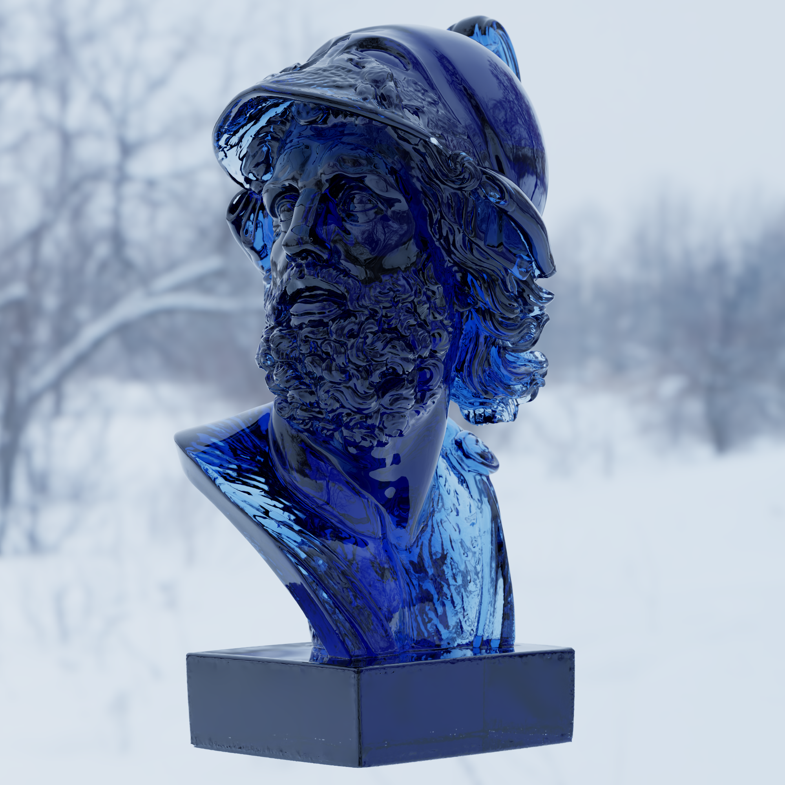
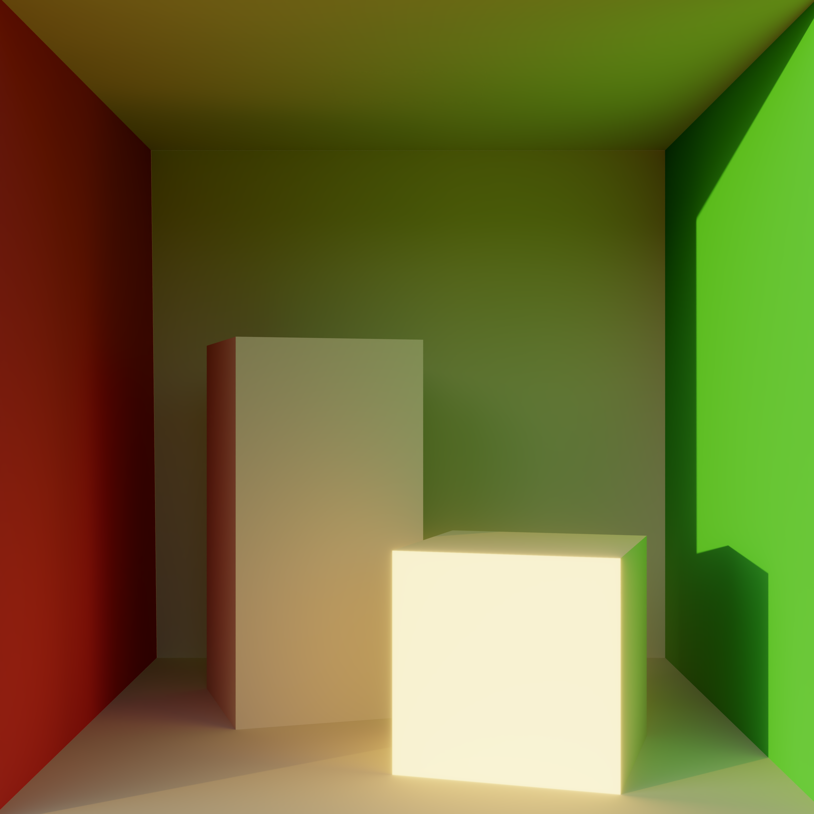

# Vulkan-Path-Tracer


Physically based offline path tracer made in Vulkan with Ray Tracing Pipeline extension. It uses energy conserving BSDF with Diffuse, Dielectric, Metallic and Glass lobes + volume scattering. Renders can also be saved as png images.

# System Requirements
- [TODO]
- Either NVIDIA RTX 2000+ series or AMD RX 6000+ series to support all of the extensions below. You may check whether they're present on your device [here](https://vulkan.gpuinfo.org/listdevices.php), maybe it's possible to run on older hardware.
  - VK_KHR_ray_query
  - VK_KHR_acceleration_structure
  - VK_KHR_ray_tracing_pipeline
  - VK_KHR_swapchain
  - VK_KHR_deferred_host_operations
- Visual Studio 2022 (older versions might work but aren't tested).

# Running
[TODO]

# Building
[TODO]

# Features Overview

- BSDF with MIS
- Energy compensation implemented according to [[Turquin 2018]](https://blog.selfshadow.com/publications/turquin/ms_comp_final.pdf) paper.
- HDR Environment Maps
- Importance sampling Environment map
- Textures and Normal Maps
- Editor
  - Changing material and path tracing properties at runtime
  - Loading your own scenes in any format supported by [assimp](https://github.com/assimp/assimp/blob/master/doc/Fileformats.md)
  - Exporting renders into .PNG files
- Post Processing
  - Bloom using Mip Maps
  - ACES tonemapping
- Anti Aliasing
- Depth of Field
- Volumetric scattering with MIS
- Russian roulette

# Gallery







# In Depth Project Overview

**Disclaimer**: This section describes my specific implementation choices and approach to path tracing. I'll be going over the entire project in depth. Starting from file structure and gradually explaining each feature. The mathematical formulations and techniques described here represent my interpretation and implementation of various published papers and methods. But for authoritative and complete information, please refer to the original papers cited throughout this readme.

## Code Structure
This path tracer is built on [VulkanHelper](https://github.com/Zydak/VulkanHelper), my vulkan abstraction to get rid of the explicitness but keep the performance and features of vulkan. I use it for all my projects to minimize the boilerplate code.

The project is split into 5 main components:
- Application
- Editor
- Path Tracer
- Post Processor
- Shaders

<p align="center">
  
</p>

Application is simple, it creates window and vulkan instance, and then delegates the rendering into the Editor component.

Editor manages the UI rendering as well as path tracer and post processor components. It retrieves the user input through the UI and feeds it into the path tracer and post processor to modify their behaviour.

Path tracer is an isolated component, it has no knowledge of the editor. The data to it is passed by get/set functions. This way the communication happens through these small defined channels so there is no coupling between the two, the editor can be easily swapped out. The component itself manages the path tracing, as an input it takes scene filepath and spits out path traced image as an output. It creates and manages all resources needed for path tracing (materials, cameras, mesh buffers). The only way to interact with it (apart from previously mentioned get/set functions) is calling `PathTrace()` which will schedule the work on the GPU.

Post processor also is an isolated component, it has no knowledge of the editor. As an input it takes HDR image and as output it gives post processed LDR image. The only way to interact with it is a set of get/set functions and `PostProcess()` function which does the actual post processing. Right now it doesn't do much, there's just bloom, exposure, gamma and ACES tonemapping.

Shaders are where all actual work happens. For a shading language I chose Slang since it has good compatibility with Vulkan and is generally nice to work with. The structure here is your classic RT pipeline in any API with the main 3 shaders dictating the code flow:

- `RayGen.slang` - Entry point shader that generates primary rays from camera and orchestrates the path tracing loop. It handles 2 types of intersections, geometry intersections, and AABB volume intersections. When the geometry is intersected the `ClosestHit.slang` shader is called. When AABB volume intersection is detected, it uses `Volume.slang` functionality to handle the scattering inside the volume.
- `ClosestHit.slang` - Handles surface shading, nested volumes (volumes inside meshes), and scattering direction from surface.
- `Miss.slang` & `MissShadow.slang` - Handle rays that miss geometry, mostly just samples the environment map.

Then there are Helper classes:

- `Material.slang` - Encapsulation of the material properties. Implementation of the BSDF.
- `Surface.slang` - Encapsulation of the surface data. All calculations tied to the geometry (normals and texture coords).
- `Volume.slang` - Encapsulation of AABB volumes.
- `Sampler.slang` - Sampling functions and random number generation.

and some utilities that don't really fit anywhere in particular:
- `RTCommon.slang` - Shared data structures and common ray tracing utilities that are shared across files.
- `Defines.slang` - Shader preprocessor definitions and constants.

Then there's also Lookup Table Calculator but it could really be a separate application altogether, it isn't really tied to anything and nothing is really tied to it. So I'll go over it in the [Energy Compensation](#energy-compensation) section.

## Ray Tracing Pipeline
The acceleration structure for ray tracing as well as all mesh intersection tests are handled through the Vulkan RT pipeline, and that part of the code is handled by [VulkanHelper](https://github.com/Zydak/VulkanHelper). I decided to use Vulkan RT pipeline for the simplicity and performance. It allows for utilizing RT cores on the newer GPUs so it's a lot faster than doing everything in compute. And of course you don't have to set up your own acceleration structure so it's way simpler. Although I wonder if using ray queries inside a compute shader would be faster or slower. I never got to test that out. The only thing that's worth noting here is that I do loop based approach for generating rays instead of recursion (I don't spawn new rays from hit shader), I found it around 2x-3x faster. I guess the GPU doesn't like recursion. Also with loop based approach there's no depth limit. Last time I checked vulkan only guarantees that the recursion limit is at least 1, anything above that varies per GPU.

## BSDF
Materials use a principled BSDF (Bidirectional Scattering Distribution Function), which means that there is no material type per se. You edit the material property values (like metallic) and the lobes are blended between for you. So to put it into words nicely: it's a **multi-lobe BSDF with scalar-weighted blending**. This approach is useful because it allows for a lot of artistic control. I can also really easily import materials from different file formats like glTF or OBJ, so that I don't have to roll my own format.

Currently supported material properties are:
- Base Color
- Emissive Color
- Specular Color
- Metallic
- Roughness
- IOR
- Transmission
- Anisotropy
- Anisotropy Rotation
- Base Color Texture
- Normal Texture
- Metallic Texture
- Roughness Texture
- Emissive Texture

### Code conventions
Each path tracer has slightly different notation and assumptions when it comes to the directions. A popular notation is $\omega_o$ for direction from a given point to a viewing point, and $\omega_i$ for the direction from a given point to the light source. But this is a backward path tracer (it traces rays from camera to the scene), so saying that incoming direction ($\omega_i$) is the direction we're actually going in seemed confusing to me. So in my code, the **incoming direction** (from a point on surface to view point) is denoted as $\mathbf{V}$ (for view), and **outgoing direction** (from a point on surface to a light source) is denoted as $\mathbf{L}$ (for light), the same notation is used throughout this readme. Also please note all calculations in code on material data inside `Material.slang` are done in **tangent space**, not world space. I chose this for performance reasons, in tangent space there's no need for calculating the cosine of the angle between vector and surface normal. You can get it right away with $\hat{v}_z$.

### Microsurface

I wanted the path tracer to be physically based, so I use microfacet theory to simulate surface scattering. When a ray hits the surface, the microsurface $\mathbf{H}$ is sampled according to the VNDF for GGX. Sampling implementation follows the method described in [Sampling the GGX Distribution of Visible Normals](https://jcgt.org/published/0007/04/01/paper.pdf).

$$
\text{VNDF} = \frac{G_1(\mathbf{V}) \cdot \text{max}(0, \mathbf{V} \cdot \mathbf{H})\cdot D}{\mathbf{V} \cdot \mathbf{N}}
$$

### Lobes
I split materials into 3 different types
- Metallic
- Dielectric
- Glass

When a ray hits the surface, one of these 3 types is sampled stochastically based on their sampling weights $w_{\text{metallic}}$, $w_{\text{dielectric}}$, $w_{\text{glass}}$. These weights are chosen more or less arbitrarily and then are normalized so that they sum up to 1.

A direction is then sampled from the selected type to determine the outgoing direction $\mathbf{L}$, and the BSDF is evaluated to determine how much radiance is reflected or refracted towards $\mathbf{V}$ from $\mathbf{L}$.

### Sampling
The BSDF is divided into two parts, sampling the direction (`SampleBSDF(V, H, F)`) and evaluation of that direction (`EvaluateBSDF(V, H, L, F)`). First let's focus on sampling the outgoing direction.

#### Metallic
The sampling weight is simple here: $w_\text{metallic} = metallic$.
The outgoing direction $\mathbf{L}$ can be computed as

$$
\mathbf{L} = \text{reflect}(-\mathbf{V}, \mathbf{H})
$$

Note that it is possible for $\mathbf{L}$ to go below the surface. In that case I discard the sample. That leads to an energy loss which I then fix with energy compensation lookup tables so that everything is energy conserving. The alternative would be to properly simulate multiple surface scattering according to [Heitz 2016](https://jo.dreggn.org/home/2016_microfacets.pdf). I'll touch on that later.

#### Dielectric

Sampling weight is $w_\text{dielectric} = (1 - metallic) * (1 - transmission)$.

Unlike metals, where I only simulate reflection, the dielectrics are a little bit more complicated. I basically simulate 2 cases here: the light can either reflect from the surface, or transmit into it.

The probability of ray being reflected is given by the fresnel equation

$$
\begin{gather*}
\text{Given:} \quad \eta = \frac{n_i}{n_t}, \quad \cos\theta_i = \mathbf{V} \cdot \mathbf{H} \\
\sin^2\theta_t = \eta^2 \left(1 - \cos^2\theta_i\right) \\
\text{If } \sin^2\theta_t > 1: \quad F_D = 1\\
\text{Else:} \quad \cos\theta_t = \sqrt{1 - \sin^2\theta_t} \\
r_s = \frac{\eta \cos\theta_t - \cos\theta_i}{\eta \cos\theta_t + \cos\theta_i} \\
r_p = \frac{\eta \cos\theta_i - \cos\theta_t}{\eta \cos\theta_i + \cos\theta_t} \\
F_D = \frac{1}{2} \left( r_s^2 + r_p^2 \right)
\end{gather*}
$$

A random value $\xi \sim \mathcal{U}(0, 1)$ is sampled and

$$
\begin{gather*}
\text{If} \quad \xi < F_D: \quad \text{Reflect} \\
\text{Else}: \quad \text{Transmit}
\end{gather*}
$$

If ray got reflected, outgoing direction is computed the same way as for metallic.

$$
\mathbf{L} = \text{reflect}(-\mathbf{V}, \mathbf{H})
$$

If ray got transmitted, I scatter it diffusely, for that I use Lambertian reflection. Outgoing direction $\mathbf{L}$ is computed by sampling a random vector on a hemisphere with cosine weighted distribution.

###

#### Glass
Sampling weight is $w_\text{glass} = (1 - metallic) * transmission$.

Ideally, I could have implemented glass as part of the dielectric (since glass is also a dielectric material), then I could choose between scattering diffusely and refracting based on material's $\text{transmission}$ value, but I had to make it a separate thing due to a constraint with the energy compensation system.

The problem is that the [[Turquin 2019]](https://blog.selfshadow.com/publications/turquin/ms_comp_final.pdf) paper doesn't provide a method to calculate energy compensation separately for just the transmission component, it only gives the combined reflection + transmission compensation. According to it, the energy compensation lookup tables need to account for all possible light paths, and for refractive materials like glass, this includes both reflected and transmitted rays: $E_\text{ss}^S = E_\text{ss}^R + E_\text{ss}^T$. This means I need to apply the same energy compensation to both the reflection and transmission parts of the glass BSDF. So reflecting ray requires knowing whether the material will be refractive or not. I have to know whether to apply only reflection compensation (like in dielectric) or reflection + transmission compensation.

I had an attempt at making refractive only lookup table but it failed miserably. I'm not really sure whether it's not possible at all or I had made some mistake along the way because they didn't really expand on that in the paper. So anyway, that's why I have glass as a separate type alongside dielectric. I hope that made any sense.

To determine whether the ray is reflected or refracted I use the same logic as in dielectric, a random variable $\xi \sim \mathcal{U}(0, 1)$ is sampled and

$$
\begin{gather*}
\text{If} \quad \xi < F_D: \quad \text{Reflect}\\
\text{Else}: \quad \text{Refract}
\end{gather*}
$$

If ray got reflected, outgoing direction is computed the same way as for dielectric and metallic.

$$
\begin{gather*}
\mathbf{L} = \text{reflect}(-\mathbf{V}, \mathbf{H})\\
\end{gather*}
$$

And for refraction, instead of $\text{reflect}$, $\text{refract}$ is called.

$$
\mathbf{L} = \text{refract}(-\mathbf{V}, \mathbf{H}, \eta) \\
$$

### Evaluation
With $\mathbf{V}$, $\mathbf{H}$ and $\mathbf{L}$ in place the BSDF can be evaluated. Everything here is based on [Sampling the GGX Distribution of Visible Normals](https://dl.acm.org/doi/pdf/10.1145/357290.357293) & [Microfacet Models for Refraction through Rough Surfaces](https://www.graphics.cornell.edu/~bjw/microfacetbsdf.pdf).

#### Metallic

The BRDF is:

$$
f_{\text{metallic}} = \frac{F \cdot D \cdot G}{4 (\mathbf{V} \cdot \mathbf{N})(\mathbf{V} \cdot \mathbf{L})}
$$

where

$$
D = \frac{1}{\pi \alpha_x \alpha_y (\frac{x_h^2}{\alpha_x^2} + \frac{y_h^2}{\alpha_y^2} + z_n^2)^2}
$$

$$
G = G_1(\mathbf{V}) \cdot G_1(\mathbf{L})
$$

$$
G_1(\hat{v}) = \frac{1}{1 + \Lambda(\hat{v})} \text{, where }
\Lambda(\hat{v}) = \frac{-1 + \sqrt{1 + \frac{\alpha_x^2 x_{\hat{v}}^2+\alpha_y^2 y_{\hat{v}}^2}{z_{\hat{v}}^2}}}{2} 
$$

Now for fresnel, I don't have complex indices of refraction, so I decided to just do what Blender does: blend between surface base color and specular tint color based on Schlick fresnel approximation.

$$
F = \text{lerp}(\mathbf{C}, \mathbf{S}, 1 - \mathbf{V} \cdot \mathbf{H})^5
$$

The PDF is given by weighting VNDF (probability of sampling $\mathbf{H}$ given direction $\mathbf{V}$) by the jacobian of the reflect operator.

$$
p_\text{metallic} = \frac{\text{VNDF}}{4 (\mathbf{V} \cdot \mathbf{H})}
$$

#### Dielectric

Reflection is evaluated in pretty much the same way as metallic.

$$
\begin{gather*}
f_{\text{dielectric}}^R = \frac{F \cdot D \cdot G}{4 (\mathbf{V} \cdot \mathbf{N}) (\mathbf{L} \cdot \mathbf{N})}\\
p_\text{dielectric}^R = \frac{\text{VNDF}}{4 (\mathbf{V} \cdot \mathbf{H})}
\end{gather*}
$$

with the only difference being that instead of using Schlick, the $F$ factor gets changed to the specular tint color of the surface.

$$
F = \text{specularTint}
$$

It isn't equal to $F_D$ because the actual fresnel equation is already included in the sampling probability, so I use $F$ factor in the equation just for tinting the color.

And if ray got transmitted, it scatters diffusely, so I'm using simple Lambertian reflection here:

$$
\begin{gather*}
f_\text{dielectric}^T = \mathbf{C} \cdot \frac{1}{\pi} \\
p_\text{dielectric}^T = \frac{\mathbf{L} \cdot \mathbf{N}}{\pi}
\end{gather*}
$$

Where $\mathbf{C}$ is the surface base color.

#### Glass

BRDF and PDF for reflection stay the same as in dielectric, nothing is different here.

$$
\begin{gather*}
f_{\text{glass}}^R = \frac{F \cdot D \cdot G}{4 (\mathbf{V} \cdot \mathbf{N}) (\mathbf{L} \cdot \mathbf{N})}\\
p_\text{glass}^R = \frac{\text{VNDF}}{4 (\mathbf{V} \cdot \mathbf{H})}\\
F = \text{specularTint}
\end{gather*}
$$

For refraction, instead of BRDF, BTDF is computed

$$
f_\text{glass}^T = \frac{|\mathbf{V} \cdot \mathbf{H}| |\mathbf{L} \cdot \mathbf{H}|}{|\mathbf{V} \cdot \mathbf{N}| |\mathbf{L} \cdot \mathbf{N}|} \cdot \frac{\eta^2 \cdot F \cdot G \cdot D}{(\eta(\mathbf{V} \cdot \mathbf{H}) + (\mathbf{L} \cdot \mathbf{H}))^2}
$$

With fresnel being the surface base color since I want the color to be tinted on refraction.

$$
F = \mathbf{C}
$$

The PDF also slightly changes, we still use the same VNDF, but this time instead of weighting by the jacobian of $\text{reflect}$, it's weighted by the jacobian of $\text{refract}$

$$
p_\text{glass}^T = \frac{\text{VNDF}}{\frac{\eta^2 |\mathbf{L} \cdot \mathbf{H}|}{(\eta(\mathbf{V} \cdot \mathbf{H}) + \mathbf{L} \cdot \mathbf{H})^2}}
$$

#### Final BSDF

After every lobes' BxDF and PDF have been evaluated they have to be combined. For that I multiply each BxDF and PDF by their respective probabilities of being sampled and then simply add them all together.

$$
\begin{gather*}
f = f_\text{metallic} \cdot w_\text{metallic} + f_\text{dielectric}^R \cdot w_\text{dielectric} \cdot F_D + f_\text{dielectric}^T \cdot w_\text{dielectric} \cdot (1 - F_D) + f_\text{glass}^R \cdot w_\text{glass} \cdot F_D + f_\text{glass}^T \cdot w_\text{glass} \cdot (1 - F_D)\\
p = p_\text{metallic} \cdot w_\text{metallic} + p_\text{dielectric}^R \cdot w_\text{dielectric} \cdot F_D + p_\text{dielectric}^T \cdot w_\text{dielectric} \cdot (1 - F_D) + p_\text{glass}^R \cdot w_\text{glass} \cdot F_D + p_\text{glass}^T \cdot w_\text{glass} \cdot (1 - F_D)
\end{gather*}
$$

And that gives me the final BSDF $f$ and it's PDF $p$ given outgoing direction $\mathbf{L}$.

Final contribution of the surface is of course given by:

$$
\text{contribution} = \frac{f}{p}
$$

Here's a little presentation of the BRDF with varying parameters for each lobe:


## Energy compensation
My GGX implementation is not energy conserving, that's because of 2 reasons. First when the $L$ is sampled, it is possible for ray to bounce into the surface instead of out of it (or the other way around for refraction). In that case I just discard the sample, which means that the energy is lost completely. And the second reason, the masking function discards light occluded by other microfacets. That's bad because increasing roughness of a surface introduces visible darkening of the color. This is especially visible in rough glass where light bounces multiple times.

<p align="center">
  
  
</p>

<p align="center">
  
  
</p>

One way to fix this is simulating multiple surface scattering, accounting for the fact that light can bounce multiple times on a microsurface, just like [[Heitz 2016]](https://jo.dreggn.org/home/2016_microfacets.pdf) suggests. The problem is that: 1. it's not that easy to implement, and 2. according to [[Turquin 2019]](https://blog.selfshadow.com/publications/turquin/ms_comp_final.pdf) properly simulating multiple scattering can be from 7x to even 15x slower. So instead I decided to use energy compensation lookup tables implemented according to [[Turquin 2019]](https://blog.selfshadow.com/publications/turquin/ms_comp_final.pdf). They're easy to compute and implement, but most importantly, they're fast.

### Lookup Energy Calculator
The CPU code for generating LUTs (Lookup Tables) is in the `LookupTableCalculator.cpp`. The class itself is pretty simple, you give it a shader alongside the LUT size, it executes that shader repeatedly until all samples have been accumulated, and then it returns the lookup table as a vector of floats. These floats are then cached on disk inside `Assets/LookupTables` as binary files and later loaded as textures for the path tracer to use. The computation of the samples is done fully on GPU, it could be just as easily implemented on the CPU, but of course it would be much much slower.

#### Reflection LUT
The first LUT is the reflection LUT, it's used to compensate metallic and dielectric lobes, since they are reflection only. Code for computing the energy loss is in `LookupReflect.slang`. To compute the amount of energy lost, a dummy surface and material are created. Based on the direction $V$ determined by the x coordinate in the LUT, and roughness that's determined by y coordinate in the LUT, the microsurface $H$ and outgoing direction $L$ are sampled. Then the GGX reflection is evaluated, and the amount of energy that left the surface is saved into a buffer. This process is repeated millions of times for each pixel in the LUT to get a somewhat accurate estimate of the amount of energy lost on average. I decided to use 64x64x32 LUT for the reflection. After taking 10 million samples per pixel (1310720000000 in total) I ended with this:

<p align="center">
  
</p>

X axis represents viewing angle ($\mathbf{V} \cdot \mathbf{N}$) and Y axis represents surface roughness. As you can see, most energy is lost at grazing angles with high roughness (Lower right corner, both X and Y are high, since (0, 0) is left top corner).

But the reflection LUT is 3 dimensional, and the third parameter is anisotropy, but this one is tricky, that's because the energy loss is dependent on the viewing direction, not just angle this time. So to properly compute energy loss for anisotropy, I'd actually need to add even more dimensions to the table. But I decided not to do that, the LUT still gets most of the energy from anisotropy back, and the anisotropy itself is used so rarely that I decided it's not really worth it.

#### Glass LUT
Glass LUT is computed in a similar fashion with a couple of small differences. First, instead of computing the energy lost during reflection, the energy loss during both reflection and refraction is computed. Second, the LUT has to also be parameterized by IOR, so the third dimension of the LUT is IOR instead of anisotropy this time. And lastly, 2 different LUTs have to be computed for glass, the differentiation between ray hitting the surface from inside the mesh and ray hitting the surface from outside the mesh has to be made. That's because IOR changes based on that fact. I decided to use 128x128x32 LUT this time because the glass needs a lot more precision than simple reflection. Also x coordinate is now parameterized with $(\mathbf{V} \cdot \mathbf{N})^2$ because more precision is needed on grazing angles. The code can be found in `LookupRefract.slang`. After accumulating 10 million samples per pixel (5242880000000) in total I get this:

<p align="center">
  
  
</p>

First image represents LUT for ray coming from inside the mesh while the second represents the ray coming from outside. Both are slices of the third dimension with IOR 1.5.

#### Compensation
After getting the tables the rest is simple, just use the equations from the paper:

For metallic and dielectric reflection:

$$
f_\text{ms} = (1 + F_0 \cdot \frac{1 - E_\text{ss}}{E_\text{ss}}) \cdot f_\text{ss}
$$

with $E_\text{ss}$ being the value from the LUT. $f_\text{ss}$ being the single scattering BRDF that's evaluated. And $f_\text{ms}$ being final multi scatter approximation.

and for glass

$$
\begin{gather*}
f_\text{ms}^R = \frac{f_\text{ss}^R}{E_\text{ss}}\\
f_\text{ms}^T = \frac{f_\text{ss}^T}{E_\text{ss}}
\end{gather*}
$$

And that's it. Here's side by side comparison, on the left, no compensation is applied, and on the right the compensation is applied.

<p align="center">
  
  
</p>

<p align="center">
  
  
</p>

<p align="center">
  
  
</p>

<p align="center">
  
  
</p>

Now, the metallic furnace test is pretty much indistinguishable without turning up the contrast, but in the glass furnace test, if you look closely, you'll see that the compensation is not perfect. That's because the tables are just approximations, they have limited dimensions, and a limited number of samples are taken, and that's causing some issues down the line. But that's okay, the couple percent of energy loss or gain are barely visible even in the furnace tests, let alone in complex scenes, and the simplicity of the solution along with its speed make it a much more preferable option from [[Heitz 2016]](https://jo.dreggn.org/home/2016_microfacets.pdf) approach. Making path tracer 100% energy conserving and preserving has almost no benefits, and the amount of performance that's sacrificed in the process is very noticeable. The only important thing to me, is that there is no longer any color darkening. Rough glass was impossible to simulate since it turned black really fast. And the color on the metal surface was very saturated and darkened. Now there's none of that. So the key point is that both problems are solved.

And even though anisotropy is not computed correctly (the viewing direction is not accounted for), it still looks quite good, most of the energy lost is being retrieved back.

<p align="center">
  
  
</p>

<p align="center">
  
  
</p>

## Anti Aliasing
AA in path tracers is basically free, the only thing that needs to be done is slightly offseting the ray direction and origin each time so that the ray's starting position covers the entire pixel across multiple samples. So when choosing pixel position on a screen, I just add small random offset for AA.

```
pixelCenter += UniformFloat2(-0.5f, 0.5f);
```

<p align="center">
  
  
</p>

## Depth Of Field
All that depth of field effect is trying to achieve is to simulate how real world camera lenses work.

<p align="center">
  
</p>

And since this is a path tracer, light rays are already simulated, so all that needs to be done is offseting the origin slightly and pointing the ray to a focus point.

```
focusPoint = origin + direction * focalLength;

randomOffset = UniformFloat2(-0.5f, 0.5f) * DoFStrenght;

RayOrigin = origin.xyz + cameraRight * randomOffset.x + cameraUp * randomOffset.y;

RayDirection = normalize(focalPoint - origin.xyz);
```

<p align="center">
  
  
</p>

## Russian roulette
To get accurate estimate of the global illumination of the scene, rays have to bounce multiple times, but how many exactly? If they bounce too little the estimate won't be accurate enough, if they bounce too much, a lot of performance is wasted since on each bounce they loose more and more energy, contributing less and less, and what's the point of calculating low contribution paths? Solution to this is russian roulette. After every bounce of the ray probability of terminating the ray $p$ is set. It can be chosen in any manner. I set it based on the maximum value of one of three RGB channels of surface contribution. A random number $\xi \sim \mathcal{U}(0, 1)$ is then generated and if $\xi$ is greater or equal than $p$, the ray is terminated. If ray continues, contribution is weighted by $p$ to account for the termination of other paths.

If $f$ is contribution of each ray then

$$
f^\prime =
\begin{cases}
0 & \xi \ge p \\
\frac{f}{p} & \text{otherwise}
\end{cases}
$$

The expected value remains the same, so the image will converge to the same result eventually:

$$
E[f^\prime] = (1 - p) \cdot 0 + p \cdot \frac{E[f]}{p} = E[f]
$$

This will of course introduce more variance, but as long as probability of termination $p$ is chosen correctly, the performance boost will easily outweight small variance.

Here's a comparison

<p align="center">
  
  
</p>

Image on the left has russian roulette disabled. It's 2000x2000 pixels, 2.5K samples per pixel (10'000'000'000 samples in total) were taken. It took 45s to compute. Image on right has russian roulette enabled, dimensions and sample count are identical, but this time it took only 20s to compute. It is visually identical to one on the left but the render time has been cut in half. And the performance boost of the russian roulette only increases as the scenes become more complex, and more bounces are needed.

Of course the maximum bounce limit still has to be set anyway. Russian roulette gives no guarantee for ray to be terminated if it bounces infinitely between 100% energy conserving surfaces. And there's no place for infinite loops in shaders. The default I use is 200 max bounces.

## Volumetrics

I implement two distinct types of volumetric rendering in this path tracer:

1. **Nested volumes** - Volumetrics contained within mesh boundaries
2. **AABB volumes** - Volumetrics contained within axis-aligned bounding boxes that users can place manually

### Why Two Separate Approaches?

The fundamental challenge was determining whether any given point in 3D space is inside or outside a volume.

#### The Problem with Mesh-Based Volumes

Consider a fog effect that fills an entire room. If I place the camera inside that room, rays will start from within the volumetric medium. So to properly account for volumetric scattering, I need to know whether I'm currently inside or outside the volume.

For mesh defined volumes, the only way to answer this question is to shoot a ray in any direction and count how many times it intersects the mesh boundary. If it's an odd number, you're inside, if even, you're outside. However, this approach has several serious problems:

- **Mesh requirements**: The mesh must be perfectly watertight with no gaps, holes, or non-manifold geometry. It also needs to be 3D and not a 2D plane, for example.
- **Performance cost**: The bigger issue though is performance, since every volume now requires additional ray tracing. You'd need to use anyhit shaders to check every intersection along the ray path. That's 1 additional really expensive ray query per pixel for *each* volume in the scene. For complex scenes with a lot of triangles, that becomes quite expensive really fast.
- **Importance sampling lights**: Transmittance values have to be computed when sampling lights, and that means additional ray queries, this time on every bounce.

#### The AABB Solution
Axis aligned bounding boxes solve all these problems. It's incredibly easy to determine whether point $p$ is inside or outside an AABB, and it doesn't require tracing any rays. Ray intersection tests with AABBs are also simple and fast.

So for large volumes that span entire scenes, I use AABBs. Mesh volumes are still included, they're great for simulating subsurface scattering and many other effects. However, due to the performance constraints mentioned above, if a ray spawns inside a mesh volume, the possibility of scattering within it is ignored. Scattering is only accounted for if the ray explicitly enters the volume from outside first. Importance sampling of lights is also disabled from within nested volumes.

The only downside of this approach is that you can't have fancy shapes for volumes you want to spawn rays within. But that's hardly an issue for things like fog. And more complex volumetric shapes are usually stored in something like OpenVDB format instead of triangles anyway.

### Nested Volumes
To determine whether a ray is in a volume or not, a global flag is kept. When a ray refracts through a mesh surface from outside, the flag is set to true. When a ray refracts from inside, the flag is set to false. This way no additional cost is added to determine whether to scatter in a volume or not. If the ray got refracted from outside and the mesh has a volume inside it, it has a chance of scattering inside the medium instead of reaching the other side of the mesh—it's as simple as that. The only thing that's needed for simulating scattering is the distance which the ray has traveled through a volume. It's easy to compute since it's just the distance between two intersection points.

### AABB volumes
AABB volumes are pretty much the same, but this time there is no global flag dictating whether the ray is inside the volume or not, since it has to account for the fact that it can spawn inside the volume. So an AABB ray intersection test is done every time. The math for that is dirt cheap, so it doesn't cause any performance issues even for multiple volumes.

### Scattering
According to [this article](https://www.scratchapixel.com/lessons/mathematics-physics-for-computer-graphics/monte-carlo-methods-in-practice/monte-carlo-simulation.html) and [Production Volume Rendering](https://graphics.pixar.com/library/ProductionVolumeRendering/paper.pdf), Probability of a ray scattering in a volume $p_s$ is given by:

$$
p_s = \sigma_t e^{-\sigma_t t}
$$

where $\sigma_t$ is the scattering coefficient (here I'll be calling it medium density), and $t$ is the distance travelled through the volume.

What is needed though is not the probability of scattering given distance, but rather the distance along the ray where scattering has occurred. It's possible to sample it from the PDF using inverse transform sampling. So the scattering distance $t$ given a random number $\xi \sim \mathcal{U}(0, 1)$ is computed as

$$
t = -\frac{\ln(1 - \xi)}{\sigma_t}
$$

If this distance is shorter than the distance to the other side of the surface, the ray has scattered inside the volume.

With $t$ in place, the next thing is simulating the scattering itself. That's done with a phase function $p(\mathbf{V} \cdot \mathbf{L})$. A phase function is like a PDF but for volumes it dictates how likely the ray is to scatter in direction $L$ given $V$. These functions are usually parameterized by $G$ or anisotropy. It controls the average scattering angle, the likelihood of light getting scattered forward, backward, or isotropically. I decided to use the Henyey-Greenstein phase function since it has become a standard in PBR.

$$
p(\mathbf{V} \cdot \mathbf{L}) = \frac{1}{4\pi} \cdot \frac{1 - g^2}{(1 + g^2 - 2g(\mathbf{V} \cdot \mathbf{L}))^{\frac{3}{2}}}
$$

But again, instead of probability, the direction itself is needed. So after doing inverse transform sampling:

$$
\mathbf{V} \cdot \mathbf{L} = 
\begin{cases}
\frac{1}{2g}(1 + g^2 - (\frac{1 - g^2}{1 - g + 2g \xi})^2) & if & g \neq 0\\
1 - 2 \xi & if & g = 0
\end{cases}
$$

But this gives only the cosine of the angle between $\mathbf{V}$ and $\mathbf{L}$. To get the full 3D direction, another angle around the cone has to be sampled.

First, I compute the sine from the cosine:
$$
\sin\theta = \sqrt{1 - (\mathbf{V} \cdot \mathbf{L})^2}
$$

Then I sample a random azimuthal angle $\phi$ uniformly:
$$
\phi = 2\pi \xi_2
$$

where $\xi_2 \sim \mathcal{U}(0, 1)$ is another random number.

Next, I construct the scattered direction $\mathbf{L}$ in a coordinate system where $\mathbf{V}$ points along the z-axis:
$$
\mathbf{L}_{local} = (\sin\theta \cos\phi, \sin\theta \sin\phi, \mathbf{V} \cdot \mathbf{L})
$$

To transform this local direction to world space, I need an orthonormal basis around $\mathbf{V}$. I construct two tangent vectors perpendicular to $\mathbf{V}$:

$$
\mathbf{T}_1 = 
\begin{cases}
\text{normalize}(\mathbf{V} \times (0, 0, 1)) & \text{if } |\mathbf{V}_y| = 1\\
\text{normalize}(\mathbf{V} \times (0, 1, 0)) & \text{otherwise}
\end{cases}
$$

$$
\mathbf{T}_2 = \mathbf{V} \times \mathbf{T}_1
$$

Finally, the world space scattered direction is:
$$
\mathbf{L} = \mathbf{L}_{local}.x \cdot \mathbf{T}_1 + \mathbf{L}_{local}.y \cdot \mathbf{T}_2 + \mathbf{L}_{local}.z \cdot \mathbf{V}
$$

The rest is easy. Since we have both $\mathbf{V}$ and $\mathbf{L}$, we can evaluate how much light gets scattered from $\mathbf{L}$ to $\mathbf{V}$. This part is almost the same as on surfaces:

$$
\text{contribution} = \frac{f}{\text{PDF}}
$$

But there is no BxDF this time, all there is is a phase function $p$, which acts like both BxDF and PDF at the same time:

$$
\text{contribution} = \frac{\mathbf{C} \cdot p}{p} = \mathbf{C}
$$

which makes my life easier because it just cancels out.

With this, it's possible to simulate a lot of cool looking effects, subsurface scattering being the best example.

<p align="center">
  
</p>

This gives materials a more waxy look because light can penetrate the surface and exit on the same side but in a different location, as opposed to reflecting immediately. It's a pretty expensive simulation since the medium has to be really dense, and a lot of scattering events have to be simulated. So usually for rendering, subsurface scattering is just approximated using different and more efficient methods. But with this, it's almost as accurate as you can get.

<p align="center">
  
  
</p>

When it comes to AABB volumes there's really not much to see without any light sampling. The most you can do, is place fog around the scene and wait eternity for it to converge. Probability of a light ray bouncing in a volume multiple times and then hitting a light source is abysmally low, most of the paths won't contribute anything. Image below is an example of that, it took 1 millions samples **per pixel** (2 073 600 000 000 samples in total, that's a scary number, god bless GPUs) to look somewhat decent, I had to path trace this for almost 2 hours, which is quite long considering how simple the scene is.

<p align="center">
  
</p>

Where AABB volumes really shine though, is direct light sampling. Then it's possible to create god rays and other effects in a decent amount of time. And that's the topic of the next section.

# References

## Papers Implemented
- [Sampling the GGX Distribution of Visible Normals](https://jcgt.org/published/0007/04/01/paper.pdf)
- [Microfacet Models for Refraction through Rough Surfaces](https://www.graphics.cornell.edu/~bjw/microfacetbsdf.pdf)
- [Importance Sampling Microfacet-Based BSDFs using the Distribution of Visible Normals](https://inria.hal.science/hal-00996995v2/document)
- [A Reflectance Model For Computer Graphics](https://dl.acm.org/doi/pdf/10.1145/357290.357293)
- [Practical multiple scattering compensation for microfacet models](https://blog.selfshadow.com/publications/turquin/ms_comp_final.pdf)
- [Production Volume Rendering 2017](https://graphics.pixar.com/library/ProductionVolumeRendering/paper.pdf)

## Models
- https://developer.nvidia.com/orca/amazon-lumberyard-bistro - Bistro
- https://www.intel.com/content/www/us/en/developer/topic-technology/graphics-research/samples.html - Sponza
- https://sketchfab.com/3d-models/screaming-dragon-head-3d-print-5712b52618f743b193bdd39459099f25 - Screaming Dragon Head
- https://sketchfab.com/3d-models/dog-statue-49d97ca2fbf34f85b6c88ae8ebc7514f - Dog Statue
- https://github.com/mmacklin/tinsel - Ajax
- https://polyhaven.com/hdris - Env Maps
- https://benedikt-bitterli.me/resources/ - Dragon
- https://wirewheelsclub.com/models/1965-ford-mustang-fastback/ - Mustang
- https://renderman.pixar.com/official-swatch - RenderMan teapot
- https://www.cgbookcase.com/ - Textures for teapots
- https://benedikt-bitterli.me/resources/ - Material Test Ball
- https://sketchfab.com/3d-models/
