# Overview

The main goal for this project was to create energy conserving and preserving offline path tracer with complex materials. I think that the goal has been achieved pretty well. There are 11 different material parameters available: Albedo, Emissive, Roughness, Metallic, Anisotropy, Anisotropy Rotation, Specular Tint, Transparency, Medium Density, Medium Color and IOR. Everything is powered by Vulkan and all of the calculations are done on the GPU, so the entire thing runs pretty fast, especially compared to the CPU path tracers (more info in the [Benchmark](#benchmark) section). So let's take a deeper look how exactly is everything working.

# Table Of Contents

- [Overview](#overview)
- [Table Of Contents](#table-of-contents)
- [Implementation Details](#implementation-details)
  - [Ray Tracing](#ray-tracing)
    - [RT Pipeline](#rt-pipeline)
    - [Shader types](#shader-types)
      - [Raygen Shader](#raygen-shader)
        - [Ray Generation](#ray-generation)
        - [Anti Aliasing](#anti-aliasing)
        - [Depth Of Field](#depth-of-field)
        - [Russian Roulette](#russian-roulette)
        - [Caustics Suppression](#caustics-suppression)
      - [Closest Hit Shader](#closest-hit-shader)
      - [Miss Shader](#miss-shader)
  - [BSDF And Light Transport](#bsdf-and-light-transport)
    - [Light Transport](#light-transport)
    - [BSDF](#bsdf)
    - [Energy Conservation](#energy-conservation)
      - [Rendering Equation](#rendering-equation)
    - [BSDF Evaluation](#bsdf-evaluation)
      - [Energy Compensation For Conductors](#energy-compensation-for-conductors)
      - [Energy Compensation For Dielectrics](#energy-compensation-for-dielectrics)
      - [Code](#code)
    - [Participating Media](#participating-media)
      - [Homogenous (uniform) Volumes](#homogenous-uniform-volumes)
      - [Heterogenous (non-uniform) Volumes](#heterogenous-non-uniform-volumes)
    - [Glass as a volume](#glass-as-a-volume)
    - [Conclusion](#conclusion)
  - [Denoising](#denoising)
  - [Conclusion](#conclusion-1)
- [Benchmark](#benchmark)
  - [Specs](#specs)
  - [Performance](#performance)
  - [Cornell Box](#cornell-box)
  - [Dragon](#dragon)
    - [Opaque](#opaque)
    - [Transparent](#transparent)
  - [Sponza](#sponza)
- [Editor](#editor)
  - [Info Section](#info-section)
  - [Viewport Settings section](#viewport-settings-section)
  - [Camera Settings Section](#camera-settings-section)
  - [Shaders Settings Section](#shaders-settings-section)
  - [Scene Settings Section](#scene-settings-section)
  - [Environment Map Section](#environment-map-section)
  - [Path Tracing Section](#path-tracing-section)
  - [File Render Section](#file-render-section)
  - [Post Processing Section](#post-processing-section)
  - [Serialization Section](#serialization-section)
  - [Conclusion](#conclusion-2)
- [Limitations And Possible Future Improvements](#limitations-and-possible-future-improvements)
  - [Editor](#editor-1)

# Implementation Details

## Ray Tracing

First, let's look into how exactly is the path tracing working. And then we'll take a look at the BSDF and how the shading is done.

### RT Pipeline

The entire ray traversal through the scene is handled by a Vulkan Ray Tracing Pipeline and not my custom code. Why? It's faster, because unlike doing everything in compute shaders, it enables you to use specialized RT cores on modern GPUs. And It's way simpler, You don't have to code your own BVH, ray geometry intersections etc. all of that is handled for you, so it is generally faster to deploy.

### Shader types
The Vulkan Ray Tracing Pipeline is fairly flexible because it's made out of several programmable shader stages. These shader stages are designed to handle different aspects of ray traversal and interaction with the scene. There are 5 types of these shaders but I'm using only 3 of them:

**Ray Generation Shader**
* It serves as an entry point for the ray tracing by generating the rays. It basically defines origin and direction of the starting rays.

**Closest-Hit Shader**
* This shader is called for each ray intersection with the geometry. It most often handles the actual shading of the hit point and chooses next direction.

**Miss Shader**
* It's called when there are no intersections in the scene.

#### Raygen Shader

First let's talk about ray gen shader. There are 2 approaches for generating rays - Recursive and loop based.

##### Ray Generation
* In recursive approach you generate only 1 ray per pixel in raygen shader, shoot it into the scene, and if it hits something, the closest hit shader takes over. Then you spawn another ray but this time you do it from hit shader and not raygen. That's why it's called recursive, you invoke hit shader from hit shader.

* In loop based approach, you create a loop inside the ray gen shader which spawns rays over and over again and don't use recursion in closest hit shader. You just get back into the raygen and spawn another ray where the last one left off.

I used the loop based approach as it is way better than a recursive one, why?
* It's about 2-3 times faster than the recursive method. I suspect that's because there's really no efficient way of implementing stack on the GPU, which just causes recursive function calls to work like shit.
* You're not constricted by the depth limit. In RT pipeline you can't just use recursion infinitely, I don't know what's the minimum guaranteed limit, but on my computer the maximum recursion is 31, it of probably varies per device. You can query the limit using **VkPhysicalDeviceRayTracingPipelinePropertiesKHR::maxRayRecursionDepth**. If you cross the limit device will be lost so you'll most likely just crash. Of course loop based approach doesn't have this limit, you can bounce rays through the scene for as long as you like.

Now let's talk about some techniques that I used in my raygen shader to improve quality and speed: Anti aliasing, Russian Roulette, Depth of field, and Caustics Suppression.

##### Anti Aliasing

Aliasing is a known artefact in computer graphics, it's caused by the fact that in real world cameras edges of pixels are a blend of foreground and background, that's because in real world the space is continuous, it has infinite resolution, so if we want to turn this space into pixels we're basically averaging all the space that pixel takes up. In computer graphics we're not averaging anything, we're just shooting a ray in some direction and sampling it's color. This approach is called **point sampling**, luckily for us in path tracing we're averaging multiple rays per pixel anyway, so the easiest fix to our problem is just offsetting the rays a little bit in random direction so that they are average color of the space that the pixel takes up.

It's really simple in terms of code, we just generate random point on a 2D square and then we offset the pixel center with it.

```
vec2 antiAliasingJitter = RandomPointInSquare(payload.Seed) * 0.5f;

const vec2 pixelCenter = vec2(gl_LaunchIDEXT.xy) + vec2(0.5) + antiAliasingJitter;
```

And then just calculate direction like before:

```
const vec2 inUV = pixelCenter / vec2(gl_LaunchSizeEXT.xy);
vec2 d = inUV * 2.0 - 1.0;

vec4 origin    = uni.ViewInverse * vec4(0, 0, 0, 1);
vec4 target    = uni.ProjInverse * vec4(d.x, d.y, 1, 1);
vec3 direction = vec3(uni.ViewInverse * vec4(normalize(target.xyz), 0.0f));
```

Here's the result:

<p align="center">
  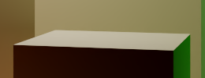
  
</p>

<p align="center"> 
Left image was rendered with anti-aliasing and the right was rendered without. The difference is quite clear.
</p>

##### Depth Of Field

Depth of field (DoF) effect is pretty simple, it's a camera effect that simulates a real-world lens. It causes objects at a certain distance from the camera (Focal point) to appear sharp, while objects farther from that point appear progressively more blurred due to the camera lens bending the light. 

<p align="center">
  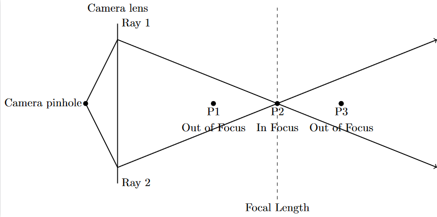
</p>
<p align="center"> 
Offsetting origin of the ray 
</p>

<p align="center">
  
</p>
<p align="center"> 
Point sampling
</p>

So really all you need to do in code is randomly offset ray origin and set ray direction to **focalPoint - rayOrigin**.


```
// Calculate focal point
vec3 focalPoint = origin.xyz + direction * pcRay.FocalPoint;

// Calculate random jitter
vec2 jitter = RandomPointInCircle(seed) * pcRay.DoFStrenght / 500.0f;

// Offset the origin
RayOrigin = origin.xyz + camRight * jitter.x + camUp * jitter.y;

// Calculate the direction
RayDirection = normalize(focalPoint - payload.RayOrigin);
```
<p align="center">

<p align="center">
  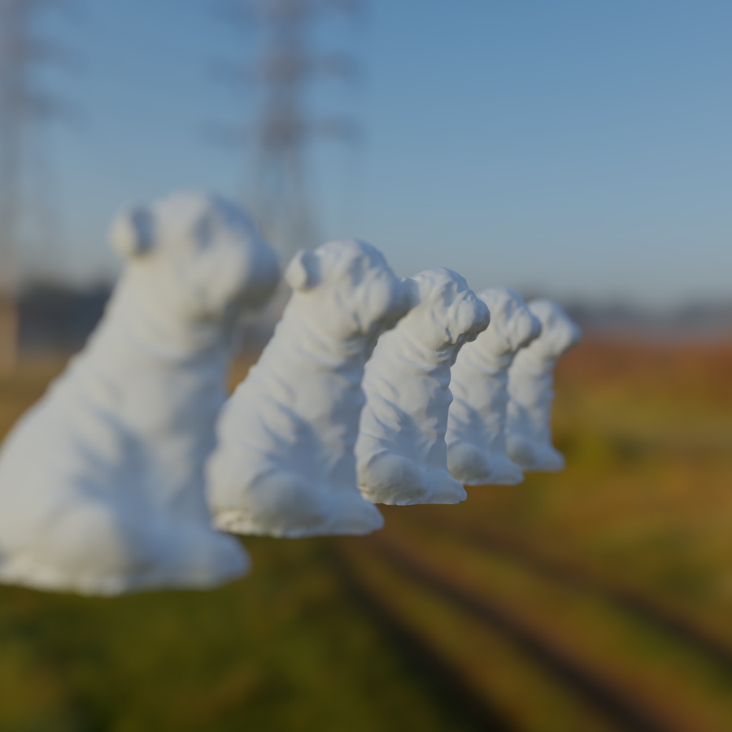
  
</p>
<p align="center"> 
Left image was rendered with Depth of Field effect on, you can clearly see how focal point is set on a middle sculpture, and how the first and the last one are completely out of focus. Right image was rendered without Depth of Field effect for comparison. 
</p>

##### Russian Roulette

Each ray color (throughput) is computed like following:

$$F = \prod_{i=0}^{N} F_i$$

where $F$ is the integrand (light contribution of the ray), $F_i$ is contribution of each bounce, and $N$ is the number of ray bounces.

Because the ray accumulation is a monte carlo simulation, to have a completely unbiased and mathematically correct result of the sample, ray should be bounced around a scene infinite amount of times, which is completely impossible to do. But as each successive bounce does less and less visually (it's throughput decreases due to color absorption) path tracers usually set the bounce limit to some hardcoded value like 10 or 20, so the image is still "visually" correct, although it's mathematically wrong. But how is this limit chosen? If it's too small result is biased so much that it's no longer visually appealing, if it's too large, it's a waste of time computing low throughput paths which don't change anything visually. Here's when the **Russian Roulette** comes into play.

At each ray-surface intersection, probability $p$ is set it can be chosen in any manner, I set it based on the minimum value of one of three RGB ray channels. A random number $r$ is generated, and if $r$ is less than $p$, the ray continues, otherwise, it terminates. If the ray continues, its contribution is multiplied by a factor of $\frac{1}{p}$ to account for the termination of other paths. Here's a mathematical formulation of this:

When applying Russian Roulette, after each bounce new integrand is computed:

$$ F\prime = \begin{cases} 
0 & \text{with probability } (1 - p) \\
\frac{F}{p} & \text{with probability } p
\end{cases} $$

And then just set the old integrand $F$ to newly computed one $F\prime$.

So as you can see that as long as $F$ is divided by $p$ the expected value remains mathematically unbiased:

$$ E[F\prime] = \left(1 - p\right) \cdot 0 + p \cdot \frac{E[F]}{p} = E[F] $$

Of course if we choose to sample with probability $(1 - p)$ which means the $F\prime$ equals 0, we can stop bouncing the ray any further, it's throughput is 0. And every other bounce, no matter it's throughput, will also be zero since anything times 0 is 0.

And because only paths with low throughput get terminated, only small amount variance is introduced and the convergence rate stays relatively similar to the original one. This way the result is not only mathematically correct, but a lot of computation time is saved by not evaluating low throughput paths. 

By applying russian roulette we're in fact **always** introducing more variance, but if probability $p$ is chosen correctly we're gaining efficiency which outweighs small variance that it introduces. But if for some reason the probability $p$ is chosen poorly, like a constant of 0.01. Only 1% of the camera rays are traced and then multiplied by a 100. From a mathematical point of view, the image is still correct, theoretically it will eventually converge on the right result. But visually it's horrible. If the termination probability is 99% for each bounce then the probability that ray reaches 20 bounces is $0.01^{20} = (10^{-2})^{20} = 10^{-40}$. So the probability of reaching 20 bounces (I'd say it's optimal for "visually correct" image) is equal $0.0000000000000000000000000000000000000001$! That's why the image will be mostly dark, you'll be lucky to get 3 or even 2 bounces most of the time, which is nowhere near the needed amount. So terminate your rays wisely.

In terms of code it's really simple:
```
// Calculate probability
float p = min(max(curWeight.x, max(curWeight.y, curWeight.z)) + 0.001, 1.0f);

// Decide whether to terminate
if(Rnd(seed) >= p)
  break;  // paths with low throughput that won't contribute, stop tracing any further

// If not, then divide current weight by p
curWeight /= p;
```

<p align="center">
  
  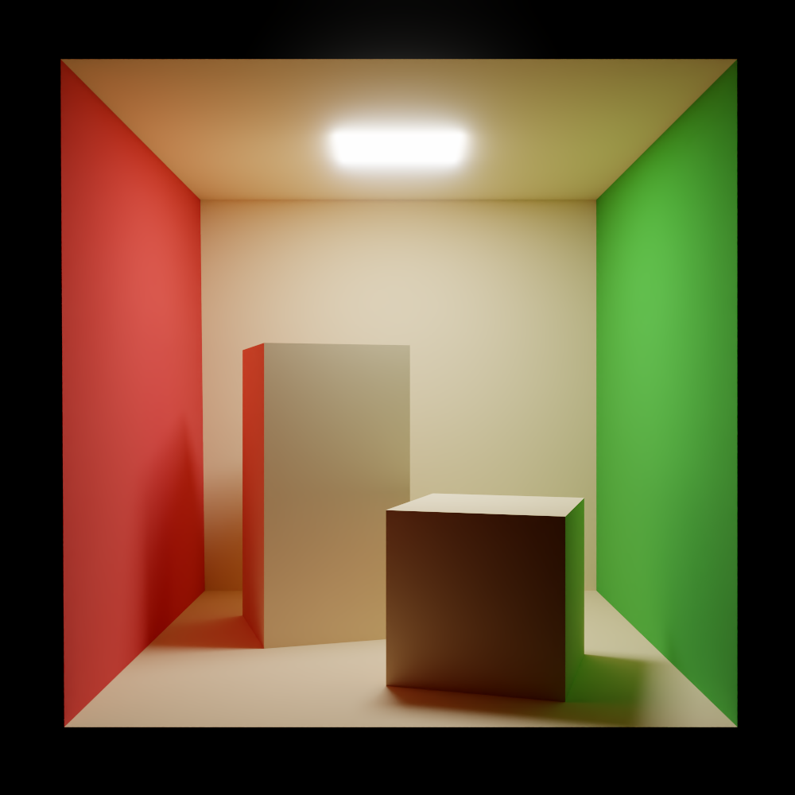
  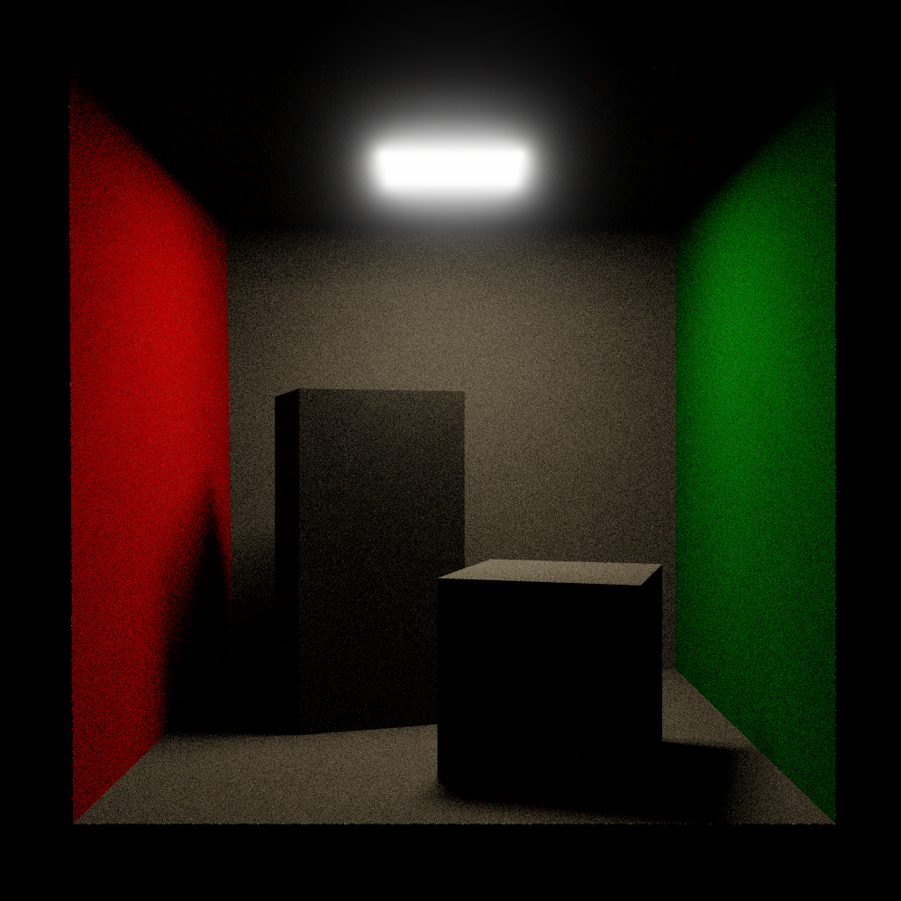
</p>

<p align="center"> 
Left image was rendered without russian roulette (430s for 200k samples per pixel on 1000x1000 image)
</p>
<p align="center"> 
Middle image was rendered with roulette with correctly picked probability (141s for 200k samples per pixel on 1000x1000 image)
</p>
<p align="center"> 
right image was rendered with roulette using constant probability 0.01 (42s for 200k samples per pixel on 1000x1000 image)
</p>

So in general, this method reduces computation by terminating a lot of paths that don't really contribute anything while keeping the rendering unbiased. It gives you a nice performance boost based on the scene settings, what I mean by that is because I'm choosing to terminate my rays based on the color so you could say "luminance", if materials aren't absorbing any light (they are white) the roulette won't give us any performance increase, rays aren't terminated if they are bright, and their brightness depends on the materials colors. So the darker the scene the more performance you get, more on that in the [Benchmark](#benchmark) section.

##### Caustics Suppression

Caustics Suppression is a method used to limit the luminance of the sampled ray. Because of lack of complex light transport algorithm, if the scene contains environment map with a few very bright spots the variance goes through the roof. If I pick a 2k env map that has 3 pixels that are really bright and I just path trace with my naive approach it will be a disaster, I would probably have to run this for several days to bring down the noise to a level where I can denoise it. Otherwise the variance is just too big (at least for my denoiser).

<p align="center">
  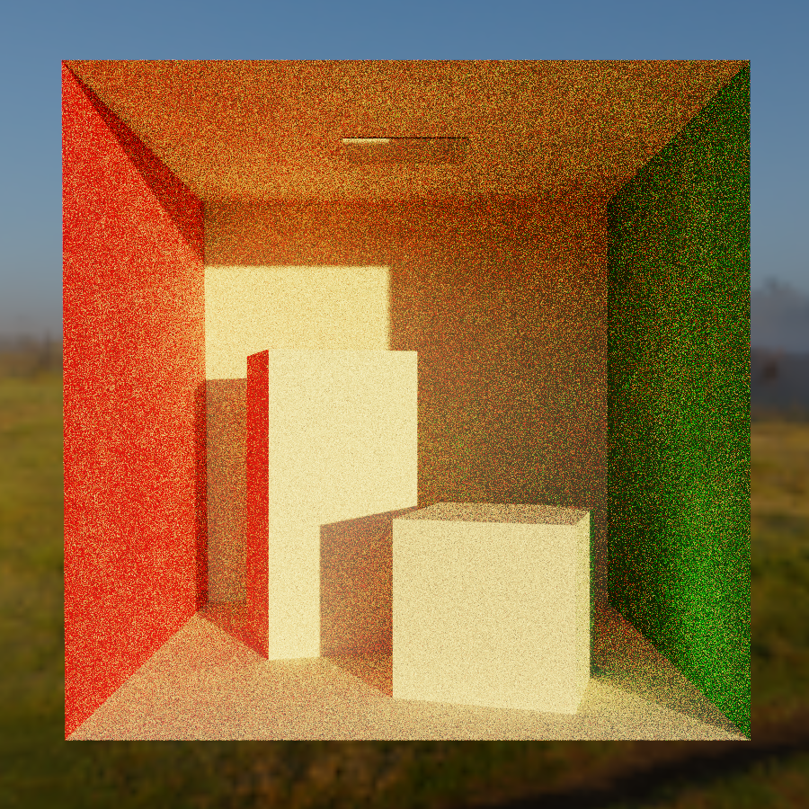
  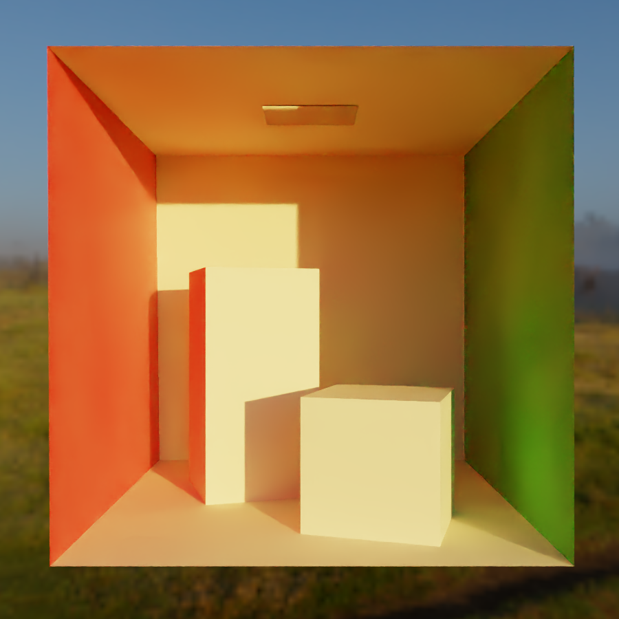
</p>
<p align="center"> 
The left image shows cornell box lit by a very bright env map, the image has 200k samples per pixel. Right image shows an attempt at denoising it.
</p>


There are 2 things we can do about that. One is to implement importance sampling, and the other one is to just limit the environment map brightness. I chose to do the second approach.

<p align="center">
  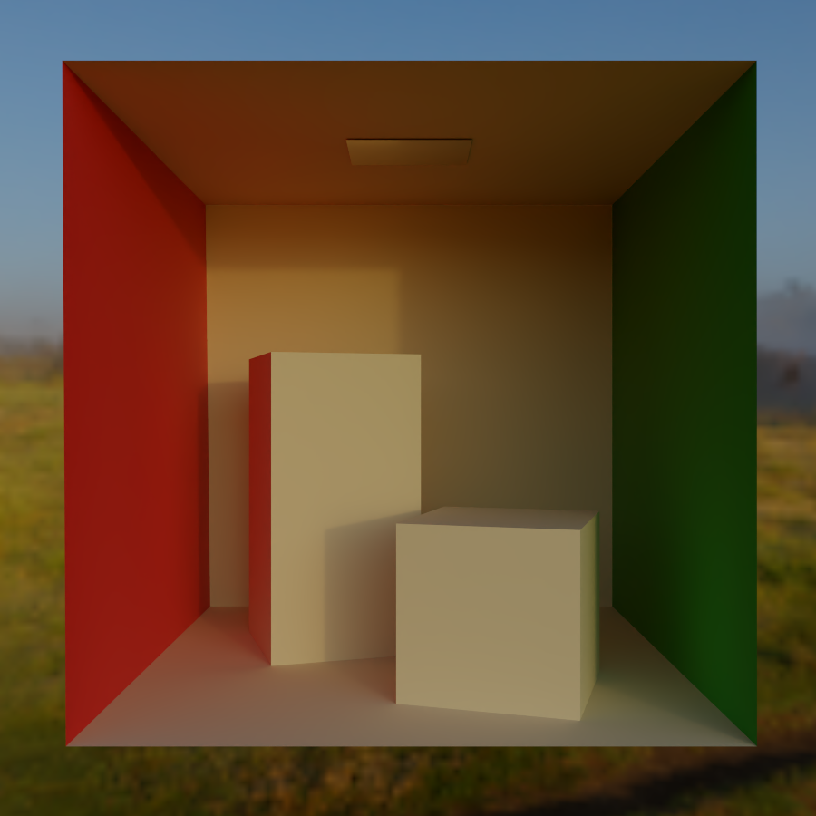
</p>

<p align="center"> 
Image Shows the same image as above (200k samples per pixel) but this time max luminance of the env map is limited to 500.
</p>

As you can see the image is way darker, but that's logical if the brightness is limited.

And that concludes the Ray Generation Shader! Full code of the shader can be found in [here](https://github.com/Zydak/Vulkan-Path-Tracer/blob/main/PathTracer/src/shaders/raytrace.rgen).

#### Closest Hit Shader

The closest hit is pretty simple, it queries the mesh data of the object that has been hit. Computes barycentric coordinates of the hit point. Calculates material properties and then the shading and next ray direction is handled by the BSDF which I'll talk about later. Code can be found [here](https://github.com/Zydak/Vulkan-Path-Tracer/blob/main/PathTracer/src/shaders/raytrace.rchit).

#### Miss Shader

The miss shader is even simpler, there's really nothing to talk about here, it just converts ray direction to texture coordinates and returns color of the environment map texture. Code can be found [here](https://github.com/Zydak/Vulkan-Path-Tracer/blob/main/PathTracer/src/shaders/raytrace.rmiss).

## BSDF And Light Transport

Light transport and BSDF are the most important parts of the path tracer. BSDF determines shading of the pixels and ray directions, and light transport algorithm determines how fast the path tracer will converge on the correct result. So maybe let's talk about specific implementation of these two.

### Light Transport

For light transport I'm using simple naive approach of picking ray directions based on the BSDF, so for mirror-like surface the direction will be perfect reflection and for more matte surfaces it will be random direction on the hemisphere. This approach results in high amount of variance in large scenes with small lights (or high variance env maps like I've shown above), but that's okay for me, using a complex light transport algorithm was way out of the scope for this project.

### BSDF

When we want to get the color of the pixel we need to know what materials the ray hit on the way. So at each bounce we essentially want to know what colors does the material absorb. If we want, we could go with the easy approach of just multiplying the ray color by the material color. Or just modelling the color absorption in pretty much any way we want (so probably keep it as material color for diffuse and conductors and change it to 1 for dielectrics). But this has one major issue, we'll be stuck with a naive light transport algorithm forever. That's because we can't really evaluate some ordinary ray direction, we can only evaluate the EXACT direction that the light bounces off the surface. And complex light transport algorithms like light sampling *require* this property of being able to evaluate an ordinary ray direction (in this case the direction to light from the surface). And this is when the BSDF comes into action.

BSDF is **bidirectional scattering distribution function**, it's a mathematical function that determines how much energy is absorbed during the process of reflection or refraction based on the surface properties, it can be denoted as $f_s(i, o, n)$, where $i$ is the incoming direction, $o$ is the outgoing direction, and $n$ is the surface normal. Speaking more precisely, it is combination of BRDF (**bidirectional reflectance distribution function**) which is reflected component and BTDF (**bidirectional transmittance distribution function**) which is transmitted component. So we can denote it as $f_s(i, o, n) = f_r(i, o, n) + f_t(i, o, n)$. It returns how much energy (color) is absorbed if ray bounces from $i$ to $o$.

<p align="center">
  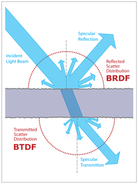
</p>

Real world surfaces are rarely perfectly smooth. Instead, they have microscopic imperfections that affect in which direction light reflects off them. So as the computing power of computers increased, the microsurface model appeared. It was first described by R.L. Cook and K.E. Torrance in 1982 in [this paper](https://dl.acm.org/doi/10.1145/357290.357293). It assumes that a surface is made up of many tiny, semi-randomly oriented **microfacets**. The orientation of **microfacets** is based on roughness, the rougher the surface, the more likely it is for microfacet to point in the direction other than the **macrosurface** (surface normal).

<p align="center">
  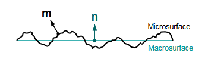
</p>

But the microsurface is just too small to be fully simulated, instead the model assumes that it can be modeled at runtime with 2 statistical functions, distribution function $D(m)$ and shadowing-masking function $G(i, o, m)$. $D(m)$ describes the statistical distribution of the microfacet normals $m$ over the microsurfac i.e. what's the probability of the microfacet being oriented in the direction $m$. $G(i, o, m)$ determines what portion of the microsurface is visible from both directions $i$ and $o$ due to shadowing and masking.

$G(i, o, m)$ is derived as
$$
G(i, o, m) = G_1(i, m) \cdot G_1(o, m)
$$

<p align="center">
  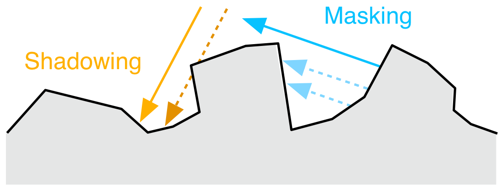
</p>

There also is 1 more term denoted as $F(i, m)$, it's fresnel term. I won't go into detail about it here because it's quite a complex topic, but it essentially describes the ratio of reflection to refraction. In real world when you look straight at the surface the reflection is weaker (not always), the amount of this reflection is called **base reflectivity**, it's denoted as $F_0$. But when looking at the surface from a grazing angle the reflection becomes stronger.

<p align="center">
  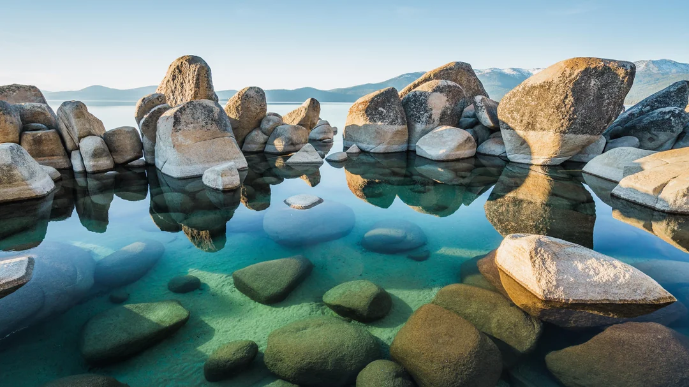
</p>

<p align="center"> 
Water is a perfect example of this, at the incident angle it's pretty much transparent. Whereas at grazing angle it's a perfect mirror.
</p>

Unfortunately fresnel is a complex equation, and there's really no way to calculate it correctly if you're not inside a spectral ray tracer which I'm not. So I used an approximation made by Christophe Schlick called [Schlick's approximation](https://en.wikipedia.org/wiki/Schlick's_approximation).

What's nice about these functions is that you're can use any combination you like. There are a lot of different distributions, masking-shadowing functions and fresnel approximations. Some of them are more efficient and some of them are more realistic. For distribution I went with the GGX distribution since it's pretty much industry standard these days. It looks good, is nicely documented and not so slow either. For masking-shadowing function I went with Smith for pretty much the same reasons. And for Fresnel I went with Schlick's approximation.

But to be able to actually use all these functions we first need an outgoing ray direction. To get that, we first generate $m$, which is microfacet normal. Then we can do $o = reflect(-i, m)$. The $m$ vector is calculated based on the distribution chosen. As I mentioned earlier I used GGX, but it's a little bit modified version of it to support something called **Anisotropy**. If anisotropy of a material is high it's normals get stretched in different directions, they basically reflect light in different ways depending on the viewing direction.

<p align="center">
  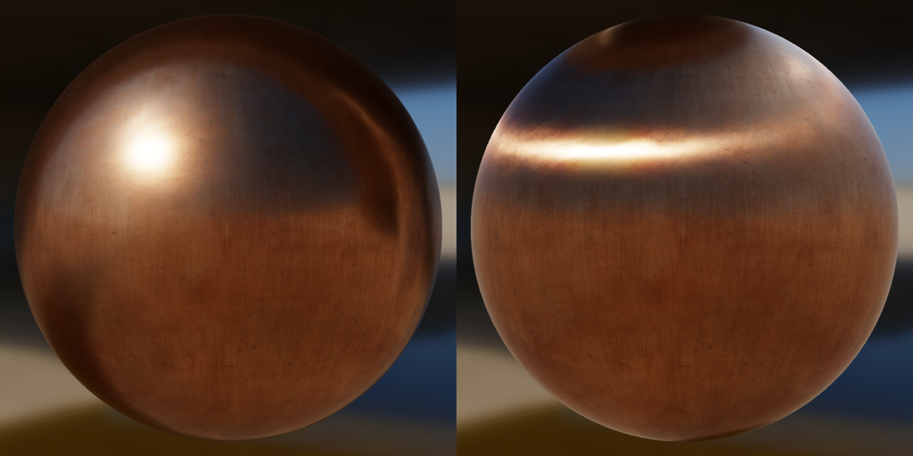
</p>
<p align="center"> 
Left image represents material without anisotropy. Right image represents a material with anisotropy.
</p>

The version I use is presented in detail by Eric Heitz in [Sampling the GGX Distribution of Visible Normals](https://jcgt.org/published/0007/04/01/paper.pdf). So if you're interested in how exactly does it work refer to the paper.

With all this knowledge we can finally create the BSDF. [Microfacet Models for Refraction through Rough Surfaces](https://www.graphics.cornell.edu/~bjw/microfacetbsdf.pdf) derives more modern form of the BSDF proposed by Cook.

They derive the $f_r$ term as:

$$
f_r(\mathbf{i}, \mathbf{o}, \mathbf{n}) = \frac{F(\mathbf{i}, \mathbf{m}) G(\mathbf{i}, \mathbf{o}, \mathbf{m}) D(\mathbf{h}_r)}{4 |\mathbf{i} \cdot \mathbf{n}| |\mathbf{o} \cdot \mathbf{n}|}
$$

and $f_t$ term as:

$$
f_t(\mathbf{i}, \mathbf{o}, \mathbf{n}) = \frac{|\mathbf{i} \cdot \mathbf{m}| |\mathbf{o} \cdot \mathbf{m}| \eta_o^2 (1 - F(\mathbf{i}, \mathbf{m})) G(\mathbf{i}, \mathbf{o}, \mathbf{m}) D(\mathbf{m})}{|\mathbf{i} \cdot \mathbf{n}| |\mathbf{o} \cdot \mathbf{n}| \left(\eta_i (\mathbf{o} \cdot \mathbf{m}) + \eta_o (\mathbf{i} \cdot \mathbf{m})\right)^2}
$$

so our $f_s$ is:

$$
f_s(\mathbf{i}, \mathbf{o}, \mathbf{m}) = f_r(\mathbf{i}, \mathbf{o}, \mathbf{m}) + f_t(\mathbf{i}, \mathbf{o}, \mathbf{m})
$$

But in a monte carlo simulation for values to check out we also have to divide the BSDF by it's probability, so the probability of the sampled ray direction. So we end up with:

$$
f_s(\mathbf{i}, \mathbf{o}, \mathbf{m}) = \frac{f_r(\mathbf{i}, \mathbf{o}, \mathbf{m})}{PDF_r} + \frac{f_t(\mathbf{i}, \mathbf{o}, \mathbf{m})}{PDF_t}
$$

Where according to the [Sampling the GGX Distribution of Visible Normals](https://jcgt.org/published/0007/04/01/paper.pdf) PDF is equal to the VNDF ([Distribution of Visible Normals](https://inria.hal.science/hal-00996995v2/document)) weighted by the Jacobian of the operator (reflect of refract). So for reflection it's:

$$
PDF_r = \frac{G_1(\mathbf{i}, \mathbf{m}) \cdot D \cdot |\mathbf{i} \cdot \mathbf{m}|}{4 \cdot |\mathbf{i} \cdot \mathbf{m}| \cdot |\mathbf{i} \cdot \mathbf{n}|}
$$

And for refractions it's:

$$
PDF_t = \frac{G_1(\mathbf{i}, \mathbf{m}) \cdot |\mathbf{i} \cdot \mathbf{m}| \cdot D \cdot \eta_o^2 \cdot |\mathbf{o} \cdot \mathbf{m}|}{|\mathbf{i} \cdot \mathbf{n}| \cdot (\eta_i |\mathbf{o} \cdot \mathbf{m}| + \eta_o |\mathbf{i} \cdot \mathbf{m}|)^2}
$$

So we end up with this pretty big equations for both reflection and refraction. Byt we're actually quite lucky because almost every term just cancel out (note that $|\mathbf{o} \cdot \mathbf{n}|$ cancels out with the cosine attenuation term in the rendering equation and not directly with the PDF) and we're left only with:

$$
\frac{f_r(\mathbf{i}, \mathbf{o}, \mathbf{m})}{PDF_r} = F(\mathbf{i}, \mathbf{m}) \cdot G_1(\mathbf{o}, \mathbf{m})
$$

And for refraction

$$
\frac{f_t(\mathbf{i}, \mathbf{o}, \mathbf{m})}{PDF_t} = \eta_o^2 (1 - F(\mathbf{i}, \mathbf{m})) G_1(\mathbf{o}, \mathbf{m})
$$

Unfortunately, this approach of calculating the BSDF instead just multiplying the ray weight by the surface color has one really big problem. It's not energy conserving, which means it destroys the energy. What I mean by that is when you shoot ray into completely white surface, it shouldn't absorb any light (that's the definition of white color, it does not absorb anything, all channels are maxed out so $1 \cdot 1 = 1$). But that's not the case here. We'll look into why in a second, but first lets explain how do we even measure that.

### Energy Conservation
In short, if we say that something is energy conserving we mean that light is not destroyed as it bounces around a scene. We can check for energy conservation using a furnace test. What is a furnace test? The general idea is that if you have a 100% reflective object that is lit by a uniform environment, it becomes indistinguishable from the environment. It doesn’t matter if the object is matte or mirror like, or anything in between, it just “disappears”. We can easily prove that:

#### Rendering Equation
Color of a pixel is given by the outgoing radiance $L_o$ in the direction $\mathbf{i}$ which is given by solving a rendering equation. Here I'll use a simple one where BSDF = $\frac{albedo}{\pi}$. But this easily extends to more complex BRDFs, BSDFs etc.

$$
L_o(\mathbf{x}, \mathbf{i}) = L_e(\mathbf{x}, \mathbf{i}) + \int_{\Omega} L_i(\mathbf{x}, \mathbf{o}) \cdot f_s(\mathbf{x}, \mathbf{o}) \cdot \cos(\theta_o) do
$$

where:
- $L_e(\mathbf{x}, \mathbf{i})$ is the light emitted by the surface in the direction $\mathbf{i}$ from the point $\mathbf{x}$.
- $L_o(\mathbf{x}, \mathbf{i})$ is the outgoing radiance in the direction $\mathbf{i}$ from the point $\mathbf{x}$.
- $L_i(\mathbf{x}, \mathbf{o})$ is the incoming radiance from the direction $\mathbf{o}$.
- $f_s(\mathbf{x}, \mathbf{i}, \mathbf{o})$ is the BSDF, or the amount of light reflected at point $\mathbf{x}$ from the direction $\mathbf{o}$.
- $\cos(\theta_o)$ is the cosine of the angle $\theta_o$ between the surface normal and the direction $\mathbf{o}$.
- $do$ is the differential solid angle in the direction $\mathbf{o}$.

Now if we make our object perfectly reflective (it doesn't absorb any light), so set the material color to 1. Our BSDF should always equal $\frac{1}{\pi}$. Then if we we just ignore emission the rendering equation simplifies to:

$$
L_o(\mathbf{x}, \mathbf{i}) = \frac{1}{\pi} \int_{\Omega} L_i(\mathbf{x}, \mathbf{o}) \cdot \cos(\theta_o) d\mathbf{o}
$$

Integral $\int_{\Omega} \cos(\theta_o) do$ is always equal $\pi$, that's why you usually don't see calculation of it in code, but let's solve that anyway. To solve it, we use spherical coordinates where:

$$
do = \sin(\theta_o) d\theta_o d\phi_i
$$

So the integral becomes:

$$
\int_{\Omega} \cos(\theta_o) do = \int_{0}^{2\pi} \int_{0}^{\pi/2} \cos(\theta_o) \sin(\theta_o) d\theta_o d\phi_i
$$

Separate the integrals:

- **Azimuthal Integral**:

$$
\int_{0}^{2\pi} d\phi_i = 2\pi
$$

- **Polar Integral**:

Substitute $u = \sin(\theta_o)$ so $du = \cos(\theta_o) \ d\theta_o$:

$$
\int_{0}^{\pi/2} \cos(\theta_o) \sin(\theta_o) d\theta_o = \int_{0}^{1} u du = \frac{u^2}{2} \bigg|_{0}^{1} = \frac{1}{2}
$$

Combining the results:

$$
\int_{\Omega} \cos(\theta_o) do = 2\pi \cdot \frac{1}{2} = \pi
$$

Substitute this result back into the rendering equation:

$$
L_o(\mathbf{x}, \mathbf{i}) = \frac{1}{\pi} \cdot \pi \cdot L_i(\mathbf{x}, \mathbf{o}) = L_i(\mathbf{x}, \mathbf{o})
$$

As you can see, $L_o(\mathbf{x}, \mathbf{i}) = L_i(\mathbf{x}, \mathbf{o})$. The $L_i(\mathbf{x}, \mathbf{o})$ is equal to the background color, and because the background is uniform, it doesn't matter in which direction the ray is reflected, so it doesn't matter whether the surface is a perfect mirror or very rough, the ray direction doesn't matter as every direction will return the same value. This means that $L_o(\mathbf{x}, \mathbf{i})$ will always equal the background color for every pixel. And that means that we won't be able to distinguish between an object and the background! 

So if I use a perfectly white background and place a perfectly reflective sphere in the scene, I shouldn't be able to see it. And that is exactly what happens!
<p align="center">
  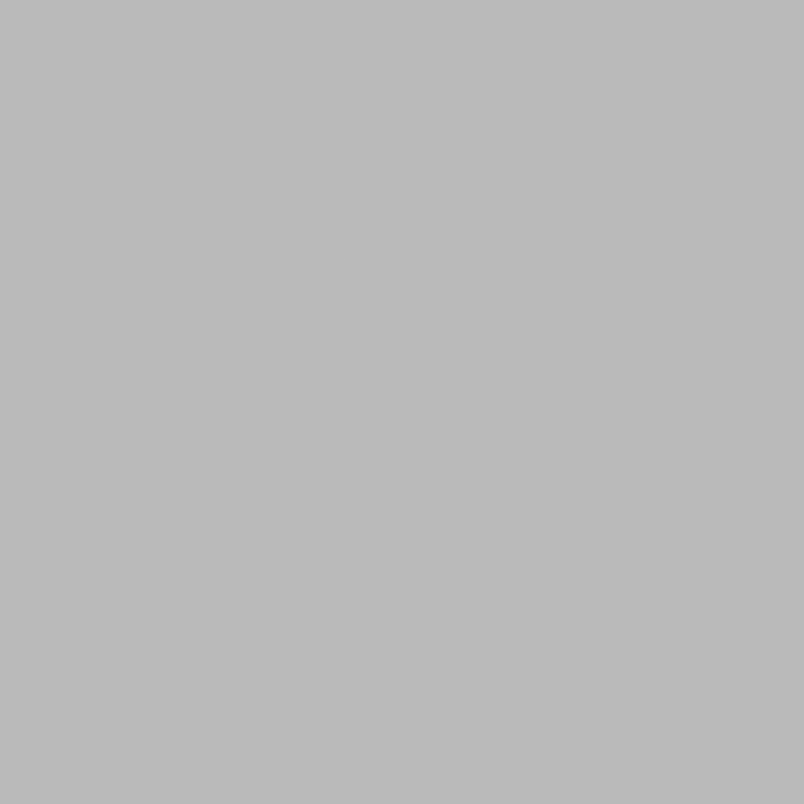
</p>

Why is any of this useful? Well, if we mess up any part of the renderer, like the BSDF, the furnace test will fail. If we absorb too much energy (destroy light), we'll see a dark sphere on a white background. On the other hand, if we reflect too much energy (create light), we'll see a sphere brighter than the background. And that's exactly what happens if I intentionally break my BSDF:

Here's the result of incorrectly calculated BSDF:
<p align="center">
  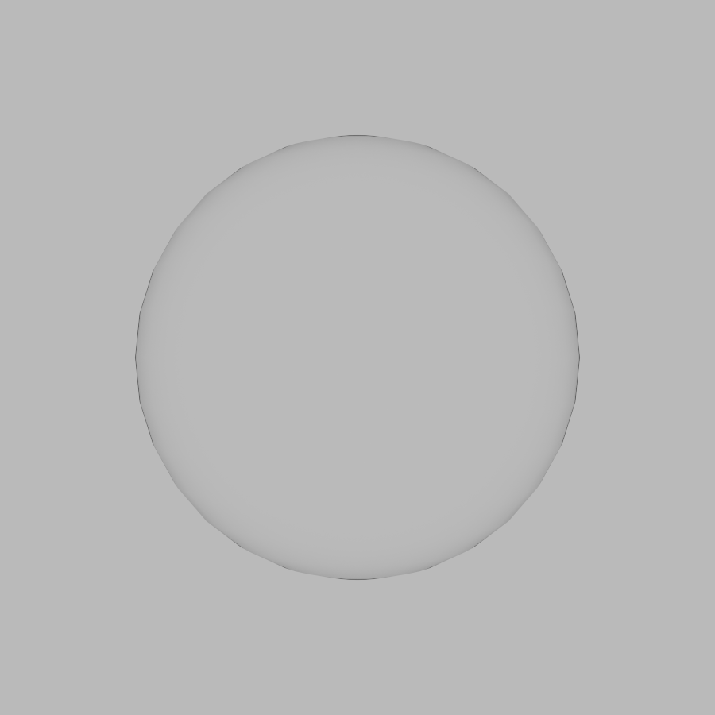
  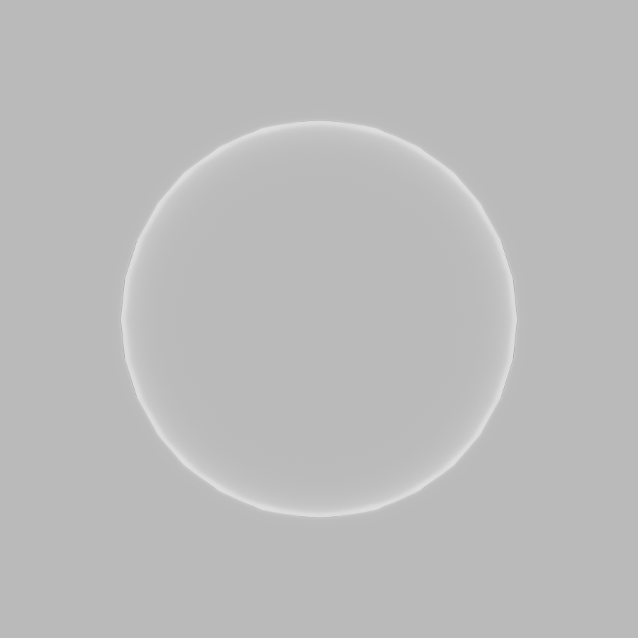
</p>

You can clearly see that something is wrong. On the image on the left the BSDF is absorbing too much energy at high angles. On the image on the right the BSDF is reflecting too much energy at high angles. In both cases $L_o(x, \mathbf{i}) \neq L_i(x, \mathbf{o})$ which means that some part of the rendering equation is messed up, in this case it's BSDF which no longer equals $\frac{1}{\pi}$.

### BSDF Evaluation

So back to the BSDF problem, as I said earlier, it does *not* conserve energy. The BSDF with DFG terms is not always equal to $\frac{1}{\pi}$ for white surface so the equation won't always equal 1.

<p align="center">
  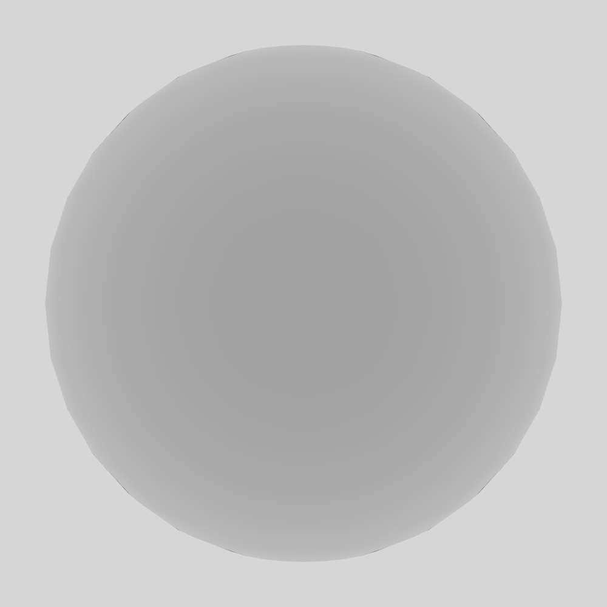
</p>
<p align="center">
Fully metallic sphere with roughness 1.
</p>

That's because of 2 things:

1. When surface is rough, it's completely possible for the microfacet to be oriented in such a way that the light bounces *into* the object from it. And there's not really much we can do about it besides discarding the sample. So literally destroying the light. That's because if we try to do anything (i.e. change the direction with rejection sampling), we'll no longer match the distribution of normals, so we'll introduce bias (more on that [here](https://chat.stackexchange.com/rooms/154146/discussion-between-enigmatisms-and-tom-clabault)).

2. Shadowing-masking term is also destroying energy. It tells us when the microfacet is covered by other microfacets from our point of view, and if it is, we don't really do anything. We just multiply the result by the portion of the microfacet that's visible. So we're also destroying energy.

<p align="center">
  
</p>
<p align="center">
You can clearly see that as the object becomes rougher it's starting to lose the color and saturation which is very inconvenient for artists to work with. The material is fully metallic with roughness increasing from left to right.
</p>

These 2 problems can be solved by accounting for something called **Multiple Surface Scattering**. So basically bouncing the ray again in case it is bounced in the direction of another microfacet.

<p align="center">
  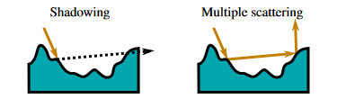
</p>

But doing multiple scattering has a huge downside - It's really hard and really slow. If you want to look into details you can read [Multiple-Scattering Microfacet BSDFs with the Smith Model](https://eheitzresearch.wordpress.com/240-2/) by Eric Heitz. But this method is usually only used for validation purposes because of it's performance. According to [Practical multiple scattering compensation for microfacet models](https://blog.selfshadow.com/publications/turquin/ms_comp_final.pdf) which I'll talk about in a second, Heitz's method is from 7 to 15 times slower than doing single scattering! This makes it pretty much impractical even for offline rendering, it's just not worth it. It's also not possible to evaluate it non-stochastically, so it can only be used in offline path tracers. There are more papers on this topic but each of them has some other major problem. Like [Position-free Multiple-bounce Computations for Smith Microfacet BSDFs](https://wangningbei.github.io/2022/MBBRDF.html), It's still not conserving 100% of the energy and is not reciprocal and does not have closed form solution, i.e. it can't be evaluated non-stochastically. Or [Multiple-bounce Smith Microfacet BRDFs using the Invariance Principle](https://wangningbei.github.io/2023/GMBBRDF.html), it can't evaluate refractions. All of the other papers that you can easily find on the topic have some other major downsides. Most often being just slow and limiting.

So instead a lot of people figured out that energy loss is something that can be approximated by just precomputing it and putting it into lookup tables (LUTs). This process is described in previously mentioned [Practical multiple scattering compensation for microfacet models](https://blog.selfshadow.com/publications/turquin/ms_comp_final.pdf) by Emmanuel Turquin or [Revisiting Physically Based Shading at Imageworks](https://blog.selfshadow.com/publications/s2017-shading-course/imageworks/s2017_pbs_imageworks_slides_v2.pdf) slides by Christopher Kulla & Alejandro Conty. The biggest advantages of it are

1. It works for any BxDF.
2. It has a closed form solution so we can use it even outside path tracing.
3. It has pretty much no performance cost (just 1 really small texture fetch).

#### Energy Compensation For Conductors

So how does it work? Energy loss can actually be precomputed, that's because the only 2 factors it depends on (for conductors at least) are viewing angle and roughness of the surface. According to Turquin's paper we can precompute exactly how much energy is lost by just averaging random samples over the hemisphere with given angle and roughness. We'll call that value $E_{ss}(\mathbf{i})$ ($ss$ for single scattering). 

$$
E_{ss}(\mathbf{i}) = \int_{\Omega} \frac{f_r(\mathbf{i}, \mathbf{o}, \mathbf{m})}{PDF_r} \cdot \cos(\theta_o) do
$$

Turquin focuses on extreme minimalism and speed, so they decided to just scale the lobe by some factor of energy missing called $k_{ms}(\mathbf{i})$. We can compute it using this formula:

$$
k_{ms}(\mathbf{i}) = \frac{1 - E_{ss}(\mathbf{i})}{E_{ss}(\mathbf{i})}
$$

Then just put the $k_{ms}(\mathbf{i})$ values into a texture (or buffer) and send it to the GPU. I chose to do it in 32x32 texture, so we take 32 steps for viewing angle from 0 to 1. And then 32 steps for roughness also from 0 to 1. So we just do a nested loop and push the result of each loop into a pixel on the texture. In code it would look like this:

```
for (int r = 0; r < 32; r++)
{
	for (int v = 0; v < 32; v++)
	{
		float roughness = glm::max((float(r)) / 32.0f, 0.0001f);
		float viewCosine = glm::max((float(v)) / 32.0f, 0.0001f);

		results.push_back(AccumulateBRDF(roughness, viewCosine));
	}
}
```

Where `AccumulateBRDF` generates and accumulates random samples, I decided to take 100K samples. Overall for 3 tables (Why 3 you'll see in a minute when we talk about dielectrics) generating all of the samples takes about 386s, and I ran it fully multithreaded on 12 threads. So you'll most likely want to cache it somewhere on disk.

After doing that we end up with this 32x32 texture where X is viewing angle and Y roughness:

<p align="center">
  
</p>

And with that we can just scale the original $f_r$ with it like this:

$$
f_{r}^{ms} = (1 + F_0 \cdot k_{ms}) \cdot \frac{f_r(\mathbf{i}, \mathbf{o}, \mathbf{m})}{PDF_r}
$$

And that's it, if we replace the final color with $f_{r}^{ms}$, so apply the energy compensation, we get a massive difference.

<p align="center">
  
  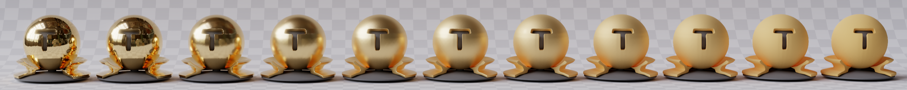
</p>
<p align="center">
First image shows the BRDF before applying energy compensation. The second image shows BRDF after applying energy compensation. The material is fully metallic with roughness increasing from left to right.
</p>

What we have to remember is that it's still just an approximation, so it doesn't conserve 100% of the energy, it can easily pass the furnace test, but even if it would lose only 0.1% of energy after 200 bounces you'll lose almost 20% of the initial energy. But you can't have both 100% accuracy *and* speed, so this is a nice compromise. After all it's not really about conserving *all* of the energy, we just want the material not to change color so that materials are predictable and easy to work with for the artists.

<p align="center">
  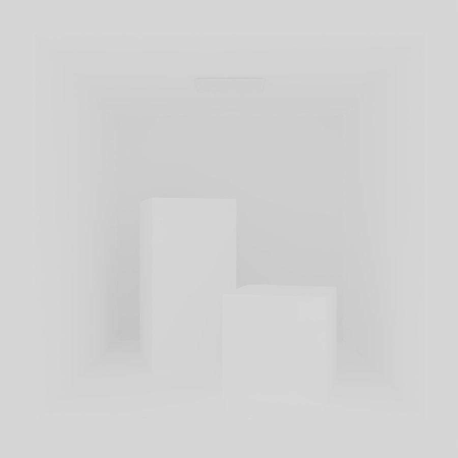
</p>
<p align="center">
Image shows a furnace test done on complex geometry (Cornell Box), as mentioned above with more and more bounces a visible portion of energy is being lost.
</p>

But the biggest problem for conductors is **Anisotropy** which I talked about earlier. We're not accounting for it in this approximation, so we'll still lose the energy even with the energy compensation applied.

<p align="center">
  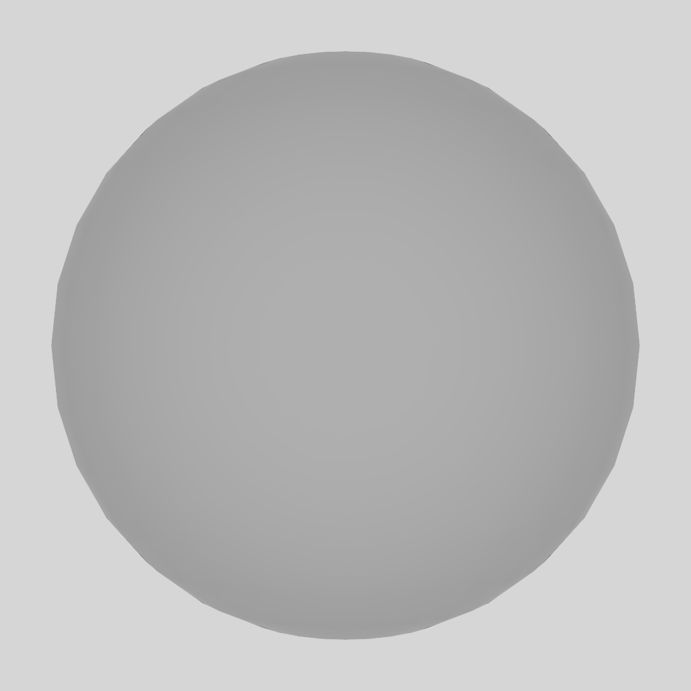
</p>
<p align="center">
Image shows a furnace test done on material with roughness 1 and anisotropy 1.
</p>

What we could do is extend the table to more dimensions, so instead of doing it only for viewing angle and roughness we could use the third dimension of the texture for Anisotropy. But it's not really possible, that's because the highlights are getting stretched based on the viewing direction (not the angle) of the camera (i.e. we won't get the same result when we're standing in front of the object as if we're standing right to it). So even if we average the samples over the hemisphere like we did before it won't be enough. Making a table that accounts for direction would be really complex and it would have to be *really* big. So it's just not practical. But, we can just ignore the direction aspect and accumulate over the entire hemisphere. And if we try just that, we can actually get most of the energy back.

<p align="center">
  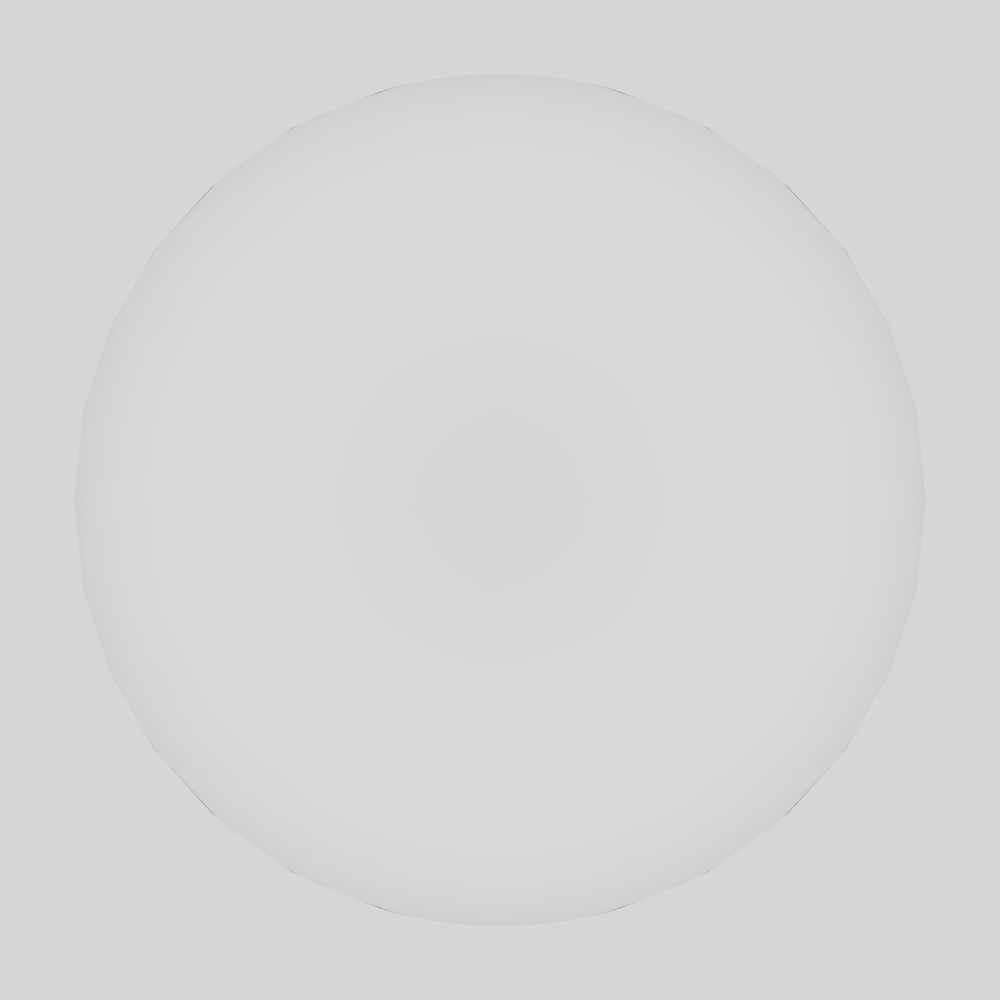
</p>
<p align="center">
Image shows a furnace test done on material with roughness 1 and anisotropy 1. But this time with anisotropy energy compensation.
</p>

It won't pass a furnace test, but we have to draw the line somewhere. Again, the point of this is so that's it's convenient for artist to work with materials, and not to conserve 100% of the energy, end user doesn't care about that. So it's a pretty good approximation.

#### Energy Compensation For Dielectrics

Pretty much the same applies for dielectrics, for dielectric reflection we can use the same LUT we've used for conductors since the distribution of normals stays the same (at least in my renderer, if not then you'll have to use different table). And for refraction we just create another table, but this time we use IOR as the third dimension instead of anisotropy and evaluate with refraction BSDF. We also have to create 2 tables, 1 for when the eta is greater than 1 (entering surface from outside) and 1 for when eta is smaller than 1 (leaving the surface from inside). And that's pretty much it. Now we could just apply it like we did before, if it wasn't for one thing, because... well, refraction is a little bit more complicated, I'm not sure why exactly is that the case, but it's not really possible to make a perfect approximation for refraction. I just couldn't find the solution, no paper even mentions this. But if you look into [Conty's slides](https://blog.selfshadow.com/publications/s2017-shading-course/imageworks/s2017_pbs_imageworks_slides_v2.pdf) you won't find a furnace test done **only** for refraction. Same with [Turquin](https://blog.selfshadow.com/publications/turquin/ms_comp_final.pdf) they don't really show any furnace test done. Then I went to blender and found out that even cycles (path tracing in blender) doesn't conserve energy for refractions!

<p align="center">
  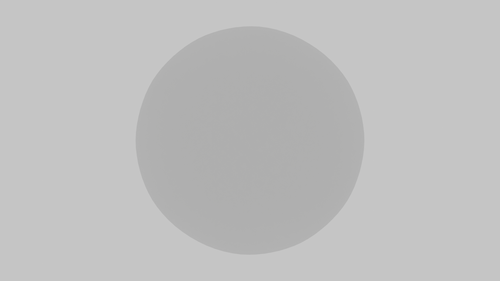
</p>
<p align="center">
Image shows a furnace test done inside blender on a transparent material with roughness 1 and IOR 3.
</p>

So I assume that's just how things are, it's not really possible to perfectly approximate the refraction (at least using LUTs). That said it's still a pretty decent approximation. It allows us to retrieve some if not most of the energy lost, especially on low IOR, but you definitely won't get it to the level of reflections. But it's better than nothing I guess.

<p align="center">
  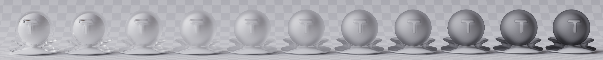
  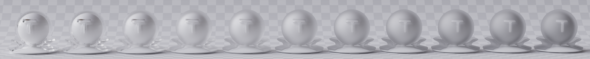
</p>
<p align="center">
First image shows the BRDF before applying energy compensation. The second image shows BRDF after applying energy compensation. Material is perfectly transparent with IOR 1.2 and roughness changing from left to right.
</p>

But there actually is another way to get everything 100% energy conserving, and without implementing some complex multiple scattering algorithm. And that is to not use the distributions. Remember when I talked about the *easy* approach at the start of the [BSDF](#bsdf) section? Well, that is a completely valid approach. But as I said there, you just can't evaluate some ordinary direction like you can with a BSDF evaluation function. But it has a property of being 100% energy conserving. And it will look completely the same as the evaluation method, since the only thing that determines the actual color is the Fresnel, and we can easily just replace the material color with fresnel. Remember when I talked about the 2 problems that cause the destruction of energy? The first one was the case when we're bouncing into the object and we have to discard the sample, with distributions we can't use rejection sampling because we'll no longer match our distribution of normals, but guess what, if there's no BSDF there's no distribution to match. So we can actually use rejection sampling. And the second problem, the shadowing-masking term, it's also absent because there's no BSDF. So our problems are magically solved. We suddenly can implement pseudo random walk on the microsurface using rejection sampling like so:

```
// Pick initial direction the same way we're doing it with BSDF
vec3 H = GGXSampleAnisotopic(V, mat.ax, mat.ay, Rnd(seed), Rnd(seed));
vec3 rayDir = normalize(reflect(-V, H));
// V is View vector in tangent space, I was referring to it as i direction before

// Fresnel term, the same one we're using in the BSDF
vec3 F = mix(mat.Color.xyz, vec3(1.0f), SchlickWeight(dot(V, H)));

// Start "random walk"
for (int i = 0; i < 100; i++) // 100 is just there so that we do not blow the GPU up with infinite loop in some weird edge case
{
    // Check if the direction is ok
    if (rayDir.z > 0.0f)
        break;

    // Generate new direction
    vec3 H = GGXSampleAnisotopic(V, mat.ax, mat.ay, Rnd(seed), Rnd(seed));
    rayDir = normalize(reflect(-V, H));

    // Attenuate the color since we've hit another microfacet
    F *= mix(mat.Color.xyz, vec3(1.0f), SchlickWeight(dot(V, H)));
}

BSDF = F;
```

And that's it! The code above is for conductor, but we can easily change the fresnel to be whatever we want for dielectric reflection and refraction. This way we get a 100% energy conserving BSDF, the only downside is that we can't evaluate directions which is a real bummer and a must have for more complex light transport. But since I'm not really using any complex light transport algorithm anyway, I couldn't care less, I'm not evaluating the directions anyway, so all of the images in the [Gallery](https://github.com/Zydak/Vulkan-Path-Tracer?tab=readme-ov-file#gallery) are taken with this approach and not with the distributions just for the better look. If you also aren't going for a complex light transport like light sampling I advise to just use the rejection sampling approach, because you get absolutely no advantage of using distributions in that case. And you'll just make yourself a ton of work with energy compensations like I did. But if for some reason you want or need to evaluate the direction then you'll have to go through all that trouble.

For conductors it looks pretty much the same, the only thing that differs is the fresnel, since with rejection sampling we're attenuating the color with each microsurface hit. And with energy compensation we're just approximating this phenomenon by multiplying by the fresnel of the final outgoing direction. So the rejection sampling will look more correct.

<p align="center">
  
  
  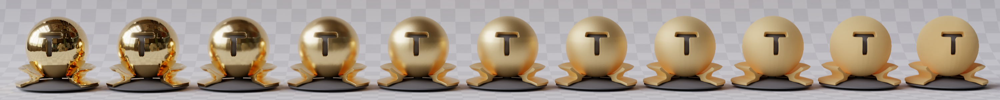
</p>
<p align="center">
First image shows the BRDF before applying energy compensation. The second image shows BRDF after applying energy compensation. Third image uses rejection sampling without distributions. The material is fully metallic with roughness increasing from left to right.
</p>

But you can actually see quite the difference when it comes to the refractions since the energy compensation LUT is way worse than for conductors.

<p align="center">
  
  
  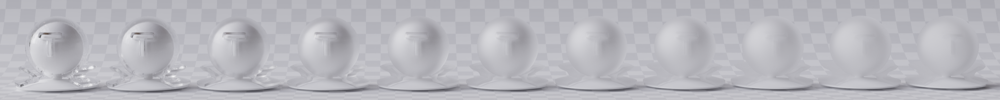
</p>
<p align="center">
First image shows the BRDF before applying energy compensation. The second image shows BRDF after applying energy compensation. Third image uses rejection sampling without distributions. Material is perfectly transparent with IOR 1.2 and roughness changing from left to right.
</p>

Note that I did implement the distribution approach **and** the rejection sampling approach. Code for the distributions and *proper* BSDF can be found in [BSDFExperimental.glsl](https://github.com/Zydak/Vulkan-Path-Tracer/blob/main/PathTracer/src/shaders/BSDFExperimental.glsl) and the code for the rejection sampling can be found in [BSDF.glsl](https://github.com/Zydak/Vulkan-Path-Tracer/blob/main/PathTracer/src/shaders/BSDF.glsl).

#### Code

So now that I explained how is energy working, let's talk about the implementation. It's actually really simple. I start by computing the probabilities of each lobe (if you're interested in how is that done just look into the code), I compute a random number and stochastically choose which lobe to sample. When it comes to lobes there are 4 of them:

Diffuse lobe which is acting like a rough surface that isn't affected by fresnel. It is most often combined with dielectric reflection lobe which I'll talk about in a second. To compute it I'm using so called Lambertian Diffuse, which is basically saying that the lobe is stronger when the $\cos(\theta_o)$ is bigger. It's the best match for object since that's how the surfaces act in real world so it's more [realistic](https://en.wikipedia.org/wiki/Lambertian_reflectance). It is evaluated like so:

$$
f_r(\mathbf{i}, \mathbf{o}, \mathbf{m}) = \text{color} * |\mathbf{o} \cdot \mathbf{m}| \cdot \frac{1}{\pi}
$$

And it's PDF is

$$
PDF_r = |\mathbf{o} \cdot \mathbf{m}| \cdot \frac{1}{\pi}
$$

As you can see the entire equation immediately simplifies to

$$
\frac{f_r(\mathbf{i}, \mathbf{o}, \mathbf{m})}{PDF_r} = \text{color}
$$

with $\mathbf{m}$ being just the surface normal in this case, we're not using microfacets (we could be but we don't have to).

And the direction of diffuse is just a cosine distribution, so it's more likely so sample where the $\cos(\theta_o)$ is bigger.

Dielectric reflection lobe which acts like another surface on top of the diffuse lobe. It is responsible for specular reflections, it does not tint the color and is evaluated with microfacets so roughness changes it's look. And it doesn't matter what method you're using (i.e. distributions or rejection sampling). If you're using distributions then I already described how to evaluate that:

$$
f_r(\mathbf{i}, \mathbf{o}, \mathbf{n}) = \frac{F(\mathbf{i}, \mathbf{m}) G(\mathbf{i}, \mathbf{o}, \mathbf{m}) D(\mathbf{h}_r)}{4 |\mathbf{i} \cdot \mathbf{n}| |\mathbf{o} \cdot \mathbf{n}|}
$$

$$
PDF_r = \frac{G_1(\mathbf{i}, \mathbf{m}) \cdot D \cdot |\mathbf{i} \cdot \mathbf{m}|}{4 \cdot |\mathbf{i} \cdot \mathbf{m}| \cdot |\mathbf{i} \cdot \mathbf{n}|}
$$

The only thing you have to do is **ALWAYS** set $F(\mathbf{i}, \mathbf{m})$ to 1 (or whatever you like the most, you just can't tint the color if user doesn't explicitly want to tint it). It's like saying that base reflectivity is 1 no matter the angle. If you want to use rejection sampling the same thing applies, but instead of changing the F term you just attenuate the color for each microsurface hit by 1 (so you actually don't attenuate it because $1 \cdot 1 = 1$).

The direction sampled is based on microfacet distribution chosen. As I mentioned I went with GGX, there's really nothing special to it, if you want to see the implementation look at [Sampling.glsl](https://github.com/Zydak/Vulkan-Path-Tracer/blob/main/PathTracer/src/shaders/Sampling.glsl). The function returns `H` vector, or as I referred to it here $\mathbf{m}$, so you just have to act like it's your new surface normal and call `reflect(-V, H)`. `V` being view vector ($\mathbf{i}$).

Conductor lobe in contrast to dielectric reflection does attenuate the color. So you do literally the same thing as in there but you set $F(\mathbf{i}, \mathbf{m})$ to the actual fresnel (in my path tracer a schlick approximation).

```
vec3 F = mix(mat.Color.xyz, vec3(1.0f), SchlickWeight(dot(V, H)));
```

Sampling the direction is exactly the same.

And the last lobe which is dielectric refraction. This time you do want to attenuate it so your fresnel becomes the material color or whatever you like the most (you can use schlick here but I'm not sure that's based on anything in real world?). The only difference is that you call `refract` instead of `reflect`. And of course if you're doing distributions approach evaluate it differently than reflection. I also talked about that.

And these 4 simple lobes can create pretty much any material you can encounter in real world. In total we end up with 8 material parameters that change how the lobes act and the probability at which they are sampled.

* Surface Color.
* Emissive Color (I haven't talked about it but it's really simple, you just add it to the ray contribution like it's a light so it's just $L_e()$ function).
* Roughness which changes the microfacet distribution.
* Metallic. Determines whether to sample dielectric lobes or the conductors one.
* Anisotropy. Changes the direction of highlights.
* Specular Tint. I also haven't talked about this one, it just tints the color of specular (dielectric) highlights to the material color.
* Transparency.
* IOR. Index of Refraction, it determines how much the path of ray is bent when entering a medium (like glass).

You can see all of the parameters tweaked in the [Material Showcase](https://github.com/Zydak/Vulkan-Path-Tracer/tree/main#material-showcase) section in the main readme.

### Participating Media 

There's one more thing to talk about when it comes to shading and it's volumes (or participating media). Volumes are different than normal surfaces, they aren't a hard matter but particles floating in the air (smoke or fog). The difference is that unlike with hard matter, the photon (ray) can actually go through the volume instead of being reflected (or refracted) right away. It no only can go through the volume, but it can also be scattered inside it. The probability of a photon colliding with the particle is determined by extinction coefficient denoted as $\sigma(x)$, which speaking precisely, is the probability density of collision per unit distance traveled inside the volume.

<p align="center">
  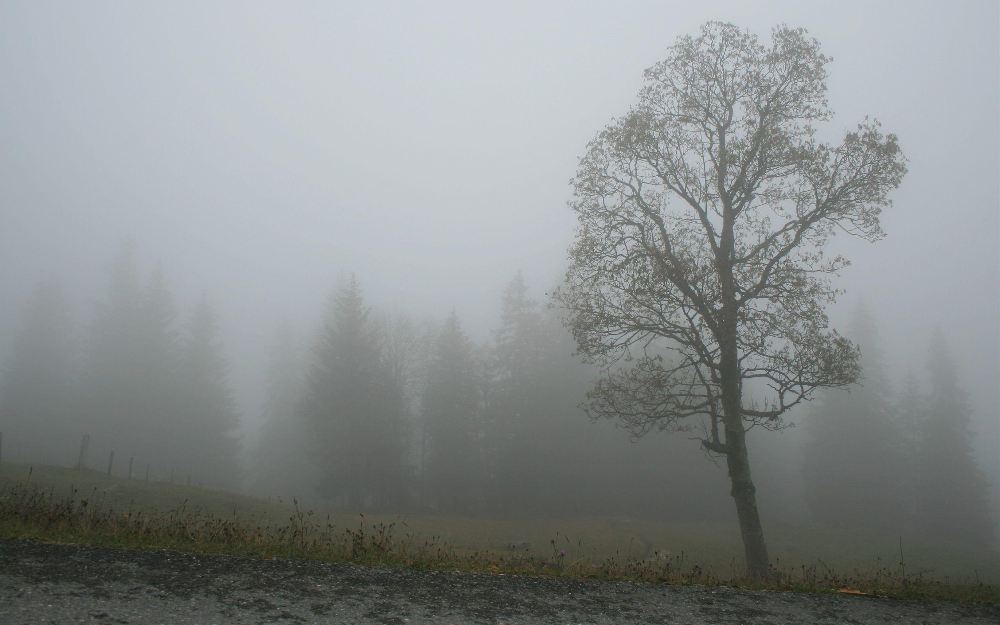
</p>
<p align="center">
Image of the forest in fog, the bigger the distance to the object, the bigger the probability that the photon will hit the particle in the air and scatter. And this causes objects at far distances to become less visible.
</p>

#### Homogenous (uniform) Volumes

The homogenous (uniform) volumes are usually described by **absorption coefficient** denoted as $\sigma_a(x)$. It determines the amount of light that is absorbed by the volume (usually it's transferred into heat). **scattering coefficient** denoted as $\sigma_s(x)$. It determines the amount of light that gets scattered (i.e. that hits a particle and changes direction). And **Phase Function** that determines the new photon direction after the scattering occurs. There's also one more coefficient, called **extinction coefficient** and it's denoted as $\sigma_t = \sigma_a + \sigma_s$. It describes the amount of light that is either scattered or absorbed, so it's just a sum of previous coefficients.

The amount of light that is being absorbed or scattered in a volume is described by **Beer-Lambert** law.

$$
T(x) = e^{-\sigma_t \cdot x}
$$

So we can just calculate the overall path through the volume and apply the above formula right? Well... not really, because it won't account for indirect lighting, the approach that I described is usually considered in rasterizers, but we're in a path tracer. So what we can and want to do is actually a random walk in a surface, this way we're not only accounting for the energy lost inside the volume but can also alter the path of light, just like in real world! This way we'll account for indirect lighting (i.e. what happens if ray changes its initial direction and hit's different light?). But how do we do that? Well, we can actually use the **Beer-Lambert** formula as our PDF for the scattering. In other words, the $T(x)$ is the probability of the photon hitting the particle in a volume. It's an exponential function so it actually decreases as the x value grows, we can think of it being the probability that we will scatter for the values greater than x. For x = 0 it's 1, so we have a 100% change that we will scatter farther, and let's say that for x = 0.5 we get 0.5, so we have a 50% chance of scattering farther along the way than after traveling for 0.5 meters. It's weird but it works. 

But how exactly do we calculate the $x$? In short, if we have the PDF we can use inverse transform sampling to be able to get random values with given distribution. And luckily we already have the PDF. So after doing just that we can compute our $x$ with the following formula:

$$
x = -\frac{\ln(\xi)}{\sigma_t}
$$

We have the distance at which we hit the particle, so now to decide whether to scatter or absorb we compute the probabilities of each event like so:

$$
p_s = \frac{\sigma_s}{\sigma_t}
$$

$$
p_a = \frac{\sigma_a}{\sigma_t}
$$

Then we can just decide whether to scatter or absorb by randomly choosing one of the probabilities.

If we choose to scatter, we need to know the direction in which to scatter. The new direction is determined by the **Phase function**, there are lots of different ones like Rayleigh or Mie but the most commonly used is **Henyey-Greenstein** because it's really easy to sample and pretty quick to compute compared to the other ones. The phase functions are in fact just PDFs, the probability of ray going in the given direction, but just like before we can use inverse transform sampling to sample the distribution.

The **Henyey-Greenstein** is defined like so:

$$
p(\theta) = \frac{1}{4\pi} \frac{1 - g^2}{1 + (g^2 - 2g\cos{\theta})^{3/2}}
$$

with $\theta$ being the angle between the incident direction and the scattered direction. And the $g$ term, it's called **Assymetry factor**, it's describing the volume anisotropy, so how likely the light is to scatter in forward or backward direction. It ranges from $-1 \leq g \leq 1$, where -1 means the rays will always scatter perfectly backwards, 0 means the ray will be scattered equally over the sphere, and 1 means the direction won't change.

After doing inverse transform sampling we get

$$
\cos{\theta} = \frac{1}{2g} \left[1 + g^2 - (\frac{1 - g^2}{1 - g + 2g\xi})^2\right]
$$

Of course a single angle is not enough to create direction but we can easily generate random dir with this angle using spherical coordinates like so:

$$
\phi = 2\pi\xi
$$

$$
\sin{\theta} = \sqrt{1 - \cos{\theta}^2}
$$

$$
o_x = \sin{\theta} \cdot \cos{\phi}
$$

$$
o_y = \sin{\theta} \cdot \sin{\phi}
$$

$$
o_z = \cos{\theta}
$$

Then the only thing left to do to get a direction is rotating it along the incident ray direction like so:

$$
o_x\prime = o_x * T
$$

$$
o_y\prime = o_y * B
$$

$$
o_z\prime = o_z * N
$$

where
* $T$ is the tangent of incident direction.
* $B$ is the bitangent of incident direction.
* $N$ is the incident direction.

With that we're almost done, to actually scatter something we need only one more thing, which is the total path length through the volume that ray can travel. Then we can check if $x$ (our scatter distance) is greater than the total path length, if it is, we don't scatter since the scatter point is outside of volume. But how do we get that total path length?

First we need to check if we're intersecting with the volume, the problem is that we can't really use the vulkan ray tracing pipeline, and that's because it doesn't allow you to check whether you're inside the object or not. And this case is really important, imagine a scene (including camera) that's covered in a fog, so there is only 1 intersection point with the volume. In that case you have to be able to check whether the camera is inside the fog to determine total path length and just say that the nearest intersection is at the camera position. But vulkan rt pipeline only allows you to check what the ray is intersecting with. I mean technically there is a way, you could just query all of the intersections along the path instead just the closest one, and check what volume you're intersecting from the inside, but doing that would be a little bit complicated and slow because there are a lot of edge cases with complex geometry, and I do not really care about complex-meshes volumes anyway, maybe I'll add it some day. So the approach that I went with is just uploading a buffer of AABB colliders and checking ray intersections against that. Which is just way faster and simpler than using ray queries on triangles.

So the final algorithm would look something like this:

```
// Query closest geometry
float closestGeometry = ...

float finalScatterDistance = floatMax;
for (int i = 0; i < volumeCount; i++)
{
    float scatterDistance = GetScatterDistance(volume);

    float distNear;
    float distFar;
    DeduceHitPoints(volume, ray, distNear, distFar);

    if (isInsideTheVolume(ray))
        distNear = 0.0f;

    float pathLengthThroughVolume = distFar - distNear;

    // Geometry is in front of the volume so there is no way to collide with volume
    if (distNear > closestGeometry)
        pathLengthThroughVolume = 0.0f;

    // Geometry is splitting the volume
    else if (distFar > closestGeometry)
        pathLengthThroughVolume = closestGeometry - distFar;

    // Loop through all volumes and check which ones scatters closest to the camera
    float scatterDistanceFromCamera = distNear + scatterDistance;
    if (pathLengthThroughVolume > scatterDistance && scatterDistanceFromCamera < finalScatterDistance)
      finalScatterDistance = scatterDistanceFromCamera;
}

if (finalScatterDistance != floatMax)
    // volume collision
else
    // Don't scatter, evaluate the surface BSDF if there's anything on the way
```

So now we can check whether the photon collides with the volume particles or not, but how is this collision evaluated exactly? First we have to decide whether to scatter or absorb the photon. That's done with previously computed probabilities $p_s$ and $p_a$.

```
if (random < pa)
{
    // Absorb
    break; // Break the ray traversal
}
else if (random < pa + ps)
{
    // Scatter
    origin = origin + ((distNear + scatterDistance) * currentDir);
    rayColor *= volumeColor;

    // Change the direction and trace further
    currentDir = SampleHenyeyGreenstein(...);
}
```

And we're done, we can actually see the results:

<p align="center">
  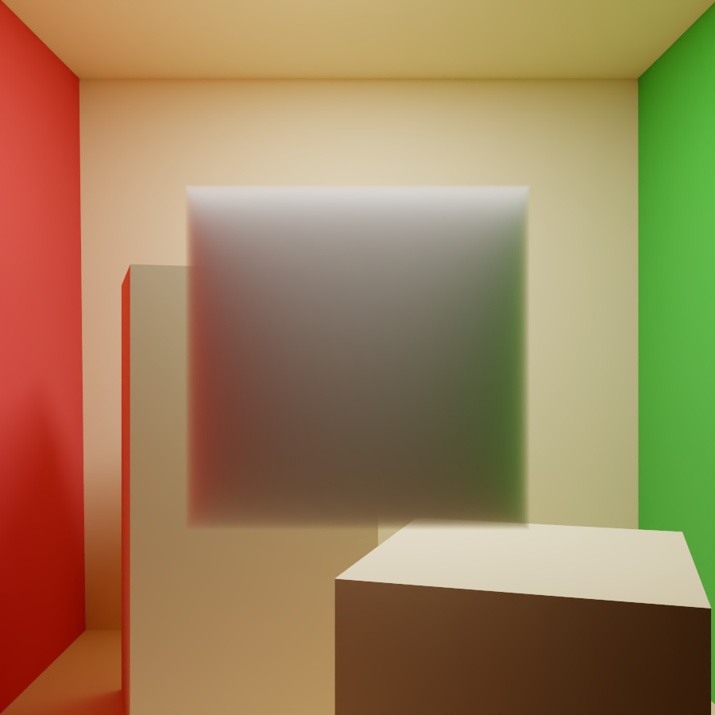
</p>

Now to speed things up a by a bit we can handle absorption a little bit differently. Instead of breaking the ray traversal through the scene we can just modify the rayColor with the inverted probability of absorption, so for low absorption we'll have 1 (no modification) and for high absorption we'll have 0 (absorb everything). we can either to that with 

$$
1 - \frac{\sigma_a}{\sigma_t}
$$ 

or just 

$$
\frac{\sigma_s}{\sigma_t}
$$

since it's just inverted absorption probability.

```
rayColor *= vec3(scatteringCoefficient / sigmaT) * volumeColor;
```

From a mathematical point of view it's literally the same thing, previously we just absorbed the color by ending the ray path, and now we're absorbing it through decreasing the ray energy (color). So theoretically after an infinite amount of samples the result will be exactly the same (of course we don't need that many). And it's way faster from the computer perspective because there's way less branching for the GPU and well, we're just tracing more paths overall so there's less variance. It is around 2-2.5x faster, but it depends on the volume settings of course.

<p align="center">
  
  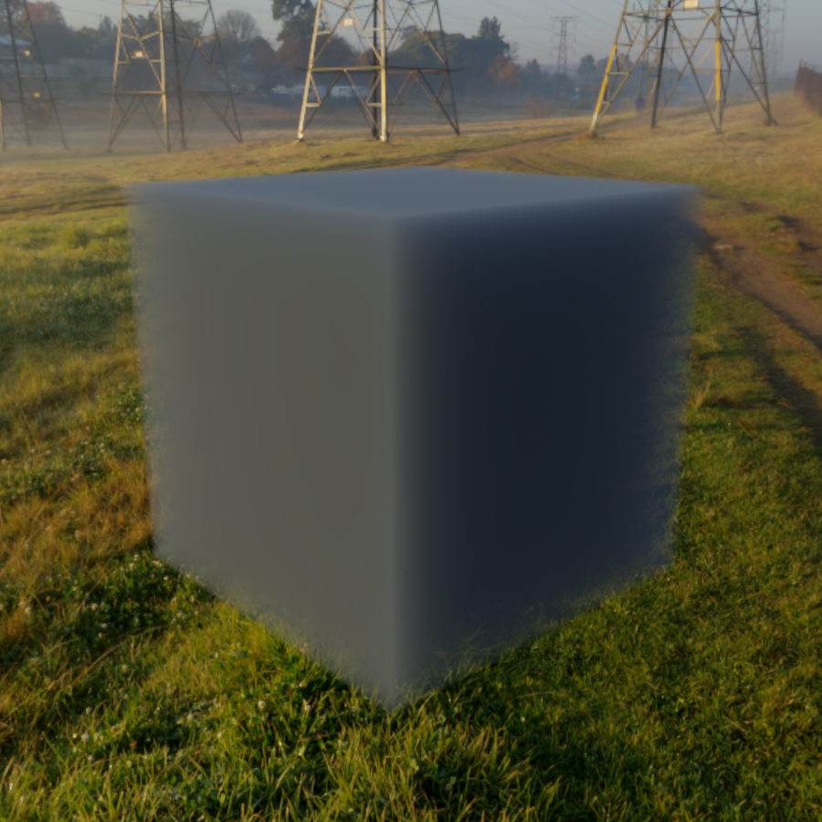
</p>
<p align="center">
Left image shows breaking the loop approach while the left one is showing modifying the ray color. Both look identical.
</p>

And if we're modifying the albedo anyway, we can actually just get rid of the absorption coefficient $\sigma_a$ altogether, we can model the absorption purely using volume color which is preferable because well, as a rule of thumb, the less parameters there are the easier and more intuitive the work is for the artists. So now we can model our volume with only 3 parameters - Color, scattering coefficient, and anisotropy for phase function.

Here are some other settings for the volume like no absorption which makes it look like a cloud:
<p align="center">
  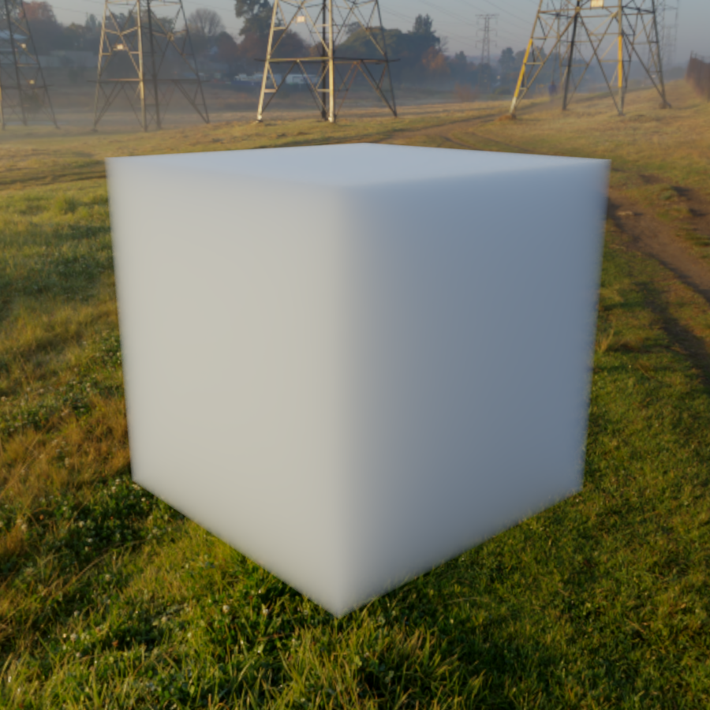
</p>

Or really high scattering coefficient which makes the object look more like a solid matter with sub-surface scattering:

<p align="center">
  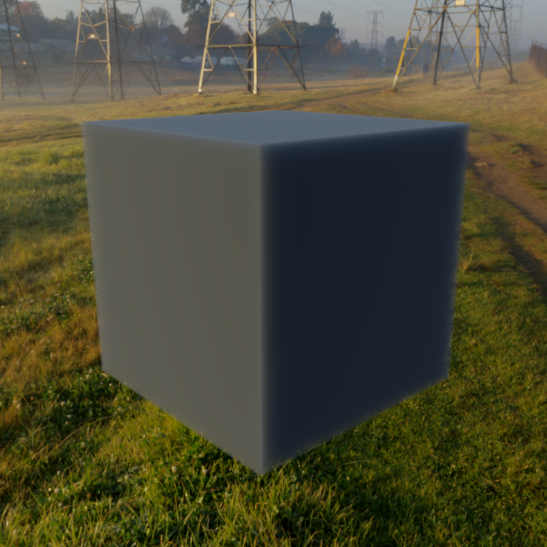
</p>

You can also make the scattering coefficient really low and the volume really big, it will look like a fog, which I think is pretty much the only use case for homogenous volumes that are just AABBs. Then you can place a light in the scene and actually see the so called god-rays of the lights. Although doing that will create insane amounts of noise with naive path tracing, since now literally every ray can hit the light no matter it's initial direction. Ray paths are really twisted which leads to a lot of variance:

<p align="center">
  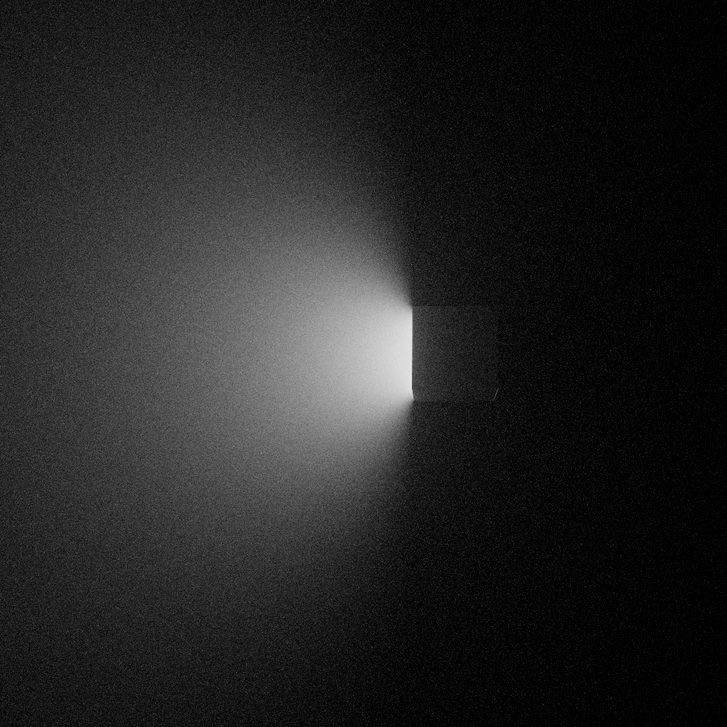
</p>

It is always possible to just path trace it till it looks good, but it will take a long time to do so. Here's the undenoised version of the image you can find in the [Gallery](https://github.com/Zydak/Vulkan-Path-Tracer#gallery), there's a car with lights on in a fog, it actually took 1 million samples **per pixel** to make it look even half decent. I had to path trace it for almost 2 hours! But it's definitely worth to see how beautifully the light is scattering in the fog, and the denoiser does a pretty good job at denoising it anyway. That said I still had to keep the exposure pretty small so that the worse looking parts just weren't visible.

<p align="center">
  
</p>

Also as a fun fact, because in the algorithm described above we're looping over all volumes and choosing the closest scatter distance, the volumes can naturally blend together:

<p align="center">
  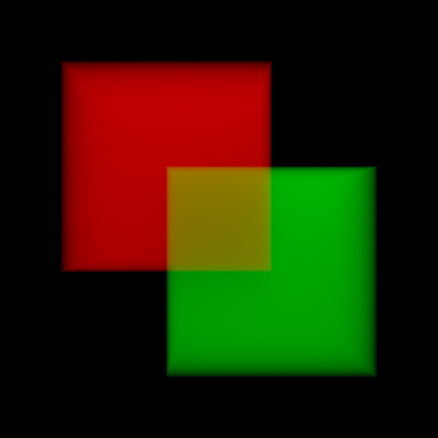
</p>

#### Heterogenous (non-uniform) Volumes

In contrast to homogenous volumes, heterogenous volumes are not uniform everywhere, their density varies for every position. To sample something like this we have to make one change to the previous algorithm, and that is to resample the volume properties after traveling through it for certain distance. We could just resample after some fixed distance, like 0.1 meters, but that would be awfully slow, especially if the volume is mostly empty. So what I'll do is use a method called **delta tracking**. With delta tracking the empty parts of the volume get filled with imaginary particles that don't do anything (don't absorb or change direction), but if photon hits them, volume properties get resampled.

To model these **null collisions** there's need for another coefficient, null coefficient denoted as $\sigma_n$. It's best if it's chosen in a way that the entire volume is homogenous so $\sigma = \sigma_s(x) + \sigma_n(x)$ is true for every position $x$ inside the volume. In other words, if there is a place in volume where $\sigma_s$ is high, then $\sigma_n$ should be low, and if $\sigma_s$ is low, $\sigma_n$ should be high. It doesn't have to be that way tho, $\sigma_n$ can be set to a constant, but if it's too low then the volume will look very bad, and if it's too high it's a waste of performance, since the volume will be resampled really often for no reason. So it's best to leave it homogenous ($\sigma = \sigma_s(x) + \sigma_n(x)$ for every position $x$).

So first, to make a non-uniform volume we need some data of where exactly the density varies. In other words, which parts are denser than the others. For simplicity sake I just used 3D perlin noise, so for each intersection with a volume a new $\sigma_s$ and $\sigma_n$ is computed using the ray world position like so:

```
// Noise functions come from this awesome repo: https://github.com/stegu/webgl-noise

// Get the noise value using intersection world position
float noise = cnoise(origin + (distNear * currentDir));
noise = clamp(noise, 0.0f, 1.0f);

scatteringCoefficient = noise * scatteringCoefficient;
float nullCoefficient = (1.0f - noise) * scatteringCoefficient;
```

And the probability of a null collision is computed in the same way as previous probabilities so:

$$
p_n = \frac{\sigma_n}{\sigma_t}
$$

The rest of the code stays identical, then if we hit a particle we do:

```
if (pn > random)
{
    // Null Collision

    // Update the new origin but leave the direction unchanged
    origin = origin + ((distNear + scatterDistance) * currentDir);
    continue;
}
else
{
    // Scatter
    origin = origin + ((distNear + scatterDistance) * currentDir);
    rayColor *= volumeColor;

    // Change the direction and trace further
    currentDir = SampleHenyeyGreenstein(...);
}
```

And that's it, with these simple changes we can start tracing.

<p align="center">
  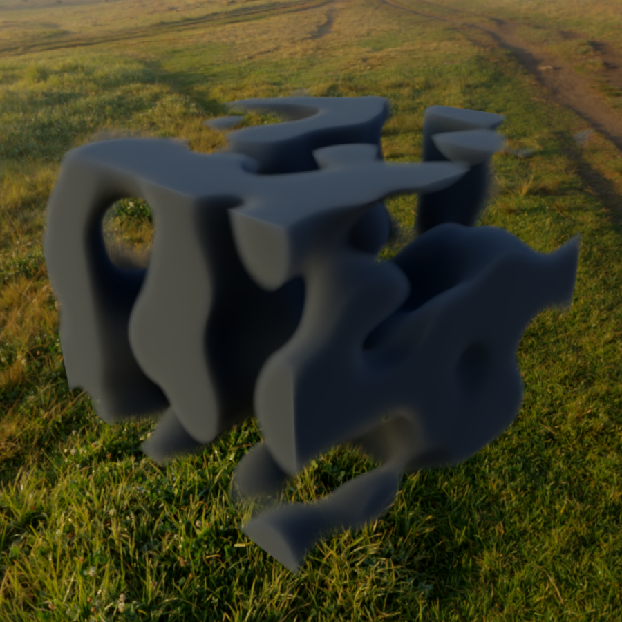
  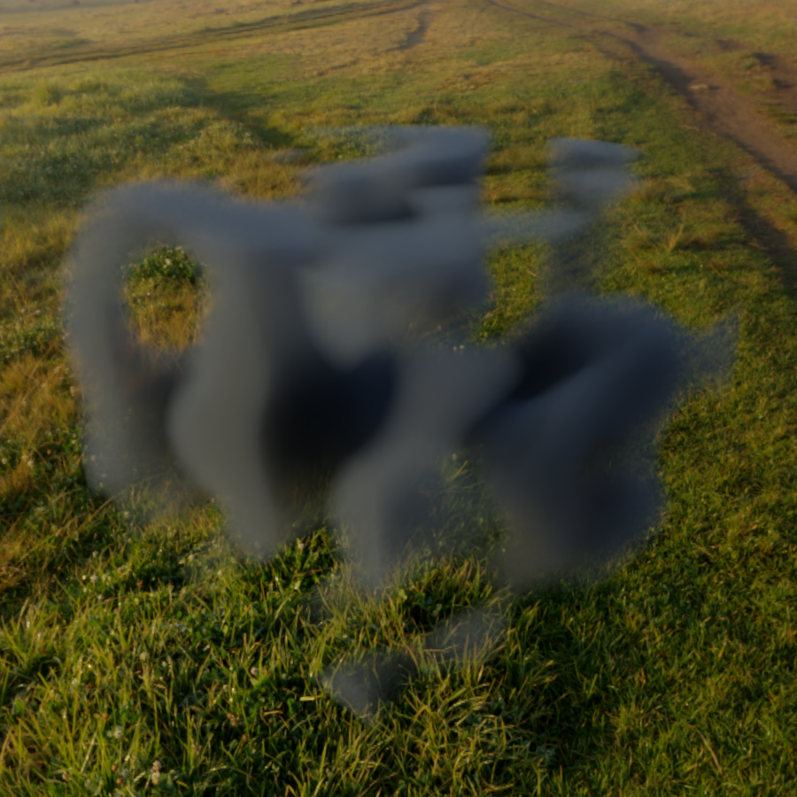
</p>

<p align="center">
Images show non-uniform participating media, the left image shows the same volume as the right one but with lower density.
</p>

Path tracing non-uniform volumes is of course way slower since there are a lot more collisions, if we have a single area with high density the entire volume has to be filled with null particles to match that density. Because of that we're wasting a lot of time on null collisions in empty areas. But as the [Production Volume Rendering](https://graphics.pixar.com/library/ProductionVolumeRendering/index.html) mentions, we can mitigate that by splitting the volume into sub-regions and treat them like they are different volumes, this way the $\sigma_n$ can be way lower in areas with low density. Since now if one region has high density, it doesn't mean we have to fill all other regions with null particles to match that density, we treat them as completely separate objects resulting in less null collisions.

<p align="center">
  
</p>
<p align="center">
Visualization of splitting one volume into subregions and tracing rays through it.
</p>

But I haven't implemented it here since I don't have any data on the CPU, as I mentioned before for the sake of simplicity I'm computing the density value on the fly when colliding with a particle. But I'm pretty sure the technique described above is exactly what OpenVDB format is doing so maybe I'll try to implement it some day.

### Glass as a volume

To more faithfully represent glass we can try shading it as if it was volume in which the light can scatter. To do that we can use two different approaches. One is to simulate the entire random walk inside the glass object with light scattering into different directions and being absorbed just like we did with normal volumes. Or just use the **Beer-Lambert** law on distance traveled when refracting the ray. I went for both approaches, since simply applying the **Beer-Lamber** law is exactly the same as doing a random walk with anisotropy equal 1. If it's not equal 1 then I'm doing a random walk. That's because with random walk it takes 3-4 times longer to render the image, but that depends purely on the scene settings and medium density. The only advantage of random walk would be ability to set the anisotropy factor, and that's it. I won't be talking about the random walk implementation here since it's literally the same as for the normal volumes, the only difference is that the closest geometry distance is now a triangle geometry and not AABB. If you're interested in that you can check the code [here](https://github.com/Zydak/Vulkan-Path-Tracer/blob/main/PathTracer/src/shaders/raytrace.rchit).

And when it comes to the **Beer-Lambert** law, literally all we have to do in code is to to change how refraction is evaluated on hit from `BSDF = Color;` to `BSDF = vec3(1.0f)'`, and add this code snippet to both reflection and refraction on glass materials:

```
vec3 beerLaw = exp(-(1.0f - Color) * mediumDensity * hitDistance);

if (hitFromTheInside)
    BSDF *= beerLaw;
```

The difference is huge, and it doesn't cost any performance.

<p align="center">
  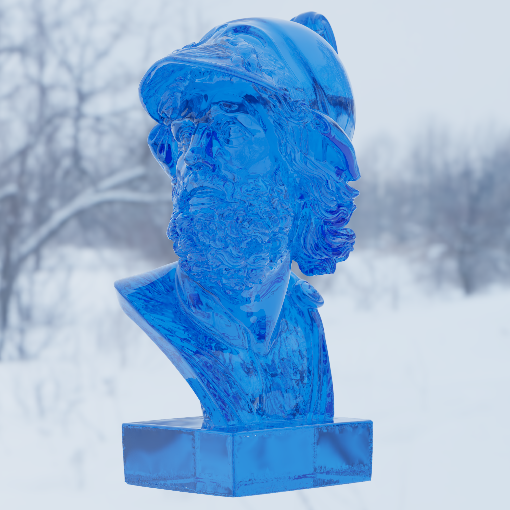
  
</p>
<p align="center">
Left render evaluated refractions with BSDF = Color. Right render evaluated them using Beer-Lambert law.
</p>

Using this method also requires a new parameter medium density, which is well, density of a medium, glass in this case. We could also keep the surface attenuation as a separate thing, so on surface hit it still gets attenuated `BSDF = Color;`, which is also fine and gives you more artistic freedom. But then another parameter called medium color has to be introduced.

### Conclusion

Well, this section was quite long, but hopefully now you can understand how and why the BSDF in my path tracer works the way it works! I really recommend reading all of the papers that I referenced to understand the topic better. Especially [Turquin](https://blog.selfshadow.com/publications/turquin/ms_comp_final.pdf) and [Heitz](https://eheitzresearch.wordpress.com/240-2/) to understand the multiple scattering and [Sampling the GGX Distribution of Visible Normals](https://jcgt.org/published/0007/04/01/paper.pdf), [Refraction through Rough Surfaces](https://www.graphics.cornell.edu/~bjw/microfacetbsdf.pdf) to understand the GGX distribution, and finally [Production Volume Rendering](https://graphics.pixar.com/library/ProductionVolumeRendering/index.html) if you're interested in participating media.

## Denoising

All denoising is done with [Optix Denoiser](https://developer.nvidia.com/optix-denoiser) running on CUDA.

First I rasterize the scene into a GBuffer to give optix a better context of the scene, the rasterized images are called **guiding layers**. I'm rasterizing the albedo of each surface onto one image, and then the normals of each surface onto another image. It's important that these images are RGBA32 because they need to match the optix buffer layout. After the images are rasterized, they are copied into Vulkan buffers. Then I get a memory handle of them with **vkGetMemoryWin32HandleKHR** and import the buffers into cuda with **cudaImportExternalMemory** and **cudaExternalMemoryGetMappedBuffer**. After that the rasterized images are ready to be used by Optix.

<p align="center">
  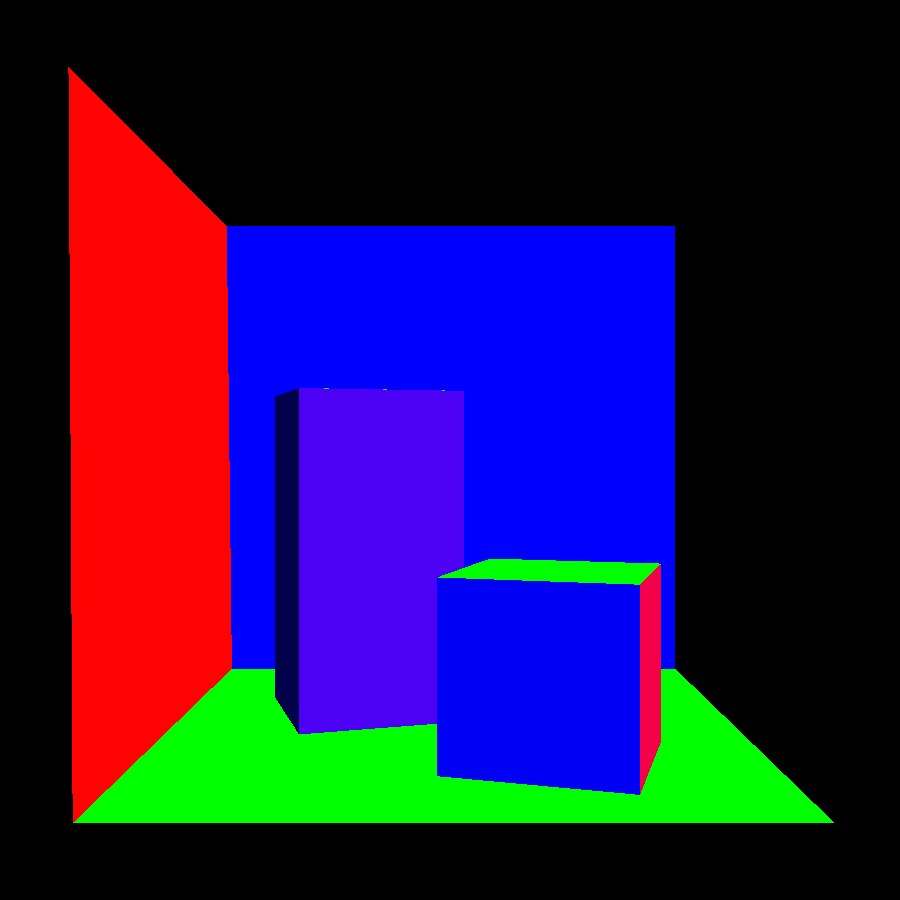
  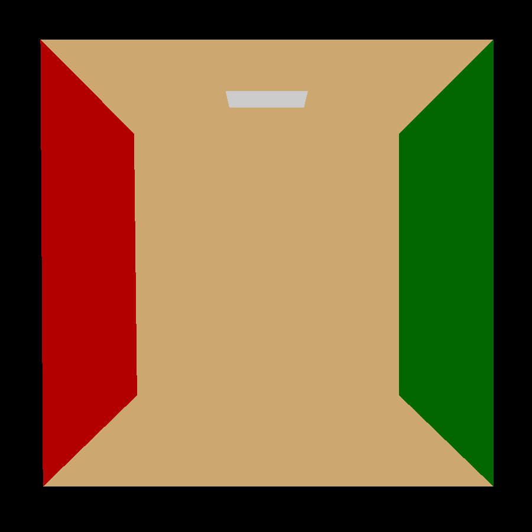
</p>

<p align="center"> 
Left image shows rasterized normal information. Right image shows rasterized albedo information.
</p>

After the rasterized images are ready, we wait for the Vulkan frame rendering to finish, pass all the information to optix (path traced image + 2 guide layers) and call **optixDenoiserInvoke**. After that we have to wait for it to finish, which takes a few milliseconds. Then we just copy the resulting cuda buffer to the Vulkan image as we did before and present it to the screen.

<p align="center">
  
  
</p>

<p align="center"> 
Left image shows the path tracing result with 15k samples per pixel, a lot of noise is clearly visible. The right image shows the denoised version of the left image. All the noise is gone.
</p>

## Conclusion

And that pretty much concludes the overview of path tracing. I went through every single component that is used to path trace my renders, I didn't explain everything in that much detail, but that's not the point of this document, if for some reason you need more details on how exactly I implemented all these things, you can just look in the code. There are also tons of online resources that will explain these things much better than I can here. 

So for further reading:
* Read the code.
* For more info on the Vulkan raytracing pipeline, see [vk_raytracing_tutorial](https://nvpro-samples.github.io/vk_raytracing_tutorial_KHR) or [raytracing gems II](https://developer.nvidia.com/ray-tracing-gems-ii) chapter 16.
* For more information on BSDF and various other techniques like Russian Roulette, see the [pbrt book](https://pbr-book.org/4ed/contents) and read all of the papers that were mentioned.
* For more info on the Optix denoiser see nvidia [vk_denoise sample](https://github.com/nvpro-samples/vk_denoise). That's what I based my denoiser implementation on.

# Benchmark

In this section I will discuss the general performance of the path tracer.

## Specs

All benchmarks were taken using:
* Intel Core i5-10400F 2.90GHz
* RTX 3060
* Windows 10
* Visual Studio 2022

## Performance
The performance of the path tracer depends on the scene and material settings. Some scenes will have more variance than others, which means you generally have to take more samples, which means longer render times. Some scenes will have a lot of enclosed spaces, which means more ray bounces, which means more time per sample. For some scenes there will be a lot of vertices, which means more time spent on intersection tests.

So here I'll present the performance of rendering 3 different scenes:
* CornellBox (64 vertices, 96 indices)
* Sponza (2.2M vertices, 11.2M indices)
* Dragon (2.5M vertices, 2.5M indices)

We'll also look at how Russian Roulette affects their performance.

## Cornell Box

<p align="center">
  
</p>

Accumulating 15,000 samples per pixel on a 1000x1000 image (i.e. 15,000,000,000 samples) with max ray depth set to 20 takes about **17.5s**. As mentioned before, the roulette works best when there is a lot of color absorption, which is the case here, the walls are dark gold and the left and right have only a single channel, so the roulette gives us a nice performance boost. Rendering without roulette takes about **44.2s**, so we get a performance increase of about 250%.

## Dragon

### Opaque

<p align="center">
  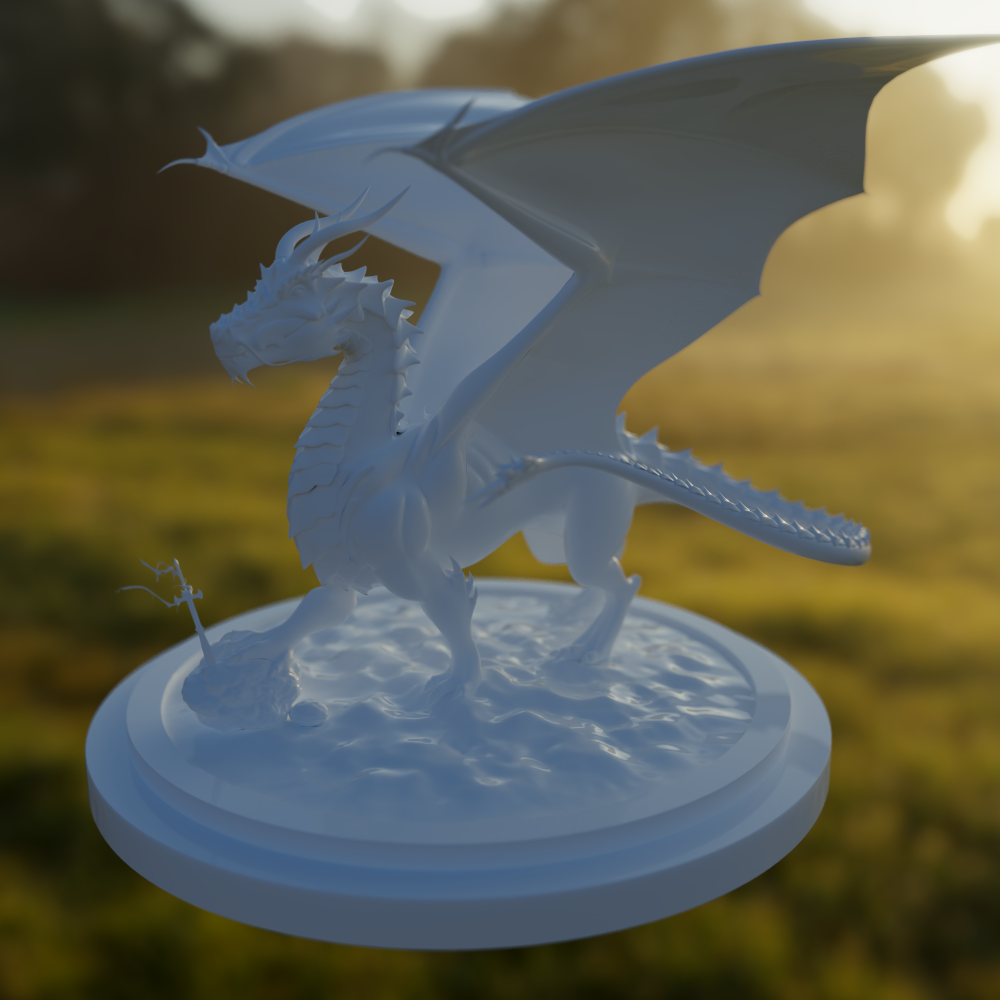
</p>

Accumulating 15,000 samples per pixel on a 1000x1000 image (i.e. 15,000,000,000 samples) with max ray depth set to 20 takes about **24.6s**. Here, where we have a single white albedo mesh, we get no performance boost from running Roulette because there is no absorption, the material is a perfect reflector. Also, due to the fact that we have a single model lit by the env map, we don't actually need 15K samples to produce a quality image, because the variance from the env map is relatively small. A 1k spp would be sufficient for this particular scene.

### Transparent

Let's also look at the case where we have a more complex material. By making it fully transparent it's no longer a single scatter, we can now also refract light, which means more bounces per sample.

<p align="center">
  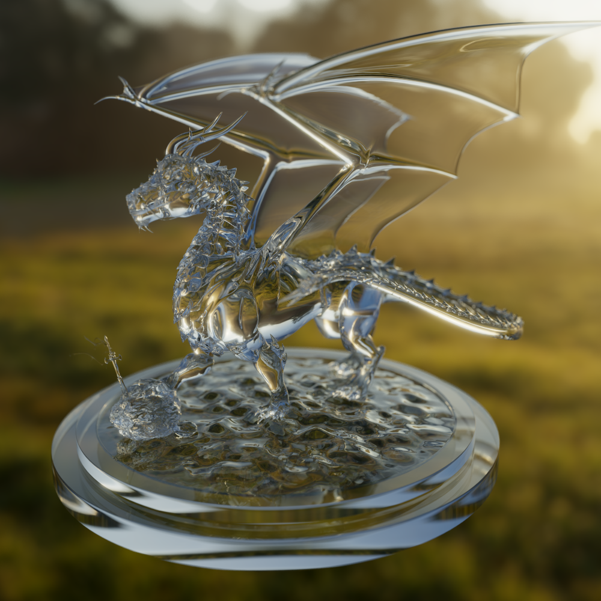
</p>

The accumulation of 15,000 samples per pixel on a 1000x1000 image (i.e. 15,000,000,000 samples) with max ray depth set to 20 takes about **56s**.

## Sponza

<p align="center">
  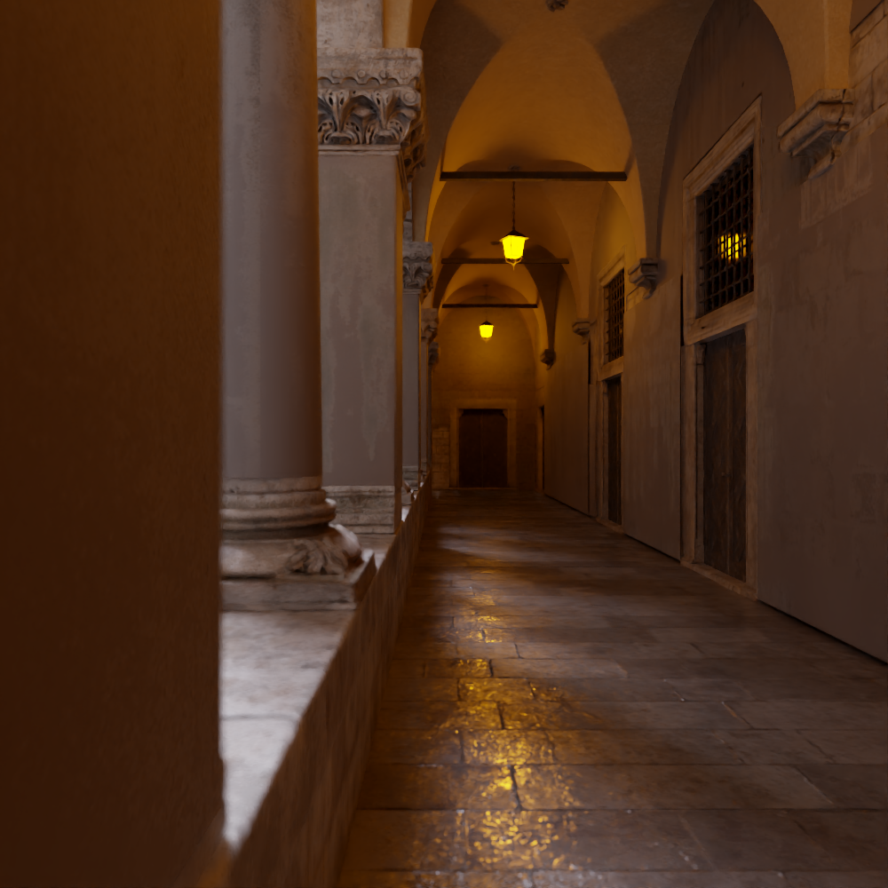
</p>

Accumulating 15,000 samples per pixel on a 1000x1000 image (i.e. 15,000,000,000 samples) with max ray depth set to 20 takes about **64.1s**. But if you zoom into the image, you'll see a lot of weird artefacts. That's because the denoiser couldn't handle all the noise generated by this scene. Here, unlike the dragon scene, we actually have to take more than 15K samples to reduce the noise to a denoiseable level. This is mainly because it's a closed room with small lights, so it produces a lot more variance. For the image in the gallery I used 500K spp.

It's the most complex scene of all, it has the most vertex data, it's practically a closed room, it has textures, small lights and so on. And because of all that and the fact that we have a LOT of absorption going on, this is where Russian Roulette shines the brightest. Rendering this scene without Russian Roulette takes **87.5** minutes! That's over an hour to get barely 15K samples! So we get a **8,190%** performance boost just by adding 4 lines of code to use the roulette.

# Editor
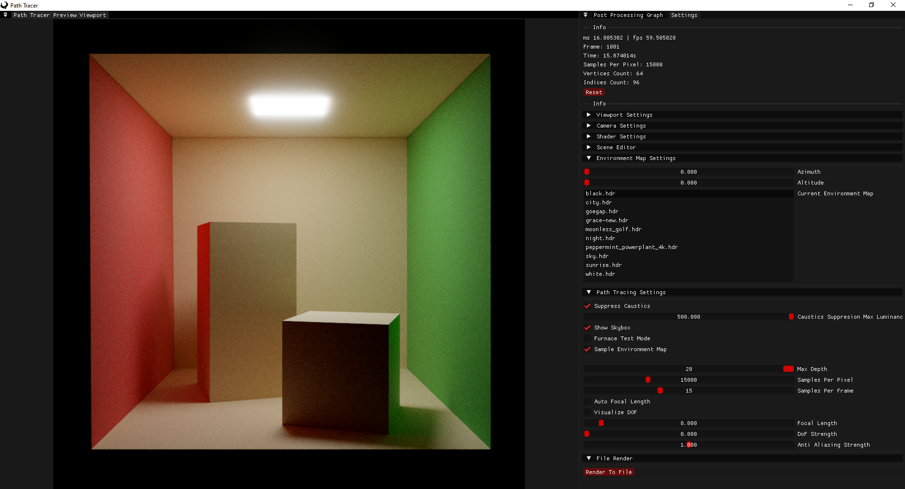

This project features a fairly simple editor, built using [ImGui](https://github.com/ocornut/imgui), which is used to modify the scene and path tracer settings. Here I'll go through each of the 8 sections of the editor and explain each parameter.

## Info Section
<p align="center">
  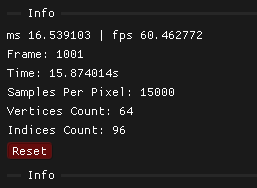
</p>

In the Info section we can find general information about the status of the application. We can find:
* Framerate.
* How many frames it took to render the image.
* How long it took to render the image.
* How many spp have been accumulated.
* How many vertices and indices the scene contains.

There's also a **Reset** button at the bottom. Pressing it will reset the image and the path tracer will start collecting samples from the beginning.

## Viewport Settings section
<p align="center">
  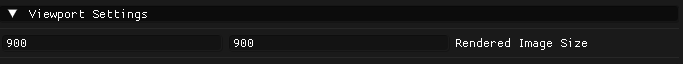
</p>

This section is quite simple, there's just an input field for the dimensions of the rendered image. The default dimensions are 900x900.

## Camera Settings Section
<p align="center">
  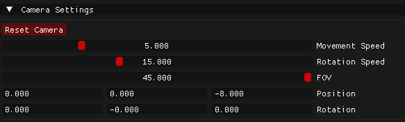
</p>

In the Camera section we can find and tweak every detail of the scene camera. We have a **Reset** button which will reset the camera position and rotation to the initial state. We can also find the FOV parameter which stands for Field Of View, it's the angular extent of the world that is seen, the bigger the fov the more world you will see. The rest of the parameters are self-explanatory.

## Shaders Settings Section
<p align="center">
  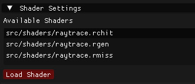
</p>

In Shader Settings we can choose which ray tracing shaders to use. We have **Available Shaders** section which lists all found shaders and is updated on the fly. We can click on any shader in the list and press the **Load Shader** button to use the selected shader. Pressing **Load Shader** will also recompile the given shader if any changes are detected. You can see which shaders are currently in use in the **Currently Loaded Shaders** list.

## Scene Settings Section
<p align="center">
  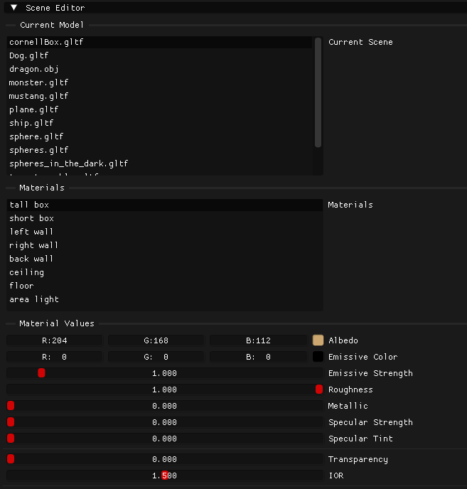
</p>

In the Scene section you can select the scene to load and edit its materials. In the **Current Scene** list you can see all detected loadable files in the **assets** directory. To be marked as loadable, a file must be in either GLTF, OBJ or FBX format. The list is updated on the fly without the need to restart the application. Below you can find the **Materials** list, it lists all the materials available in the scene. Below this list you will find sliders that allow you to edit the properties of the selected material. If you need more information about the material properties, check out the [Material Showcase](https://github.com/Zydak/Vulkan-Path-Tracer#material-showcase) and [BSDF](#bsdf) sections.

## Environment Map Section
<p align="center">
  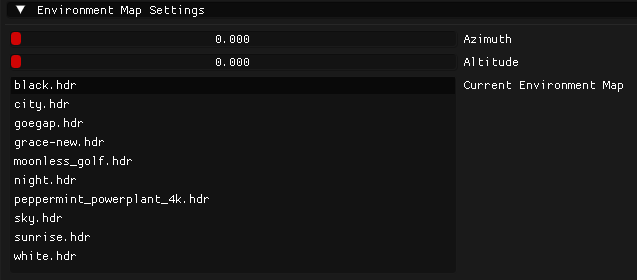
</p>

In the Environment Map section we can choose which env map to load by selecting one of the .HDR files located in the **assets** directory. As before, the list is updated on the fly. You can also rotate the env map, there are 2 sliders for this, Azimuth which is the rotation along the Y-axis (left and right) and Altitude which is the rotation along the X-axis (up and down).

## Path Tracing Section

<p align="center">
  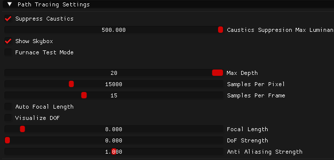
</p>

In the path tracing section we have a lot of options regarding the path tracing itself. We can choose if we want to suppress caustics (more on this here [Caustics Suppression](#caustics-suppression)). You can also choose whether to show the skybox or not, if you set this to true, the scene will still be lit, but you'll see a black background instead of the skybox. There's a **Furnace Test Mode** which sets every albedo of every material to 1.0 (more on this here [Furnace Test](#energy-conservation)). Below that we have settings for accumulation like **Max Depth** (maximum ray depth after which it will stop), Max Samples per Pixel which is self explanatory, and Samples per Frame which determines how many samples will be taken per frame, you should usually lower this setting for larger scenes to keep the editor running smoothly as it is not multithreaded, if path tracing takes 100ms to finish, the editor will also be drawn once every 100ms. Then we have settings for blur and depth of field, we can let the editor automatically deduce the focal length, we can visualize at what distance the focal length is using the **Visualize DOF** checkbox. You can also set the focal length manually, and we can set the strength of the depth of field effect (more about this here [Depth Of Field](#depth-of-field)). The last param determines how strong the anti-aliasing will be, or in other words, how big the offset will be (more about this here [Anti Aliasing](#Anti-Aliasing)).

## File Render Section
<p align="center">
  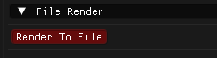
</p>

The last section contains only one button. If you're happy with all the settings you can set in the previous sections, you can click this button to render to file. If you click this button you will have to wait until all the samples are accumulated and when that happens a new section will appear:

<p align="center">
  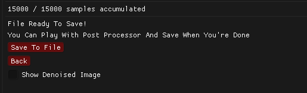
</p>

You can choose whether you want to see a denoised version of the render or not.

## Post Processing Section

TODO

## Serialization Section

TODO

## Conclusion

So as you can see the editor isn't really complex, it allows you to edit a handful of the most basic settings of a scene and path tracer, but it's far from allowing you to create your own scenes from scratch, for the scenes in the [Gallery](https://github.com/Zydak/Vulkan-Path-Tracer#gallery) I had to modify object positions in blender and then export them to GLTF. It also doesn't allow you to switch textures on models so you also have to do that in blender. But despite all this, I managed to create all renders that you can find in this readme as well as in the [Gallery](https://github.com/Zydak/Vulkan-Path-Tracer#gallery). So it's simple, but definitely sufficient for showcasing the path tracer.

# Limitations And Possible Future Improvements

## Editor
Currently the editor is quite limited, for example it doesn't allow to move loaded meshes. That's because moving anything would require rebuilding the entire acceleration structure. Which isn't that hard to do, but still requires some effort. And since I've never needed this feature and was focused on other things, it's just not there. You also can't load more than one mesh for pretty much the same reasons. You also can't choose textures for materials. They are loaded from the object file and stick to the material permanently.