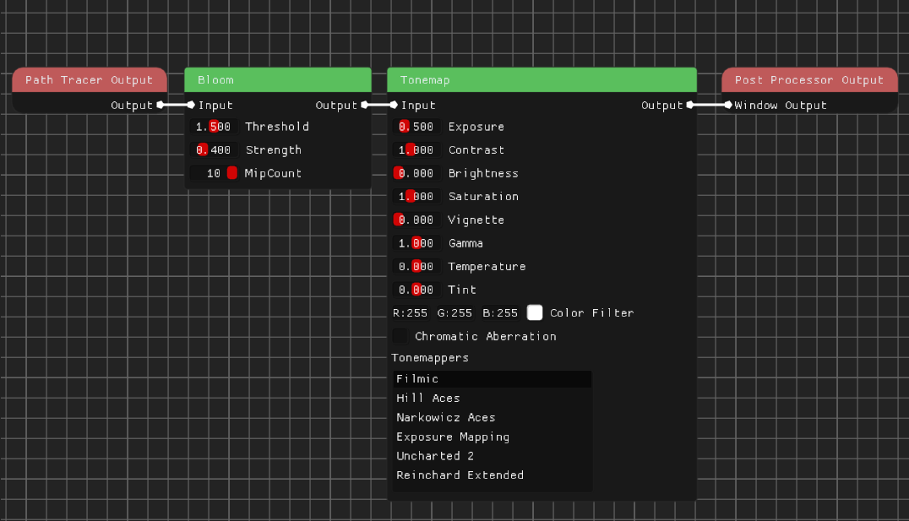

# Overview

The main goal for this project was to create energy conserving offline renderer with global illumination with variety of flexible and easy to use materials using Vulkan. I think that the goal has been achieved pretty well. There are 8 different material parameters available: Albedo, Emissive, Roughness, Metallic, Specular Strength, Specular Tint, Transparency, IOR, that can be easily tweaked to create whatever combination you like the most. Everything is powered by Vulkan and all of the calculations are done on the GPU, so the entire thing runs pretty fast, especially compared to the CPU path tracers. All of the renders that you can find in the gallery are either 1000x1000 or 2000x2000 and haven't taken more than 5-10 minutes to render (except for the sponza one, more info in the [Benchmark](#benchmark) section) and their quality is I'd say really good, especially after denoising. So let's take a deeper look how exactly is everything working.

# Table Of Contents

- [Overview](#overview)
- [Table Of Contents](#table-of-contents)
- [Implementation Details](#implementation-details)
  - [Ray Tracing](#ray-tracing)
    - [RT Pipeline](#rt-pipeline)
    - [Shader types](#shader-types)
      - [Raygen Shader](#raygen-shader)
        - [Ray Generation](#ray-generation)
        - [Anti Aliasing](#anti-aliasing)
        - [Depth Of Field](#depth-of-field)
        - [Russian Roulette](#russian-roulette)
        - [Caustics Suppression](#caustics-suppression)
      - [Closest Hit Shader](#closest-hit-shader)
      - [Miss Shader](#miss-shader)
  - [BSDF And Light Transport](#bsdf-and-light-transport)
    - [Light Transport](#light-transport)
    - [BSDF](#bsdf)
      - [Diffuse](#diffuse)
      - [Dielectric](#dielectric)
      - [Metallic](#metallic)
      - [Glass](#glass)
    - [Energy Conservation](#energy-conservation)
      - [Rendering Equation](#rendering-equation)
      - [Final Result](#final-result)
      - [My Implementation](#my-implementation)
  - [Denoising](#denoising)
  - [Conclusion](#conclusion)
- [Architecture](#architecture)
- [Benchmark](#benchmark)
  - [Specs](#specs)
  - [Performance](#performance)
  - [Cornell Box](#cornell-box)
  - [Dragon](#dragon)
    - [Opaque](#opaque)
    - [Transparent](#transparent)
  - [Sponza](#sponza)
- [Editor](#editor)
  - [Info Section](#info-section)
  - [Viewport Settings section](#viewport-settings-section)
  - [Camera Settings Section](#camera-settings-section)
  - [Shaders Settings Section](#shaders-settings-section)
  - [Scene Settings Section](#scene-settings-section)
  - [Environment Map Section](#environment-map-section)
  - [Path Tracing Section](#path-tracing-section)
  - [File Render Section](#file-render-section)
  - [Post Processing Graph](#post-processing-graph)
  - [Conclusion](#conclusion-1)
- [Limitations And Possible Future Improvements](#limitations-and-possible-future-improvements)
  - [Editor](#editor-1)
  - [Path Tracing](#path-tracing)

    

# Implementation Details

## Ray Tracing

First, let's look into how exactly is the path tracing working.

### RT Pipeline

The entire ray traversal through the scene is handled by a Vulkan Ray Tracing Pipeline and not my custom code. Why? It's faster, because unlike doing everything in compute shaders, it enables you to use specialized RT cores on modern GPUs. And It's way simpler, You don't have to code your own BVH, ray geometry intersections etc. all of that is handled for you, so it is generally faster to deploy.

### Shader types
The Vulkan Ray Tracing Pipeline is fairly flexible because it's made out of several programmable shader stages. These shader stages are designed to handle different aspects of ray traversal and interaction with the scene. There are 5 types of these shaders but I'm using only 3 of them:

**Ray Generation Shader**
* It serves as an entry point for the ray tracing by generating the rays. It basically defines origin and direction of rays.

**Closest-Hit Shader**
* This shader is called for each ray intersection with the geometry. It handles the actual shading of the hit point.

**Miss Shader**
* It's called when there are no intersections in the scene.

#### Raygen Shader

First let's talk about ray gen shader. There are 2 approaches for generating rays - Recursive and loop based.

##### Ray Generation
* In recursive approach you generate only 1 ray per pixel in raygen shader, shoot it into the scene, and if it hits something the closest hit shader takes over. Then you spawn another ray but this time you do it from hit shader and not raygen. That's why it's called recursive, you invoke hit shader from hit shader.
* In loop based approach on the other hand, you create a loop inside the ray gen shader which spawns rays over and over again and don't use recursion in closest hit shader. You just get back into the raygen and spawn another ray where the last one left off.

I used the loop based approach as it is way better than a recursive one, why?
* I found out that for whatever reason it's about 2-3 times faster depending on scene than the recursive method. It's not only my machine as other guides on RT pipeline I saw noticed that as well.
* You're not constricted by the depth limit. In RT pipeline you can't just use recursion infinitely, I don't know what's the minimum guaranteed limit but on my computer it's 31, it of course varies per device. You can query the limit using **VkPhysicalDeviceRayTracingPipelinePropertiesKHR.maxRayRecursionDepth**. If you cross the limit device will be lost so you'll most likely just crash. Of course loop based approach doesn't have this limit, you can bounce rays through the scene for as long as you like.

Now let's talk about some interesting techniques that I used in my raygen shader to improve quality and speed: Anti aliasing, Russian Roulette, Depth of field, and Caustics Suppression.

##### Anti Aliasing

Aliasing is a known artifacts in computer graphics, it's caused by the fact that in real world cameras edges of pixels are a blend of foreground and background, that's because in real world the space is continuous, it has infinite resolution, so if we want to turn this space into pixels we're basically averaging all the space that pixel takes up. In computer graphics we're not averaging anything, we're just shooting a ray in some direction and sampling it's color. This approach is called **point sampling**, luckily for us in path tracing we're averaging multiple rays per pixel anyway, so the easiest fix to our problem is just offsetting the rays a little bit in random direction so that they are average color of the space that the pixel takes up.

It's really simple in terms of code, we just generate random point on a 2D circle or square and then we offset the ray direction with it. Here's the result:

  
  

 
Left image was rendered with anti-aliasing and the right was rendered without. The difference is quite clear.

##### Depth Of Field

Depth of field (DoF) effect is pretty simple, it's a camera effect that simulates a real-world lens. It causes objects at a certain distance from the camera (Focal point) to appear sharp, while objects farther from that point appear progressively more blurred due to the camera lens bending the light. All you need to do in code is randomly offset ray origin and set ray direction to **focalPoint - rayOrigin**.

  
  

 
Left image was rendered with Depth of Field effect on, you can clearly see how focal point is set on a middle sculpture, and how the first and the last one are completely out of focus. Right image was rendered without Depth of Field effect for comparison. 

##### Russian Roulette

We compute each ray color (throughput) like following:

$$F = \prod_{i=0}^{N} F_i$$

where $F$ is the integrand (light contribution of the ray), $F_i$ is contribution of each bounce, and $N$ is the number of ray bounces.

Because the ray accumulation is a monte carlo simulation, to have a completely unbiased and mathematically correct result of the sample we should bounce the ray through the scene infinite amount of times, which is completely impossible to do. But as each successive bounce does less and less visually (it's throughput decreases due to color absorption) path tracers usually set the bounce limit to some hardcoded value like 10 or 20, so the image is still "visually" correct, although it's mathematically wrong. But how do we choose this limit? If it's too small we're biasing the result so much that it's no longer visually appealing, if it's too large we're wasting time on computing low throughput paths which don't change anything visually. Here's when the **Russian Roulette** comes into play.

At each ray-surface intersection, we set a probability $p$ it can be chosen in any manner, I set it based on the maximum value of one of three RGB ray channels. A random number $r$ is generated, and if $r$ is less than $p$, the ray continues, otherwise, it terminates. If the ray continues, its contribution is multiplied by a factor of $\frac{1}{p}$ to account for the termination of other paths. Here's a mathematical formulation of this:

When applying Russian Roulette, after each bounce we compute new integrand:

$$ F\prime = \begin{cases} 
0 & \text{with probability } (1 - p) \\
\frac{F}{p} & \text{with probability } p
\end{cases} $$

And then just set the old integrand $F$ to newly computed one $F\prime$.

So We can see that as long as we divide the $F$ by $p$ the expected value remains mathematically unbiased:

$$ E[F\prime] = \left(1 - p\right) \cdot 0 + p \cdot \frac{E[F]}{p} = E[F] $$

Of course if we choose to sample with probability $(1 - p)$ which means we set the $F\prime$ to 0, we can stop bouncing the ray any further, it's throughput is 0. And every other bounce, no matter it's throughput, will also be zero since anything times 0 is 0.

And because we're terminating only paths with low throughput we're not introducing too much variance and keeping the convergence rate relatively similar to the original one. This way the result is not only mathematically correct, but we're also saving a lot of computation time by not evaluating low throughput paths. 

By applying russian roulette we're in fact **always** introducing more variance, but if probability $p$ is chosen correctly we're gaining efficiency which outweighs small variance that it introduces. But if for some reason the probability $p$ is chosen poorly, like a constant of 0.01. We'd only trace 1% of the camera rays and then multiply them by a 100. From a mathematical point of view, the image is still correct, it will eventually converge on the right result. But visually it's horrible. If the termination probability is 99% for each bounce then the probability that we reach 20 bounces is $0.01^{20} = (10^{-2})^{20} = 10^{-40}$. So the probability of reaching 20 bounces (optimal for "visually correct" image) is equal $0.0000000000000000000000000000000000000001$! That's why the image will be super dark, you'll be lucky to get 2 or even 1 bounce most of the time, which is nowhere near the needed amount. So terminate your rays wisely.

  
  
  

 
Left image was rendered without russian roulette (366s for 200k samples per pixel)

 
Middle image was rendered with roulette with correctly picked probability (150s for 200k samples per pixel)

 
right image was rendered with roulette using constant probability 0.1 (55s for 200k samples per pixel)

So in general, this method reduces computation by terminating a lot of the low contributing paths while keeping the rendering unbiased. It gives you a nice performance boost based on the scene settings, what I mean by that is because I'm choosing to terminate my rays based on the albedo so you could say "luminance", if materials aren't absorbing any light (they are white) the roulette won't give us any performance increase, we don't terminate rays if they are bright, and their brightness depends on the materials colors. more on that in the [Benchmark](#benchmark) section.

##### Caustics Suppression

Caustics Suppression is a method used to limit the luminance of the sampled ray. Because of lack of complex light transport algorithm if we pick environment map with a few very bright spots the variance goes through the roof. And unfortunately there's not much we can do about that, so the only solution is to limit the luminance of the rays that hit those very bright spots.

If I pick a 2k env map that has 3 pixels that are really bright and I just path trace with my naive approach it will be a disaster, I would probably have to run this for several days to bring down the noise to a level where I can denoise it. Otherwise the variance is just too big to even be denoised (at least with my denoiser).

  
  

 
The left image shows cornell box lit by a very bright env map, the image has 200k samples per pixel. Right image shows attempt at denoising it.

So the only real solution to this problem (except for using better light transport algorithm) is just limiting the luminance of the environment map to limit variance.

  

 
Image Shows the same image as above (200k samples per pixel) but this time max luminance of the env map is limited to 500.

As you can see the image is way darker, but that's logical if we're literally limiting brightness. Unfortunately that's really the only way of keeping the noise at "stable" and denoiseable level for some environment maps.

And that concludes the Ray Generation Shader!

#### Closest Hit Shader

The closest hit is pretty simple, it queries mesh data, computes barycentric coordinates of the hit point, calculates material properties and the shading itself is done by the BSDF which I'll talk about later.

#### Miss Shader

The miss shader is the simplest one, there's really nothing to talk about here, it just converts ray direction to texture coordinates and returns color of the environment map texture.

## BSDF And Light Transport

Light transport and BSDF are the most important parts of the path tracer. BSDF determines shading of the pixels and properly implemented light transport algorithm determines how fast the path tracer will converge on the correct result. So maybe let's talk about specific implementation of these two.

### Light Transport

For light transport I'm using simple naive approach of picking ray directions based on the BSDF, so for mirror-like surface the direction will be perfect reflection and for more matte surfaces it will be random direction on the hemisphere. This approach results in insane amount of noise in large scenes with small lights (or high variance env maps like I've shown above), but that's okay for me, the goal of this project was to create energy conserving global illumination and not the fastest path tracer in the world. So using a complex light transport algorithm was way out of the scope for this project. Maybe some day I'll make it bidirectional or add something like MIS.

### BSDF

Current BSDF consists of 4 lobes
* Diffuse
* Dielectric
* Metallic
* Glass

#### Diffuse
Diffuse lobe is pretty simple. As color it just returns the color of the surface. The ray direction is a random direction with cosine weighted distribution, meaning that directions will more likely be sampled where the $\cos(\phi)$ is bigger. $\phi$ being the angle between the reflected ray direction and the surface normal.

#### Dielectric
Dielectric lobe chooses color based on **SpecularTint** factor, the bigger the **SpecularTint** the more color will be shifted from 1 to the material color. The ray direction is choosen based on the GGX distribution. It returns half vector in which microfacet is pointing. The bigger the **Roughness** factor the bigger the chance that it will be pointing in direction different from surface normal.

#### Metallic
Metallic lobe returns the material color same as the diffuse lobe. For the ray direction it uses the exact same distribution as dielectric lobe.

#### Glass
Glass lobe can have 2 cases - reflection and refraction. Whether the light will reflect or refract is based on Fresnel term ([more info here](https://pbr-book.org/4ed/Reflection_Models/Specular_Reflection_and_Transmission#FrDielectric)). Same as before we calculate the half vector, if the ray refracts we choose material color as output color and if it reflects we choose 1 (we choose one because the glass is dielectric so we don't want to tint it).

If you want to see how these lobes work there is a [Material Showcase](https://github.com/Zydak/Vulkan-Path-Tracer/tree/main?tab=readme-ov-file#material-showcase) section in the main readme which shows each specific lobe.

Lobes are sampled semi randomly, each lobe has it's weight, the bigger the weight the bigger the probability that it will be sampled. All of the weights calculation can be found in the code. You can find the code in the [BSDF.glsl](https://github.com/Zydak/Vulkan-Path-Tracer/blob/main/PathTracer/src/shaders/BSDF.glsl). Also, all of the lobes described above are energy conserving, as that was the main goal for this project, to make a energy conserving path tracer, but what does that even mean and how did I check that?

### Energy Conservation
In short, if we say that something is energy conserving we mean that light is neither created nor destroyed as it bounces around a scene. We can check for energy conservation using a furnace test. What is a furnace test? The general idea is that if you have a 100% reflective object that is lit by a uniform environment, it becomes indistinguishable from the environment. It doesn’t matter if the object is matte or mirror like, or anything in between, it just “disappears”. We can easily prove that:

#### Rendering Equation
Color of a pixel is given by the outgoing radiance $L_o$ in the direction $\omega_o$ which is given by solving a rendering equation. Here I'll use a simple one where BRDF = $\frac{albedo}{\pi}$. But this easily extends to more complex BRDFs, BSDFs etc.

$$
L_o(\mathbf{x}, \omega_o) = \int_{\Omega} L_i(\mathbf{x}, \omega_i) \cdot \rho(\mathbf{x}, \omega_i) \cdot \cos(\theta_i) d\omega_i
$$

where:
- $L_o(\mathbf{x}, \omega_o)$ is the outgoing radiance in the direction $\omega_o$ from the point $\mathbf{x}$,
- $L_i(\mathbf{x}, \omega_i)$ is the incoming radiance from the direction $\omega_i$,
- $\rho(\mathbf{x}, \omega_i)$ is the reflectance or BRDF / BSDF at point $\mathbf{x}$,
- $\cos(\theta_i)$ is the cosine of the angle $\theta_i$ between the surface normal and the incoming direction $\omega_i$,
- $d\omega_i$ is the differential solid angle in the direction $\omega_i$.

Now if we make our object perfectly reflective (it doesn't absorb any light), so set the albedo factor to 1. Our BRDF should always equal $\frac{1}{\pi}$ ($\rho(\mathbf{x}, \omega_i) = \frac{1}{\pi}$) no matter how rough or metallic it is. Then the rendering equation simplifies to:

$$
L_o(\mathbf{x}, \omega_o) = \frac{1}{\pi} \int_{\Omega} L_i(\mathbf{x}, \omega_i) \cdot \cos(\theta_i) d\omega_i
$$

It's a common knowledge that integral $\int_{\Omega} \cos(\theta_i) d\omega_i$ is always equal $\pi$, that's why you usually don't see calculation of it in code, but let's solve that anyway. To solve it, we use spherical coordinates where:

$$
d\omega_i = \sin(\theta_i) d\theta_i d\phi_i
$$

So the integral becomes:

$$
\int_{\Omega} \cos(\theta_i) d\omega_i = \int_{0}^{2\pi} \int_{0}^{\pi/2} \cos(\theta_i) \sin(\theta_i) d\theta_i d\phi_i
$$

Separate the integrals:

- **Azimuthal Integral**:

$$
\int_{0}^{2\pi} d\phi_i = 2\pi
$$

- **Polar Integral**:

Substitute $u = \sin(\theta_i)$ so $du = \cos(\theta_i) \ d\theta_i$:

$$
\int_{0}^{\pi/2} \cos(\theta_i) \sin(\theta_i) d\theta_i = \int_{0}^{1} u du = \frac{u^2}{2} \bigg|_{0}^{1} = \frac{1}{2}
$$

Combining the results:

$$
\int_{\Omega} \cos(\theta_i) d\omega_i = 2\pi \cdot \frac{1}{2} = \pi
$$

#### Final Result

Substitute this result back into the rendering equation:

$$
L_o(\mathbf{x}, \omega_o) = \frac{1}{\pi} \cdot \pi \cdot L_i(\mathbf{x}, \omega_i) = L_i(\mathbf{x}, \omega_i)
$$

As you can see, $L_o(\mathbf{x}, \omega_o) = L_i(\mathbf{x}, \omega_i)$. The $L_i(\mathbf{x}, \omega_i)$ is equal to the background color, and because the background is uniform, it doesn't matter in which direction the ray is reflected, so it doesn't matter whether the surface is a perfect mirror or very rough, the ray direction doesn't matter as every direction will return the same value. This means that $L_o(\mathbf{x}, \omega_o)$ will always equal the background color for every pixel. And that means that we won't be able to distinguish between an object and the background! 

So if I use a perfectly white background and place a perfectly reflective sphere in the scene, I shouldn't be able to see it. And that is exactly what happens!

  

Why is any of this useful? Well, if we mess up any part of the renderer, like the BSDF, the furnace test will fail. If we absorb too much energy (destroy light), we'll see a dark sphere on a white background. On the other hand, if we reflect too much energy (create light), we'll see a sphere brighter than the background. And that's exactly what happens if I intentionally break my BSDF:

Here's the result of incorrectly calculating dielectric reflection color:

  
  

You can clearly see that something is wrong. On the image on the left the BSDF is absorbing too much energy at high angles. On the image on the right the BSDF is reflecting too much energy at high angles. In both cases $L_o(\mathbf{x}, \omega_o) \neq L_i(\mathbf{x}, \omega_i)$ which means that some part of the rendering equation is messed up, in this case it's BSDF which no longer equals $\frac{1}{\pi}$. With this knowledge we can easily narrow down our search to the specular part of the BSDF and fix it. Then we can try to validate it again.

#### My Implementation

Now back to my implementation, does it save energy properly? Yes, it does.

As proof, you can see the furnace test done on the Marble Teapot that you can find in a [Gallery](https://github.com/Zydak/Vulkan-Path-Tracer#gallery), but this time all materials have an albedo equal to 1 (perfect reflector). You can try any model with any material settings and it won't be visible.

  

You can't see it but that's the point, I promise it's there!

Here's how it looks with a non-uniform environment map and textures:

  

Note that in certain scenes rays will get stuck between geometry and it will be hard for them to find the exits to the environment map, so you'll need to edit the bounce limit in the editor. To render this teapot I had to use a limit of 4000 because the rays are getting stuck between the teapot and it's lid. So in general, if you're going to do an furnace test, do it on a sphere and not on complex geometry.

## Denoising

All denoising is done with [Optix Denoiser](https://developer.nvidia.com/optix-denoiser) running on CUDA.

First I rasterize the scene into a GBuffer to give optix a better context of the scene, the rasterized images are called **guiding layers**. I'm rasterizing the albedo of each surface onto one image, and then the normals of each surface onto another image. It's important that these images are RGBA32 because they need to match the optix buffer layout. After the images are rasterized, they are copied into Vulkan buffers. Then I get a memory handle of them with **vkGetMemoryWin32HandleKHR** and import the buffers into cuda with **cudaImportExternalMemory** and **cudaExternalMemoryGetMappedBuffer**. After that the rasterized images are ready to be used by Optix.

  
  

 
Left image shows rasterized normal information. Right image shows rasterized albedo information.

After the rasterized images are ready, we wait for the Vulkan frame rendering to finish, pass all the information to optix (path traced image + 2 guide layers) and call **optixDenoiserInvoke**. After that we have to wait for it to finish, which takes a few milliseconds. Then we just copy the resulting cuda buffer to the Vulkan image as we did before and present it to the screen.

  
  

 
Left image shows the path tracing result with 15k samples per pixel, a lot of noise is clearly visible. The right image shows the denoised version of the left image. All the noise is gone. As you can see, Optix does a really good job of removing all the noise.

## Conclusion

And that pretty much concludes the overview of path tracing. I went through every single component that is used to path trace my renders, I didn't explain everything in that much detail, but that's not the point of this document, if for some reason you need more details on how exactly I implemented all these things, you can just look in the code. There are also tons of online resources that will explain these things much better than I can here. 

So for further reading:
* Read the code.
* For more info on the Vulkan raytracing pipeline, see [vk_raytracing_tutorial](https://nvpro-samples.github.io/vk_raytracing_tutorial_KHR) or [raytracing gems II](https://developer.nvidia.com/ray-tracing-gems-ii) chapter 16.
* For more information on BSDF and various other techniques like Russian Roulette, see the [pbrt book](https://pbr-book.org/4ed/contents).
* For more info on the Optix denoiser see nvidia [vk_denoise sample](https://github.com/nvpro-samples/vk_denoise). That's what I based my denoiser implementation on.

# Architecture

In this section I'll discuss code related architectural decisions that I made and what's most important - why I made them. We'll also touch on the code structure.

TODO

# Benchmark

In this section I will discuss the general performance of the path tracer.

## Specs

All benchmarks were taken using:
* Intel Core i5-10400F 2.90GHz
* RTX 3060
* Windows 10
* Visual Studio 2022

## Performance
The performance of the path tracer depends on the scene and material settings. Some scenes will have more variance than others, which means you generally have to take more samples, which means longer render times. Some scenes will have a lot of enclosed spaces, which means more ray bounces, which means more time per sample. For some scenes there will be a lot of vertices, which means more time spent on intersection tests.

So here I'll present the performance of rendering 3 different scenes:
* CornellBox (64 vertices, 96 indices)
* Sponza (2.2M vertices, 11.2M indices)
* Dragon (2.5M vertices, 2.5M indices)

We'll also look at how Russian Roulette affects their performance.

## Cornell Box

  

Accumulating 15,000 samples per pixel on a 1000x1000 image (i.e. 15,000,000,000 samples) with max ray depth set to 20 takes about **17.5s**. As mentioned before, the roulette works best when there is a lot of color absorption, which is the case here, the walls are dark gold and the left and right have only a single channel, so the roulette gives us a nice performance boost. Rendering without roulette takes about **44.2s**, so we get a performance increase of about 250%.

## Dragon

### Opaque

  

Accumulating 15,000 samples per pixel on a 1000x1000 image (i.e. 15,000,000,000 samples) with max ray depth set to 20 takes about **24.6s**. Here, where we have a single white albedo mesh, we get no performance boost from running Roulette because there is no absorption, the material is a perfect reflector. Also, due to the fact that we have a single model lit by the env map, we don't actually need 15K samples to produce a quality image, because the variance from the env map is relatively small. A 1k spp would be sufficient for this particular scene.

### Transparent

Let's also look at the case where we have a more complex material. By making it fully transparent it's no longer a single scatter, we can now also refract light, which means more bounces per sample.

  

The accumulation of 15,000 samples per pixel on a 1000x1000 image (i.e. 15,000,000,000 samples) with max ray depth set to 20 takes about **56s**.

## Sponza

  

Accumulating 15,000 samples per pixel on a 1000x1000 image (i.e. 15,000,000,000 samples) with max ray depth set to 20 takes about **64.1s**. But if you zoom into the image, you'll see a lot of weird artifacts. That's because the denoiser couldn't handle all the noise generated by this scene. Here, unlike the dragon scene, we actually have to take more than 15K samples to reduce the noise to a denoiseable level. This is mainly because it's a closed room with small lights, so it produces a lot more variance. For the image in the gallery I used 500K spp. You can also notice that this image is a bit different from the one in the gallery, that's because I forgot what exact settings I used there (like exposure, camera position etc.) and I don't have the ability to save the scene, more on that in the [Limitations](#limitations-and-possible-future-improvements) section, so it's really hard to recreate the scene 1:1.

It's the most complex scene of all, it has the most vertex data, it's practically a closed room, it has textures, small lights and so on. And because of all that and the fact that we have a LOT of absorption going on, this is where Russian Roulette shines the brightest. Rendering this scene without Russian Roulette takes **87.5** minutes! That's over an hour to get barely 15K samples! So we get a **8,190%** performance boost just by adding 4 lines of code to use the roulette.

# Editor

This project features a fairly simple editor, built using [ImGui](https://github.com/ocornut/imgui), which is used to modify the scene and path tracer settings. Here I'll go through each of the 8 sections of the editor and explain each parameter.

## Info Section

  

In the Info section we can find general information about the status of the application. We can find:
* Framerate.
* How many frames it took to render the image.
* How long it took to render the image.
* How many spp have been accumulated.
* How many vertices and indices the scene contains.

There's also a **Reset** button at the bottom. Pressing it will reset the image and the path tracer will start collecting samples from the beginning.

## Viewport Settings section

  

This section is quite simple, there's just an input field for the dimensions of the rendered image. The default dimensions are 900x900.

## Camera Settings Section

  

In the Camera section we can find and tweak every detail of the scene camera. We have a **Reset** button which will reset the camera position and rotation to the initial state. We can also find the FOV parameter which stands for Field Of View, it's the angular extent of the world that is seen, the bigger the fov the more world you will see. The rest of the parameters are self-explanatory.

## Shaders Settings Section

  

In Shader Settings we can choose which ray tracing shaders to use. We have **Available Shaders** section which lists all found shaders and is updated on the fly. We can click on any shader in the list and press the **Load Shader** button to use the selected shader. Pressing **Load Shader** will also recompile the given shader if any changes are detected. You can see which shaders are currently in use in the **Currently Loaded Shaders** list.

## Scene Settings Section

  

In the Scene section you can select the scene to load and edit its materials. In the **Current Scene** list you can see all detected loadable files in the **assets** directory. To be marked as loadable, a file must be in either GLTF, OBJ or FBX format. The list is updated on the fly without the need to restart the application. Below you can find the **Materials** list, it lists all the materials available in the scene. Below this list you will find sliders that allow you to edit the properties of the selected material. If you need more information about the material properties, check out the [Material Showcase](https://github.com/Zydak/Vulkan-Path-Tracer#material-showcase) and [BSDF](#bsdf) sections.

## Environment Map Section

  

In the Environment Map section we can choose which env map to load by selecting one of the .HDR files located in the **assets** directory. As before, the list is updated on the fly. You can also rotate the env map, there are 2 sliders for this, Azimuth which is the rotation along the Y-axis (left and right) and Altitude which is the rotation along the X-axis (up and down).

## Path Tracing Section

  

In the path tracing section we have a lot of options regarding the path tracing itself. We can choose if we want to suppress caustics (more on this here [Caustics Suppression](#caustics-suppression)). You can also choose whether to show the skybox or not, if you set this to true, the scene will still be lit, but you'll see a black background instead of the skybox. There's a **Furnace Test Mode** which sets every albedo of every material to 1.0 (more on this here [Furnace Test](#energy-conservation)). Below that we have settings for accumulation like **Max Depth** (maximum ray depth after which it will stop), Max Samples per Pixel which is self explanatory, and Samples per Frame which determines how many samples will be taken per frame, you should usually lower this setting for larger scenes to keep the editor running smoothly as it is not multithreaded, if path tracing takes 100ms to finish, the editor will also be drawn once every 100ms. Then we have settings for blur and depth of field, we can let the editor automatically deduce the focal length, we can visualize at what distance the focal length is using the **Visualize DOF** checkbox. You can also set the focal length manually, and we can set the strength of the depth of field effect (more about this here [Depth Of Field](#depth-of-field)). The last param determines how strong the anti-aliasing will be, or in other words, how big the offset will be (more about this here [Anti Aliasing](#Anti-Aliasing)).

## File Render Section

  

The last section contains only one button. If you're happy with all the settings you can set in the previous sections, you can click this button to render to file. If you click this button you will have to wait until all the samples are accumulated and when that happens a new section will appear:

  

You can choose whether you want to see a denoised version of the render or not.

## Post Processing Graph

  

The Editor also features a post processing graph made using [ImNodeFlow](https://github.com/Fattorino/ImNodeFlow) framework. It's super limited because it only features 3 nodes but it has a promise, and pretty nice foundations for more nodes. I have no idea why I decided to even add it here. I was just curious if making a graph in [ImGui](https://github.com/ocornut/imgui) is possible, then I added a couple of nodes and got bored with the concept, maybe I'll add something more complex into there one day, who knows. But at least I know how to make a graph for my future projects. So I hope it will come handy one day.

## Conclusion

As you can see the editor isn't really complex, it allows you to edit a handful of the most basic settings of a scene and path tracer, but it's far from allowing you to create your own scenes from scratch, for the scenes in the [Gallery](https://github.com/Zydak/Vulkan-Path-Tracer#gallery) I had to modify object positions in blender and then export them to GLTF. It also doesn't allow you to switch textures on models so you also have to do that in blender. But despite all this, I managed to create all renders that you can find in this readme as well as in the [Gallery](https://github.com/Zydak/Vulkan-Path-Tracer#gallery). So it's simple, but definitely sufficient for showcasing the path tracer.

# Limitations And Possible Future Improvements

## Editor
Currently the editor is quite limited, for example it doesn't allow to move loaded meshes. That's because moving anything would require rebuilding the entire acceleration structure. Which isn't that hard to do, but still requires some effort. And since I've never needed this feature and was focused on other things, it's just not there. You also can't load more than one mesh for pretty much the same reasons.

There are no scenes. What I mean by this is that you can't save settings for your renders (like camera position, materials, etc.). That's because I'd have to create my own scene format, parse it, serialize it, save it, deserialize it, and reload everything. It's a lot of work, and like before, I didn't really need this feature and decided to focus on other aspects of the project.

And as I mentioned before you can't choose textures for materials. They are loaded from the object file and stick to the material permanently.

## Path Tracing

This project does not use distributions, also known as PDFs (Probability Distribution Functions). So you'll only be able to sample ray direction along with color. But you can't evaluate any arbitrary ray direction as you would normally want to do for certain techniques like Importance Sampling.

The light transport algorithm uses a naive approach (sampling the BSDF). So, as I mentioned before, it produces much more noise than something like MIS or bidirectional path tracing.
