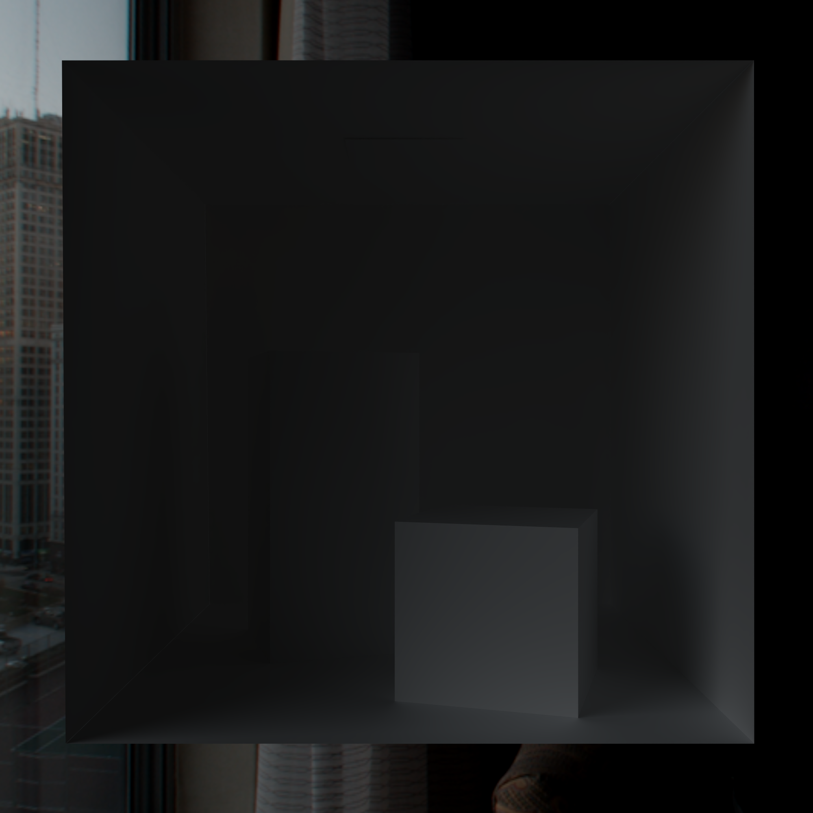

# Overview

# Implementation Details

## Ray Tracing
TODO

## Denoising
TODO

## BSDF

Current BSDF consists of 4 lobes
* Diffuse
* Dielectric
* Metallic
* Glass

#### Diffuse
Diffuse lobe is pretty simple. As color it just returns the color of the surface. The ray direction is a random direction with cosine weighted distribution, meaning that directions will more likely sampled where the $\cos(\phi)$ is bigger. $\phi$ being the angle between the reflected ray and the surface normal.

#### Dielectric
Dielectric lobe chooses color based on **SpecularTint** factor, the bigger the **SpecularTint** the more color will be shifted from 1 to the material color. The ray direction is choosen based on the GGX distribution. It returns half vector in which microfacet is pointing. The bigger the **Roughness** factor the bigger the chance that it will be pointing in direction different from surface normal.

#### Metallic
Metallic lobe returns the material color same as the diffuse lobe. For the ray direction it uses the exact same distribution as dielectric lobe.

#### Glass
Glass lobe can have 2 cases - reflection and refraction. Whether the light will reflect or refract is based on Fresnel term ([more info here](https://pbr-book.org/4ed/Reflection_Models/Specular_Reflection_and_Transmission#FrDielectric)). Same as before we calculate the half vector, if the ray refracts we choose material color as output color and if it reflects we choose 1 (we choose one because the glass is dielectric so we don't want to tint it).

You can find the code in the [BSDF.glsl](https://github.com/Zydak/Vulkan-Path-Tracer/blob/main/PathTracer/src/shaders/BSDF.glsl). All of the lobes described above are energy conserving, but what does that even mean and how did I check that?

### Energy Conservation
In short, if we say that something is energy conserving we mean that light is neither created nor destroyed as it bounces around a scene. We can check for energy conservation using a furnace test. What is a furnace test? The general idea is that if you have a 100% reflective object that is lit by a uniform environment, it becomes indistinguishable from the environment. It doesn’t matter if the object is matte or mirror like, or anything in between, it just “disappears”. We can easily prove that:

#### Rendering Equation
Color of a pixel is given by the outgoing radiance $L_o$ in the direction $\omega_o$ which is given by solving a rendering equation. Here I'll use a simple one where BRDF = $\frac{albedo}{\pi}$. But this easily extends to more complex BRDFs, BSDFs etc.

$$
L_o(\mathbf{x}, \omega_o) = \int_{\Omega} L_i(\mathbf{x}, \omega_i) \cdot \rho(\mathbf{x}, \omega_i) \cdot \cos(\theta_i) d\omega_i
$$

where:
- $L_o(\mathbf{x}, \omega_o)$ is the outgoing radiance in the direction $\omega_o$ from the point $\mathbf{x}$,
- $L_i(\mathbf{x}, \omega_i)$ is the incoming radiance from the direction $\omega_i$,
- $\rho(\mathbf{x}, \omega_i)$ is the reflectance or BRDF / BSDF at point $\mathbf{x}$,
- $\cos(\theta_i)$ is the cosine of the angle $\theta_i$ between the surface normal and the incoming direction $\omega_i$,
- $d\omega_i$ is the differential solid angle in the direction $\omega_i$.

Now if we make our object perfectly reflective (it doesn't absorb any light), so set the albedo factor to 1. Our BRDF should always equal $\frac{1}{\pi}$ ($\rho(\mathbf{x}, \omega_i) = \frac{1}{\pi}$) no matter how rough or metallic it is. Then the rendering equation simplifies to:

$$
L_o(\mathbf{x}, \omega_o) = \frac{1}{\pi} \int_{\Omega} L_i(\mathbf{x}, \omega_i) \cdot \cos(\theta_i) d\omega_i
$$

It's a common knowledge that integral $\int_{\Omega} \cos(\theta_i) d\omega_i$ is always equal $\pi$, that's why you usually don't see calculation of it in code, but let's solve that anyway. To solve it, we use spherical coordinates where:

$$
d\omega_i = \sin(\theta_i) d\theta_i d\phi_i
$$

So the integral becomes:

$$
\int_{\Omega} \cos(\theta_i) d\omega_i = \int_{0}^{2\pi} \int_{0}^{\pi/2} \cos(\theta_i) \sin(\theta_i) d\theta_i d\phi_i
$$

Separate the integrals:

- **Azimuthal Integral**:

$$
\int_{0}^{2\pi} d\phi_i = 2\pi
$$

- **Polar Integral**:

Substitute $u = \sin(\theta_i)$ so $du = \cos(\theta_i) \ d\theta_i$:

$$
\int_{0}^{\pi/2} \cos(\theta_i) \sin(\theta_i) d\theta_i = \int_{0}^{1} u du = \frac{u^2}{2} \bigg|_{0}^{1} = \frac{1}{2}
$$

Combining the results:

$$
\int_{\Omega} \cos(\theta_i) d\omega_i = 2\pi \cdot \frac{1}{2} = \pi
$$

### Final Result

Substitute this result back into the rendering equation:

$$
L_o(\mathbf{x}, \omega_o) = \frac{1}{\pi} \cdot \pi \cdot L_i(\mathbf{x}, \omega_i) = L_i(\mathbf{x}, \omega_i)
$$

As you can see, $L_o(\mathbf{x}, \omega_o) = L_i(\mathbf{x}, \omega_i)$. That means that if we choose a uniform environment light, the $L_i(\mathbf{x}, \omega_i)$ will equal to the background color no matter in which direction the ray is reflected. This means that $L_o(\mathbf{x}, \omega_o)$ will always equal the background color. And that means that we won't be able to distinguish between an object and the background. So if I use a perfectly white background and place a perfectly reflective sphere in the scene, I shouldn't be able to see it.

And that is exactly what happens!

  

Why is any of this useful? Well, if we mess up any part of the renderer, like the BSDF the furnace test will fail. If we absorb too much energy (destroy light), we'll see a dark sphere on a white background. On the other hand, if we reflect too much energy (create light), we'll see a sphere brighter than the background. And that's exactly what happens if I intentionally break my BSDF:

Here's the result of incorrectly calculating dielectric reflection color:

  
  

You can clearly see that something is wrong. On the image on the left the BSDF is absorbing too much energy at high angles. On the right image the BSDF is reflecting too much energy at high angles. In both cases $L_o(\mathbf{x}, \omega_o) \neq L_i(\mathbf{x}, \omega_i)$ which means that some part of the rendering equation is messed up, in this case it's BSDF which no longer equals $\frac{1}{\pi}$.
## My Implementation

Now, back to my implementation, does it properly conserve energy? Yes.

As a proof, you can see the furnace test on the cornell box that you can find in a gallery, but this time all materials have albedo equal 1 (perfect reflector) with roughness and metallic factors also set to 1. You can try any model with any material settings yourself and it won't be visible.

  

You can't see it but that's the point, I promise it's there!

Here's how it looks with a non-uniform environment map:

  

# Archtitecture

TODO
